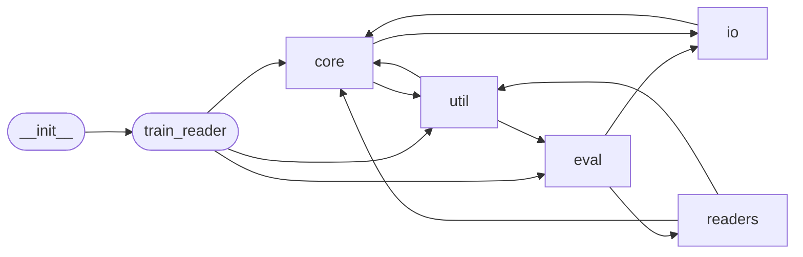

# Code Overview

[_Documentation generated by Documatic_](https://www.documatic.com)

<!---Documatic-section-Codebase Structure Python-start--->
## Codebase Structure Python

The codebase has a 3-deep folder structure,
                with 99 code files in total.

<!---Documatic-block-system_architecture-start--->

<!---Documatic-block-system_architecture-end--->

# #
<!---Documatic-section-Codebase Structure Python-end--->

<!---Documatic-section-Key Objects-start--->
## Key Objects

There are exposed imports at level-0
from the source directory (jack)

<!---Documatic-block-jack-start--->

	
<code>jack</code> (Click to Expand!)

* `jack.train_reader.train`

<!---Documatic-block-jack-end--->

# #
<!---Documatic-section-Key Objects-end--->

<!---Documatic-section-Important Functions-start--->
## Important Functions

<!---Documatic-block-important_funcs-start--->
<!---Documatic-block-most_used_funcs-start--->
### Most Utilised Functions

* [jack.util.map.numpify](8-jack_util.md#jack.util.map.numpify) (4 times)
* [jack.core.data_structures._jack_to_qasetting](7-jack_core.md#jack.core.data_structures._jack_to_qasetting) (4 times)
* [jack.core.data_structures.jack_to_qasetting](7-jack_core.md#jack.core.data_structures.jack_to_qasetting) (4 times)
* [jack.util.tf.embedding.conv_char_embedding](8-jack_util.md#jack.util.tf.embedding.conv_char_embedding) (3 times)
* [jack.eval.base.evaluate_reader](6-jack_eval.md#jack.eval.base.evaluate_reader) (2 times)
* [jack.eval.base.pretty_print_results](6-jack_eval.md#jack.eval.base.pretty_print_results) (2 times)
* jack.readers.implementations.classification_readers (2 times)
* jack.readers.implementations.extractive_qa_readers (2 times)
* jack.readers.implementations.link_prediction_readers (2 times)
* [jack.util.tf.modular_encoder.modular_encoder](8-jack_util.md#jack.util.tf.modular_encoder.modular_encoder) (2 times)
* [jack.util.tf.segment.segment_softmax](8-jack_util.md#jack.util.tf.segment.segment_softmax) (2 times)
* [jack.util.tf.highway.highway_network](8-jack_util.md#jack.util.tf.highway.highway_network) (2 times)
* [jack.util.tf.sequence_encoder.encoder](8-jack_util.md#jack.util.tf.sequence_encoder.encoder) (2 times)
* [jack.io.embeddings.glove.load_glove](5-jack_io.md#jack.io.embeddings.glove.load_glove) (2 times)
* jack.core.reader.logger (2 times)
* jack.train_reader.train (1 times)
* [jack.readers.implementations.__reader](4-jack_readers.md#jack.readers.implementations.__reader) (1 times)
* [jack.readers.implementations._tf_extractive_qa_reader](4-jack_readers.md#jack.readers.implementations._tf_extractive_qa_reader) (1 times)
* [jack.readers.implementations._tf_nli_reader](4-jack_readers.md#jack.readers.implementations._tf_nli_reader) (1 times)
* [jack.readers.implementations.cbilstm_nli_reader](4-jack_readers.md#jack.readers.implementations.cbilstm_nli_reader) (1 times)
* [jack.readers.implementations.classification_reader](4-jack_readers.md#jack.readers.implementations.classification_reader) (1 times)
* [jack.readers.implementations.complex_reader](4-jack_readers.md#jack.readers.implementations.complex_reader) (1 times)
* [jack.readers.implementations.create_shared_resources](4-jack_readers.md#jack.readers.implementations.create_shared_resources) (1 times)
* [jack.readers.implementations.dam_snli_reader](4-jack_readers.md#jack.readers.implementations.dam_snli_reader) (1 times)
* [jack.readers.implementations.distmult_reader](4-jack_readers.md#jack.readers.implementations.distmult_reader) (1 times)
<!---Documatic-block-most_used_funcs-end--->

<!---Documatic-block-end_user_funcs-start--->
### End User Exposed Functions

* jack.train_reader.train
<!---Documatic-block-end_user_funcs-end--->
<!---Documatic-block-important_funcs-end--->

# #
<!---Documatic-section-Important Functions-end--->

<!---Documatic-section-File IO-start--->
## File IO

<!---Documatic-block-file_io-start--->
The following files have file read operations

<!---Documatic-block-jack.core-start--->

	
<code>jack.core</code> (Click to Expand!)

* jack.core.shared_resources
* jack.core.torch

<!---Documatic-block-jack.core-end--->

<!---Documatic-block-jack.io-start--->

	
<code>jack.io</code> (Click to Expand!)

* jack.io.CBT2jtr
* jack.io.FB15K2jtr
* jack.io.MCTest2jtr
* jack.io.NYT2jtr
* jack.io.SNLI2jtr
* jack.io.SNLI2jtr_concat
* jack.io.SQuAD2jtr
* jack.io.WN182jtr
* jack.io.bAbI2JTR
* jack.io.embeddings.embeddings
* jack.io.embeddings.memory_map
* jack.io.embeddings.word_to_vec
* jack.io.load
* jack.io.ls2jtr
* jack.io.merge_JTR_data_files
* jack.io.multiNLI2jtr
* jack.io.newsqa2jtr
* jack.io.newsqa2squad
* jack.io.rc-data2jtr
* jack.io.read_semeval2017Task10
* jack.io.scienceQA2jtr
* jack.io.sentihood2jtr
* jack.io.simpleQuestions2jtr
* jack.io.validate

<!---Documatic-block-jack.io-end--->

<!---Documatic-block-jack.util-start--->

	
<code>jack.util</code> (Click to Expand!)

* jack.util.vocab

<!---Documatic-block-jack.util-end--->

The following files have file write operations

<!---Documatic-block-jack.core-start--->

	
<code>jack.core</code> (Click to Expand!)

* jack.core.shared_resources
* jack.core.torch

<!---Documatic-block-jack.core-end--->

<!---Documatic-block-jack.io-start--->

	
<code>jack.io</code> (Click to Expand!)

* jack.io.CBT2jtr
* jack.io.FB15K2jtr
* jack.io.MCTest2jtr
* jack.io.NYT2jtr
* jack.io.SNLI2jtr: ./data/SNLI/snippet.jtr_v1.json, ./data/SNLI/snli_1.0/snli_1.0_debug_jtr_v1.json, ./tests/test_data/SNLI/1000_samples_dev_jtr_v1.json, ./tests/test_data/SNLI/2000_samples_test_jtr_v1.json, ./tests/test_data/SNLI/2000_samples_train_jtr_v1.json, ./tests/test_data/SNLI/overfit.json
* jack.io.SNLI2jtr_concat: ./jack/data/SNLI/snippet_jtrformat_v2.json, ./jack/data/SNLI/snli_1.0/snli_1.0_debug_jtr_v2.json
* jack.io.SQuAD2jtr
* jack.io.WN182jtr
* jack.io.bAbI2JTR
* jack.io.embeddings.embeddings
* jack.io.embeddings.memory_map
* jack.io.embeddings.word_to_vec: ./data/w2v_tokens.pickle
* jack.io.ls2jtr
* jack.io.merge_JTR_data_files
* jack.io.multiNLI2jtr: ../../data/MultiNLI/multinli_0.9_debug_jtr.json, ../../data/MultiNLI/snippet.jack.json, ../../tests/test_data/MultiNLI/1000_samples_dev_jtr.json, ../../tests/test_data/MultiNLI/2000_samples_train_jtr.json, ../../tests/test_data/MultiNLI/2000_samples_train_jtr.json, ../../tests/test_data/MultiNLI/overfit.json
* jack.io.newsqa2jtr
* jack.io.newsqa2squad
* jack.io.rc-data2jtr
* jack.io.scienceQA2jtr: ../data/scienceQA/scienceQA_clozeSummaryLocal_test.json
* jack.io.sentihood2jtr: ../../tests/test_data/sentihood/overfit.json
* jack.io.simpleQuestions2jtr

<!---Documatic-block-jack.io-end--->

<!---Documatic-block-jack.util-start--->

	
<code>jack.util</code> (Click to Expand!)

* jack.util.hooks
* jack.util.vocab

<!---Documatic-block-jack.util-end--->
<!---Documatic-block-file_io-end--->

# #
<!---Documatic-section-File IO-end--->

<!---Documatic-section-Class Hierarchy-start--->
## Class Hierarchy

<!---Documatic-block-jack.core.tensorflow.TFModelModule-start--->

	
<code>jack.core.tensorflow.TFModelModule</code> (Click to Expand!)

* jack.readers.classification.shared.AbstractSingleSupportClassificationModel
* jack.readers.extractive_qa.tensorflow.abstract_model.AbstractXQAModelModule
* [jack.readers.link_prediction.models.KnowledgeGraphEmbeddingModelModule](4-jack_readers.md#jack.readers.link_prediction.models.KnowledgeGraphEmbeddingModelModule)

<!---Documatic-block-jack.core.tensorflow.TFModelModule-end--->

<!---Documatic-block-jack.readers.classification.shared.AbstractSingleSupportClassificationModel-start--->

	
<code>jack.readers.classification.shared.AbstractSingleSupportClassificationModel</code> (Click to Expand!)

* jack.readers.natural_language_inference.conditional_bilstm.ConditionalBiLSTMClassificationModel
* jack.readers.natural_language_inference.decomposable_attention.DecomposableAttentionModel
* jack.readers.natural_language_inference.modular_nli_model.ModularNLIModel

<!---Documatic-block-jack.readers.classification.shared.AbstractSingleSupportClassificationModel-end--->

<!---Documatic-block-jack.readers.extractive_qa.shared.XQAOutputModule-start--->

	
<code>jack.readers.extractive_qa.shared.XQAOutputModule</code> (Click to Expand!)

* [jack.readers.classification.shared.SimpleClassificationOutputModule](4-jack_readers.md#jack.readers.classification.shared.SimpleClassificationOutputModule)
* [jack.readers.extractive_qa.shared.XQAOutputModule](4-jack_readers.md#jack.readers.extractive_qa.shared.XQAOutputModule)
* [jack.readers.link_prediction.models.KnowledgeGraphEmbeddingOutputModule](4-jack_readers.md#jack.readers.link_prediction.models.KnowledgeGraphEmbeddingOutputModule)

<!---Documatic-block-jack.readers.extractive_qa.shared.XQAOutputModule-end--->

<!---Documatic-block-jack.readers.extractive_qa.tensorflow.abstract_model.AbstractXQAModelModule-start--->

	
<code>jack.readers.extractive_qa.tensorflow.abstract_model.AbstractXQAModelModule</code> (Click to Expand!)

* jack.readers.extractive_qa.tensorflow.fastqa.FastQAModule
* jack.readers.extractive_qa.tensorflow.modular_qa_model.ModularQAModel

<!---Documatic-block-jack.readers.extractive_qa.tensorflow.abstract_model.AbstractXQAModelModule-end--->

<!---Documatic-block-jack.readers.extractive_qa.torch.fastqa.FastQAPyTorchModelModule-start--->

	
<code>jack.readers.extractive_qa.torch.fastqa.FastQAPyTorchModelModule</code> (Click to Expand!)

* jack.core.tensorflow.TFModelModule
* jack.core.torch.PyTorchModelModule
* jack.readers.extractive_qa.torch.fastqa.FastQAPyTorchModelModule

<!---Documatic-block-jack.readers.extractive_qa.torch.fastqa.FastQAPyTorchModelModule-end--->

<!---Documatic-block-jack.util.hooks.EvalHook-start--->

	
<code>jack.util.hooks.EvalHook</code> (Click to Expand!)

* jack.util.hooks.ClassificationEvalHook
* jack.util.hooks.LogProbEvalHook
* jack.util.hooks.XQAEvalHook

<!---Documatic-block-jack.util.hooks.EvalHook-end--->

<!---Documatic-block-jack.util.hooks.TFTrainingHook-start--->

	
<code>jack.util.hooks.TFTrainingHook</code> (Click to Expand!)

* jack.util.hooks.TraceHook

<!---Documatic-block-jack.util.hooks.TFTrainingHook-end--->

<!---Documatic-block-jack.util.hooks.TraceHook-start--->

	
<code>jack.util.hooks.TraceHook</code> (Click to Expand!)

* jack.util.hooks.EvalHook

<!---Documatic-block-jack.util.hooks.TraceHook-end--->

<!---Documatic-block-jack.util.hooks.TrainingHook-start--->

	
<code>jack.util.hooks.TrainingHook</code> (Click to Expand!)

* jack.util.hooks.TFTrainingHook

<!---Documatic-block-jack.util.hooks.TrainingHook-end--->

# #
<!---Documatic-section-Class Hierarchy-end--->

[_Documentation generated by Documatic_](https://www.documatic.com)