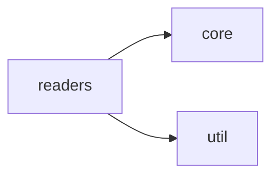
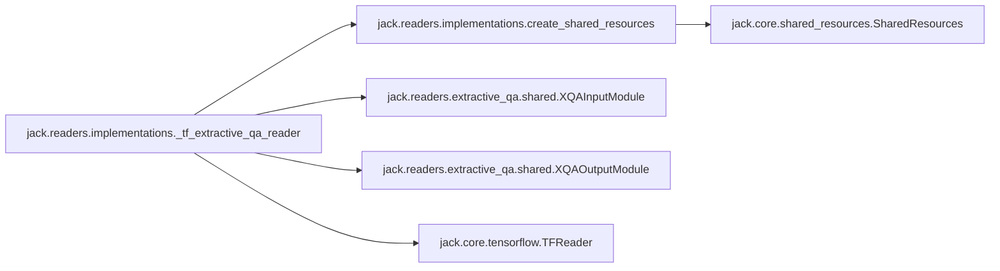
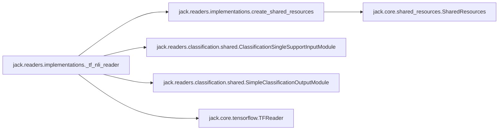
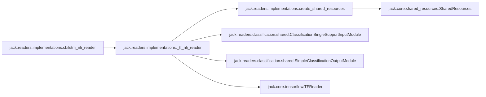
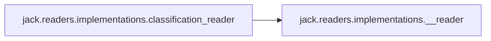
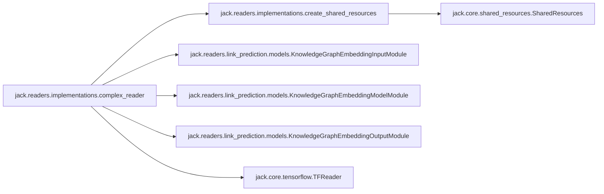
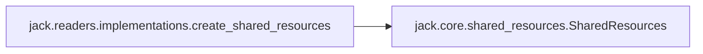
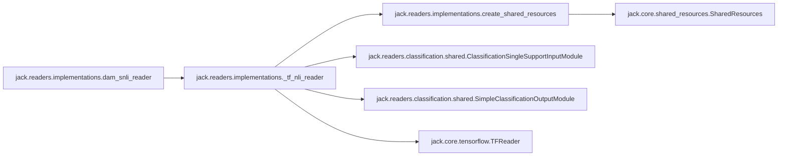
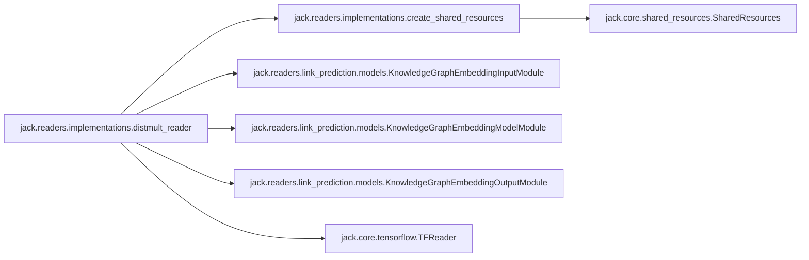

# Jack Readers

[_Documentation generated by Documatic_](https://www.documatic.com)

<!---Documatic-section-Codebase Structure-start--->
## Codebase Structure

<!---Documatic-block-system_architecture-start--->

<!---Documatic-block-system_architecture-end--->

# #
<!---Documatic-section-Codebase Structure-end--->

<!---Documatic-section-jack.readers.implementations.__reader-start--->
## [jack.readers.implementations.__reader](4-jack_readers.md#jack.readers.implementations.__reader)

<!---Documatic-section-__reader-start--->
<!---Documatic-block-jack.readers.implementations.__reader-start--->
<details>
	<summary><code>jack.readers.implementations.__reader</code> code snippet</summary>

```python
def __reader(f):
    readers.setdefault(f.__name__, f)
    return f
```
</details>
<!---Documatic-block-jack.readers.implementations.__reader-end--->
<!---Documatic-section-__reader-end--->

# #
<!---Documatic-section-jack.readers.implementations.__reader-end--->

<!---Documatic-section-jack.readers.implementations._tf_extractive_qa_reader-start--->
## [jack.readers.implementations._tf_extractive_qa_reader](4-jack_readers.md#jack.readers.implementations._tf_extractive_qa_reader)

<!---Documatic-section-_tf_extractive_qa_reader-start--->


### Object Calls

* [jack.readers.implementations.create_shared_resources](4-jack_readers.md#jack.readers.implementations.create_shared_resources)
* [jack.readers.extractive_qa.shared.XQAInputModule](4-jack_readers.md#jack.readers.extractive_qa.shared.XQAInputModule)
* [jack.readers.extractive_qa.shared.XQAOutputModule](4-jack_readers.md#jack.readers.extractive_qa.shared.XQAOutputModule)
* [jack.core.tensorflow.TFReader](7-jack_core.md#jack.core.tensorflow.TFReader)

<!---Documatic-block-jack.readers.implementations._tf_extractive_qa_reader-start--->
<details>
	<summary><code>jack.readers.implementations._tf_extractive_qa_reader</code> code snippet</summary>

```python
def _tf_extractive_qa_reader(model_module_constructor, resources_or_conf: Union[dict, SharedResources]):
    from jack.readers.extractive_qa.shared import XQAInputModule, XQAOutputModule
    shared_resources = create_shared_resources(resources_or_conf)
    input_module = XQAInputModule(shared_resources)
    model_module = model_module_constructor(shared_resources)
    output_module = XQAOutputModule()
    return TFReader(shared_resources, input_module, model_module, output_module)
```
</details>
<!---Documatic-block-jack.readers.implementations._tf_extractive_qa_reader-end--->
<!---Documatic-section-_tf_extractive_qa_reader-end--->

# #
<!---Documatic-section-jack.readers.implementations._tf_extractive_qa_reader-end--->

<!---Documatic-section-jack.readers.implementations._tf_nli_reader-start--->
## [jack.readers.implementations._tf_nli_reader](4-jack_readers.md#jack.readers.implementations._tf_nli_reader)

<!---Documatic-section-_tf_nli_reader-start--->


### Object Calls

* [jack.readers.implementations.create_shared_resources](4-jack_readers.md#jack.readers.implementations.create_shared_resources)
* [jack.readers.classification.shared.ClassificationSingleSupportInputModule](4-jack_readers.md#jack.readers.classification.shared.ClassificationSingleSupportInputModule)
* [jack.readers.classification.shared.SimpleClassificationOutputModule](4-jack_readers.md#jack.readers.classification.shared.SimpleClassificationOutputModule)
* [jack.core.tensorflow.TFReader](7-jack_core.md#jack.core.tensorflow.TFReader)

<!---Documatic-block-jack.readers.implementations._tf_nli_reader-start--->
<details>
	<summary><code>jack.readers.implementations._tf_nli_reader</code> code snippet</summary>

```python
def _tf_nli_reader(model_module_constructor, resources_or_conf: Union[dict, SharedResources]=None):
    from jack.readers.classification.shared import ClassificationSingleSupportInputModule
    from jack.readers.classification.shared import SimpleClassificationOutputModule
    shared_resources = create_shared_resources(resources_or_conf)
    input_module = ClassificationSingleSupportInputModule(shared_resources)
    model_module = model_module_constructor(shared_resources)
    output_module = SimpleClassificationOutputModule(shared_resources)
    return TFReader(shared_resources, input_module, model_module, output_module)
```
</details>
<!---Documatic-block-jack.readers.implementations._tf_nli_reader-end--->
<!---Documatic-section-_tf_nli_reader-end--->

# #
<!---Documatic-section-jack.readers.implementations._tf_nli_reader-end--->

<!---Documatic-section-jack.readers.implementations.cbilstm_nli_reader-start--->
## [jack.readers.implementations.cbilstm_nli_reader](4-jack_readers.md#jack.readers.implementations.cbilstm_nli_reader)

<!---Documatic-section-cbilstm_nli_reader-start--->


### Object Calls

* [jack.readers.implementations._tf_nli_reader](4-jack_readers.md#jack.readers.implementations._tf_nli_reader)

<!---Documatic-block-jack.readers.implementations.cbilstm_nli_reader-start--->
<details>
	<summary><code>jack.readers.implementations.cbilstm_nli_reader</code> code snippet</summary>

```python
@nli_reader
def cbilstm_nli_reader(resources_or_conf: Union[dict, SharedResources]=None):
    from jack.readers.natural_language_inference.conditional_bilstm import ConditionalBiLSTMClassificationModel
    return _tf_nli_reader(ConditionalBiLSTMClassificationModel, resources_or_conf)
```
</details>
<!---Documatic-block-jack.readers.implementations.cbilstm_nli_reader-end--->
<!---Documatic-section-cbilstm_nli_reader-end--->

# #
<!---Documatic-section-jack.readers.implementations.cbilstm_nli_reader-end--->

<!---Documatic-section-jack.readers.implementations.classification_reader-start--->
## [jack.readers.implementations.classification_reader](4-jack_readers.md#jack.readers.implementations.classification_reader)

<!---Documatic-section-classification_reader-start--->


### Object Calls

* [jack.readers.implementations.__reader](4-jack_readers.md#jack.readers.implementations.__reader)

<!---Documatic-block-jack.readers.implementations.classification_reader-start--->
<details>
	<summary><code>jack.readers.implementations.classification_reader</code> code snippet</summary>

```python
def classification_reader(f):
    __reader(f)
    classification_readers.setdefault(f.__name__, f)
    eval_hooks.setdefault(f.__name__, ClassificationEvalHook)
    return f
```
</details>
<!---Documatic-block-jack.readers.implementations.classification_reader-end--->
<!---Documatic-section-classification_reader-end--->

# #
<!---Documatic-section-jack.readers.implementations.classification_reader-end--->

<!---Documatic-section-jack.readers.implementations.complex_reader-start--->
## [jack.readers.implementations.complex_reader](4-jack_readers.md#jack.readers.implementations.complex_reader)

<!---Documatic-section-complex_reader-start--->


### Object Calls

* [jack.readers.implementations.create_shared_resources](4-jack_readers.md#jack.readers.implementations.create_shared_resources)
* [jack.readers.link_prediction.models.KnowledgeGraphEmbeddingInputModule](4-jack_readers.md#jack.readers.link_prediction.models.KnowledgeGraphEmbeddingInputModule)
* [jack.readers.link_prediction.models.KnowledgeGraphEmbeddingModelModule](4-jack_readers.md#jack.readers.link_prediction.models.KnowledgeGraphEmbeddingModelModule)
* [jack.readers.link_prediction.models.KnowledgeGraphEmbeddingOutputModule](4-jack_readers.md#jack.readers.link_prediction.models.KnowledgeGraphEmbeddingOutputModule)
* [jack.core.tensorflow.TFReader](7-jack_core.md#jack.core.tensorflow.TFReader)

<!---Documatic-block-jack.readers.implementations.complex_reader-start--->
<details>
	<summary><code>jack.readers.implementations.complex_reader</code> code snippet</summary>

```python
@link_prediction_reader
def complex_reader(resources_or_conf: Union[dict, SharedResources]=None):
    from jack.readers.link_prediction.models import KnowledgeGraphEmbeddingInputModule, KnowledgeGraphEmbeddingModelModule, KnowledgeGraphEmbeddingOutputModule
    shared_resources = create_shared_resources(resources_or_conf)
    input_module = KnowledgeGraphEmbeddingInputModule(shared_resources)
    model_module = KnowledgeGraphEmbeddingModelModule(shared_resources, model_name='ComplEx')
    output_module = KnowledgeGraphEmbeddingOutputModule()
    return TFReader(shared_resources, input_module, model_module, output_module)
```
</details>
<!---Documatic-block-jack.readers.implementations.complex_reader-end--->
<!---Documatic-section-complex_reader-end--->

# #
<!---Documatic-section-jack.readers.implementations.complex_reader-end--->

<!---Documatic-section-jack.readers.implementations.create_shared_resources-start--->
## [jack.readers.implementations.create_shared_resources](4-jack_readers.md#jack.readers.implementations.create_shared_resources)

<!---Documatic-section-create_shared_resources-start--->


### Object Calls

* [jack.core.shared_resources.SharedResources](7-jack_core.md#jack.core.shared_resources.SharedResources)

<!---Documatic-block-jack.readers.implementations.create_shared_resources-start--->
<details>
	<summary><code>jack.readers.implementations.create_shared_resources</code> code snippet</summary>

```python
def create_shared_resources(resources_or_config: Union[dict, SharedResources]=None) -> SharedResources:
    if resources_or_config is None:
        return SharedResources()
    elif isinstance(resources_or_config, SharedResources):
        return resources_or_config
    else:
        return SharedResources(config=resources_or_config)
```
</details>
<!---Documatic-block-jack.readers.implementations.create_shared_resources-end--->
<!---Documatic-section-create_shared_resources-end--->

# #
<!---Documatic-section-jack.readers.implementations.create_shared_resources-end--->

<!---Documatic-section-jack.readers.implementations.dam_snli_reader-start--->
## [jack.readers.implementations.dam_snli_reader](4-jack_readers.md#jack.readers.implementations.dam_snli_reader)

<!---Documatic-section-dam_snli_reader-start--->


### Object Calls

* [jack.readers.implementations._tf_nli_reader](4-jack_readers.md#jack.readers.implementations._tf_nli_reader)

<!---Documatic-block-jack.readers.implementations.dam_snli_reader-start--->
<details>
	<summary><code>jack.readers.implementations.dam_snli_reader</code> code snippet</summary>

```python
@nli_reader
def dam_snli_reader(resources_or_conf: Union[dict, SharedResources]=None):
    from jack.readers.natural_language_inference.decomposable_attention import DecomposableAttentionModel
    return _tf_nli_reader(DecomposableAttentionModel, resources_or_conf)
```
</details>
<!---Documatic-block-jack.readers.implementations.dam_snli_reader-end--->
<!---Documatic-section-dam_snli_reader-end--->

# #
<!---Documatic-section-jack.readers.implementations.dam_snli_reader-end--->

<!---Documatic-section-jack.readers.implementations.distmult_reader-start--->
## [jack.readers.implementations.distmult_reader](4-jack_readers.md#jack.readers.implementations.distmult_reader)

<!---Documatic-section-distmult_reader-start--->


### Object Calls

* [jack.readers.implementations.create_shared_resources](4-jack_readers.md#jack.readers.implementations.create_shared_resources)
* [jack.readers.link_prediction.models.KnowledgeGraphEmbeddingInputModule](4-jack_readers.md#jack.readers.link_prediction.models.KnowledgeGraphEmbeddingInputModule)
* [jack.readers.link_prediction.models.KnowledgeGraphEmbeddingModelModule](4-jack_readers.md#jack.readers.link_prediction.models.KnowledgeGraphEmbeddingModelModule)
* [jack.readers.link_prediction.models.KnowledgeGraphEmbeddingOutputModule](4-jack_readers.md#jack.readers.link_prediction.models.KnowledgeGraphEmbeddingOutputModule)
* [jack.core.tensorflow.TFReader](7-jack_core.md#jack.core.tensorflow.TFReader)

<!---Documatic-block-jack.readers.implementations.distmult_reader-start--->
<details>
	<summary><code>jack.readers.implementations.distmult_reader</code> code snippet</summary>

```python
@link_prediction_reader
def distmult_reader(resources_or_conf: Union[dict, SharedResources]=None):
    from jack.readers.link_prediction.models import KnowledgeGraphEmbeddingInputModule, KnowledgeGraphEmbeddingModelModule, KnowledgeGraphEmbeddingOutputModule
    shared_resources = create_shared_resources(resources_or_conf)
    input_module = KnowledgeGraphEmbeddingInputModule(shared_resources)
    model_module = KnowledgeGraphEmbeddingModelModule(shared_resources, model_name='DistMult')
    output_module = KnowledgeGraphEmbeddingOutputModule()
    return TFReader(shared_resources, input_module, model_module, output_module)
```
</details>
<!---Documatic-block-jack.readers.implementations.distmult_reader-end--->
<!---Documatic-section-distmult_reader-end--->

# #
<!---Documatic-section-jack.readers.implementations.distmult_reader-end--->

<!---Documatic-section-jack.readers.extractive_qa.shared.XQAInputModule-start--->
## [jack.readers.extractive_qa.shared.XQAInputModule](4-jack_readers.md#jack.readers.extractive_qa.shared.XQAInputModule)

<!---Documatic-section-XQAInputModule-start--->
<!---Documatic-block-jack.readers.extractive_qa.shared.XQAInputModule-start--->
<details>
	<summary><code>jack.readers.extractive_qa.shared.XQAInputModule</code> code snippet</summary>

```python
class XQAInputModule(OnlineInputModule[XQAAnnotation]):
    _output_ports = [XQAPorts.emb_question, XQAPorts.question_length, XQAPorts.emb_support, XQAPorts.support_length, XQAPorts.support2question, XQAPorts.word_chars, XQAPorts.word_char_length, XQAPorts.question_batch_words, XQAPorts.support_batch_words, XQAPorts.word_in_question, XQAPorts.correct_start, XQAPorts.answer2support_training, XQAPorts.is_eval, XQAPorts.token_offsets, XQAPorts.selected_support]
    _training_ports = [XQAPorts.answer_span_target, XQAPorts.answer2support_training]

    def setup_from_data(self, data: Iterable[Tuple[QASetting, List[Answer]]]):
        if not self.shared_resources.vocab.frozen:
            preprocessing.fill_vocab((q for (q, _) in data), self.shared_resources.vocab, self.shared_resources.config.get('lowercase', False))
            self.shared_resources.vocab.freeze()
        self.shared_resources.char_vocab = preprocessing.char_vocab_from_vocab(self.shared_resources.vocab)

    def setup(self):
        self._rng = random.Random(1)
        self.vocab = self.shared_resources.vocab
        self.config = self.shared_resources.config
        self.embeddings = self.shared_resources.embeddings
        self.__default_vec = np.zeros([self.embeddings.shape[-1]])
        self.char_vocab = self.shared_resources.char_vocab

    @property
    def output_ports(self) -> List[TensorPort]:
        return self._output_ports

    @property
    def training_ports(self) -> List[TensorPort]:
        return self._training_ports

    def preprocess(self, questions: List[QASetting], answers: Optional[List[List[Answer]]]=None, is_eval: bool=False) -> List[XQAAnnotation]:
        if answers is None:
            answers = [None] * len(questions)
        preprocessed = []
        if len(questions) > 1000:
            bar = progressbar.ProgressBar(max_value=len(questions), widgets=[' [', progressbar.Timer(), '] ', progressbar.Bar(), ' (', progressbar.ETA(), ') '])
            for (q, a) in bar(zip(questions, answers)):
                preprocessed.append(self.preprocess_instance(q, a))
        else:
            for (q, a) in zip(questions, answers):
                preprocessed.append(self.preprocess_instance(q, a))
        return preprocessed

    def preprocess_instance(self, question: QASetting, answers: Optional[List[Answer]]=None) -> XQAAnnotation:
        has_answers = answers is not None
        (q_tokenized, q_ids, _, q_length, s_tokenized, s_ids, _, s_length, word_in_question, token_offsets, answer_spans) = prepare_data(question, answers, self.vocab, self.config.get('lowercase', False), with_answers=has_answers, max_support_length=self.config.get('max_support_length', None))
        max_num_support = self.config.get('max_num_support', len(question.support))
        if len(question.support) > 1:
            scores = sort_by_tfidf(' '.join(q_tokenized), [' '.join(s) for s in s_tokenized])
            selected_supports = [s_idx for (s_idx, _) in scores[:max_num_support]]
            s_tokenized = [s_tokenized[s_idx] for s_idx in selected_supports]
            s_ids = [s_ids[s_idx] for s_idx in selected_supports]
            s_length = [s_length[s_idx] for s_idx in selected_supports]
            word_in_question = [word_in_question[s_idx] for s_idx in selected_supports]
            token_offsets = [token_offsets[s_idx] for s_idx in selected_supports]
            answer_spans = [answer_spans[s_idx] for s_idx in selected_supports]
        else:
            selected_supports = list(range(len(question.support)))
        return XQAAnnotation(question_tokens=q_tokenized, question_ids=q_ids, question_length=q_length, support_tokens=s_tokenized, support_ids=s_ids, support_length=s_length, word_in_question=word_in_question, token_offsets=token_offsets, answer_spans=answer_spans if has_answers else None, selected_supports=selected_supports)

    def create_batch(self, annotations: List[XQAAnnotation], is_eval: bool, with_answers: bool) -> Mapping[TensorPort, np.ndarray]:
        q_tokenized = [a.question_tokens for a in annotations]
        question_lengths = [a.question_length for a in annotations]
        max_training_support = self.config.get('max_training_support', 2)
        s_tokenized = []
        support_lengths = []
        wiq = []
        offsets = []
        support2question = []
        support_ids = []
        selected_support = []
        all_spans = []
        for (i, a) in enumerate(annotations):
            all_spans.append([])
            if len(a.support_tokens) > max_training_support > 0 and (not is_eval):
                is_done = False
                any_answer = any(a.answer_spans)
                while not is_done:
                    selected = self._rng.sample(range(0, len(a.support_tokens) + 1), max_training_support + 1)
                    if 0 in selected and 1 in selected:
                        selected = [s - 1 for s in selected if s > 0]
                    else:
                        selected = [max(0, s - 1) for s in selected[:max_training_support]]
                    is_done = not any_answer or any((a.answer_spans[s] for s in selected))
            else:
                selected = set(range(len(a.support_tokens)))
            for s in selected:
                s_tokenized.append(a.support_tokens[s])
                support_lengths.append(a.support_length[s])
                wiq.append(a.word_in_question[s])
                offsets.append(a.token_offsets[s])
                selected_support.append(a.selected_supports[s])
                support_ids.append(a.support_ids[s])
                support2question.append(i)
                if with_answers:
                    all_spans[-1].append(a.answer_spans[s])
        (word_chars, word_lengths, batch_word_ids, batch_vocab, batch_rev_vocab) = preprocessing.unique_words_with_chars(q_tokenized + s_tokenized, self.char_vocab)
        emb_support = np.zeros([len(support_lengths), max(support_lengths), self.embeddings.shape[-1]])
        emb_question = np.zeros([len(question_lengths), max(question_lengths), self.embeddings.shape[-1]])
        for (i, a) in enumerate(annotations):
            for (j, t) in enumerate(a.question_tokens):
                emb_question[i, j] = self.embeddings.get(t, self.__default_vec)
        for (k, s_ids) in enumerate(s_tokenized):
            for (j, t) in enumerate(s_ids):
                emb_support[k, j] = self.embeddings.get(t, self.__default_vec)
        output = {XQAPorts.word_chars: word_chars, XQAPorts.word_char_length: word_lengths, XQAPorts.question_batch_words: batch_word_ids[:len(q_tokenized)], XQAPorts.support_batch_words: batch_word_ids[len(q_tokenized):], XQAPorts.emb_support: emb_support, XQAPorts.support_length: support_lengths, XQAPorts.emb_question: emb_question, XQAPorts.question_length: question_lengths, XQAPorts.word_in_question: wiq, XQAPorts.support2question: support2question, XQAPorts.is_eval: is_eval, XQAPorts.token_offsets: offsets, XQAPorts.selected_support: selected_support, '__vocab': batch_vocab, '__rev_vocab': batch_rev_vocab}
        if with_answers:
            spans = [s for a in all_spans for spans_per_support in a for s in spans_per_support]
            span2support = []
            support_idx = 0
            for a in all_spans:
                for spans_per_support in a:
                    span2support.extend([support_idx] * len(spans_per_support))
                    support_idx += 1
            output.update({XQAPorts.answer_span_target: [span for span in spans] if spans else np.zeros([0, 2], np.int32), XQAPorts.correct_start: [] if is_eval else [span[0] for span in spans], XQAPorts.answer2support_training: span2support})
        batch = numpify(output, keys=[XQAPorts.word_chars, XQAPorts.question_batch_words, XQAPorts.support_batch_words, XQAPorts.word_in_question, XQAPorts.token_offsets])
        return batch
```
</details>
<!---Documatic-block-jack.readers.extractive_qa.shared.XQAInputModule-end--->
<!---Documatic-section-XQAInputModule-end--->

# #
<!---Documatic-section-jack.readers.extractive_qa.shared.XQAInputModule-end--->

<!---Documatic-section-jack.readers.classification.shared.SimpleClassificationOutputModule-start--->
## [jack.readers.classification.shared.SimpleClassificationOutputModule](4-jack_readers.md#jack.readers.classification.shared.SimpleClassificationOutputModule)

<!---Documatic-section-SimpleClassificationOutputModule-start--->
<!---Documatic-block-jack.readers.classification.shared.SimpleClassificationOutputModule-start--->
<details>
	<summary><code>jack.readers.classification.shared.SimpleClassificationOutputModule</code> code snippet</summary>

```python
class SimpleClassificationOutputModule(OutputModule):

    def __init__(self, shared_resources=None):
        self._shared_resources = shared_resources

    def setup(self):
        pass

    @property
    def input_ports(self) -> List[TensorPort]:
        return [Ports.Prediction.logits]

    def __call__(self, questions: List[QASetting], tensors: Mapping[TensorPort, np.ndarray]) -> List[Answer]:
        logits = tensors[Ports.Prediction.logits]
        winning_indices = np.argmax(logits, axis=1)
        result = []
        for (index_in_batch, question) in enumerate(questions):
            winning_index = winning_indices[index_in_batch]
            score = _np_softmax(logits[index_in_batch])[winning_index]
            if self._shared_resources is not None and hasattr(self._shared_resources, 'answer_vocab'):
                ans = Answer(self._shared_resources.answer_vocab.get_sym(winning_index), score=score)
            else:
                ans = Answer(question.candidates[winning_index], score=score)
            result.append([ans])
        return result
```
</details>
<!---Documatic-block-jack.readers.classification.shared.SimpleClassificationOutputModule-end--->
<!---Documatic-section-SimpleClassificationOutputModule-end--->

# #
<!---Documatic-section-jack.readers.classification.shared.SimpleClassificationOutputModule-end--->

<!---Documatic-section-jack.readers.classification.shared.ClassificationSingleSupportInputModule-start--->
## [jack.readers.classification.shared.ClassificationSingleSupportInputModule](4-jack_readers.md#jack.readers.classification.shared.ClassificationSingleSupportInputModule)

<!---Documatic-section-ClassificationSingleSupportInputModule-start--->
<!---Documatic-block-jack.readers.classification.shared.ClassificationSingleSupportInputModule-start--->
<details>
	<summary><code>jack.readers.classification.shared.ClassificationSingleSupportInputModule</code> code snippet</summary>

```python
class ClassificationSingleSupportInputModule(OnlineInputModule[MCAnnotation]):

    def setup(self):
        self.vocab = self.shared_resources.vocab
        self.config = self.shared_resources.config
        self.embeddings = self.shared_resources.embeddings
        if self.embeddings is not None:
            self.__default_vec = np.zeros([self.embeddings.shape[-1]])

    def setup_from_data(self, data: Iterable[Tuple[QASetting, List[Answer]]]):
        vocab = self.shared_resources.vocab
        if not vocab.frozen:
            preprocessing.fill_vocab((q for (q, _) in data), vocab, lowercase=self.shared_resources.config.get('lowercase', True))
            vocab.freeze()
        if not hasattr(self.shared_resources, 'answer_vocab') or not self.shared_resources.answer_vocab.frozen:
            self.shared_resources.answer_vocab = util.create_answer_vocab(qa_settings=(q for (q, _) in data), answers=(a for (_, ass) in data for a in ass))
            self.shared_resources.answer_vocab.freeze()
        self.shared_resources.char_vocab = preprocessing.char_vocab_from_vocab(self.shared_resources.vocab)

    @property
    def training_ports(self) -> List[TensorPort]:
        return [Ports.Target.target_index]

    @property
    def output_ports(self) -> List[TensorPort]:
        """Defines the outputs of the InputModule"""
        if self.shared_resources.embeddings is not None:
            return [Ports.Input.emb_support, Ports.Input.emb_question, Ports.Input.support, Ports.Input.question, Ports.Input.support_length, Ports.Input.question_length, Ports.Input.sample_id, Ports.Input.word_chars, Ports.Input.word_char_length, Ports.Input.question_batch_words, Ports.Input.support_batch_words, Ports.is_eval]
        else:
            return [Ports.Input.support, Ports.Input.question, Ports.Input.support_length, Ports.Input.question_length, Ports.Input.sample_id, Ports.Input.word_chars, Ports.Input.word_char_length, Ports.Input.question_batch_words, Ports.Input.support_batch_words, Ports.is_eval]

    def preprocess(self, questions: List[QASetting], answers: Optional[List[List[Answer]]]=None, is_eval: bool=False) -> List[MCAnnotation]:
        if answers is None:
            answers = [None] * len(questions)
        preprocessed = []
        if len(questions) > 1000:
            bar = progressbar.ProgressBar(max_value=len(questions), widgets=[' [', progressbar.Timer(), '] ', progressbar.Bar(), ' (', progressbar.ETA(), ') '])
            for (i, (q, a)) in bar(enumerate(zip(questions, answers))):
                preprocessed.append(self.preprocess_instance(i, q, a))
        else:
            for (i, (q, a)) in enumerate(zip(questions, answers)):
                preprocessed.append(self.preprocess_instance(i, q, a))
        return preprocessed

    def preprocess_instance(self, idd: int, question: QASetting, answers: Optional[List[Answer]]=None) -> MCAnnotation:
        has_answers = answers is not None
        (q_tokenized, q_ids, q_length, _, _) = preprocessing.nlp_preprocess(question.question, self.shared_resources.vocab, lowercase=self.shared_resources.config.get('lowercase', True))
        (s_tokenized, s_ids, s_length, _, _) = preprocessing.nlp_preprocess(question.support[0], self.shared_resources.vocab, lowercase=self.shared_resources.config.get('lowercase', True))
        return MCAnnotation(question_tokens=q_tokenized, question_ids=q_ids, question_length=q_length, support_tokens=s_tokenized, support_ids=s_ids, support_length=s_length, answer=self.shared_resources.answer_vocab(answers[0].text) if has_answers else 0, id=idd)

    def create_batch(self, annotations: List[MCAnnotation], is_eval: bool, with_answers: bool) -> Mapping[TensorPort, np.ndarray]:
        (word_chars, word_lengths, tokens, vocab, rev_vocab) = preprocessing.unique_words_with_chars([a.question_tokens for a in annotations] + [a.support_tokens for a in annotations], self.shared_resources.char_vocab)
        (question_words, support_words) = (tokens[:len(annotations)], tokens[len(annotations):])
        q_lengths = [a.question_length for a in annotations]
        s_lengths = [a.support_length for a in annotations]
        xy_dict = {Ports.Input.question_length: q_lengths, Ports.Input.support_length: s_lengths, Ports.Input.sample_id: [a.id for a in annotations], Ports.Input.word_chars: word_chars, Ports.Input.word_char_length: word_lengths, Ports.Input.question_batch_words: question_words, Ports.Input.support_batch_words: support_words, Ports.is_eval: is_eval, Ports.Input.support: [a.support_ids for a in annotations], Ports.Input.question: [a.question_ids for a in annotations]}
        if self.embeddings is not None:
            emb_support = np.zeros([len(annotations), max(s_lengths), self.embeddings.shape[-1]])
            emb_question = np.zeros([len(annotations), max(q_lengths), self.embeddings.shape[-1]])
            for (i, a) in enumerate(annotations):
                for (j, t) in enumerate(a.support_tokens):
                    emb_support[i, j] = self.embeddings.get(t, self.__default_vec)
                for (j, t) in enumerate(a.question_tokens):
                    emb_question[i, j] = self.embeddings.get(t, self.__default_vec)
            xy_dict[Ports.Input.emb_support] = emb_support
            xy_dict[Ports.Input.emb_question] = emb_question
        if with_answers:
            xy_dict[Ports.Target.target_index] = [a.answer for a in annotations]
        return numpify(xy_dict)
```
</details>
<!---Documatic-block-jack.readers.classification.shared.ClassificationSingleSupportInputModule-end--->
<!---Documatic-section-ClassificationSingleSupportInputModule-end--->

# #
<!---Documatic-section-jack.readers.classification.shared.ClassificationSingleSupportInputModule-end--->

<!---Documatic-section-jack.readers.link_prediction.models.KnowledgeGraphEmbeddingOutputModule-start--->
## [jack.readers.link_prediction.models.KnowledgeGraphEmbeddingOutputModule](4-jack_readers.md#jack.readers.link_prediction.models.KnowledgeGraphEmbeddingOutputModule)

<!---Documatic-section-KnowledgeGraphEmbeddingOutputModule-start--->
<!---Documatic-block-jack.readers.link_prediction.models.KnowledgeGraphEmbeddingOutputModule-start--->
<details>
	<summary><code>jack.readers.link_prediction.models.KnowledgeGraphEmbeddingOutputModule</code> code snippet</summary>

```python
class KnowledgeGraphEmbeddingOutputModule(OutputModule):

    def setup(self):
        pass

    @property
    def input_ports(self) -> List[TensorPort]:
        return [Ports.Prediction.logits]

    def __call__(self, questions: Sequence[QASetting], tensors: Mapping[TensorPort, np.array]) -> Sequence[Sequence[Answer]]:
        logits = tensors[Ports.Prediction.logits]
        results = []
        for (index_in_batch, question) in enumerate(questions):
            score = logits[index_in_batch]
            results.append([Answer(question.question, score=score)])
        return results
```
</details>
<!---Documatic-block-jack.readers.link_prediction.models.KnowledgeGraphEmbeddingOutputModule-end--->
<!---Documatic-section-KnowledgeGraphEmbeddingOutputModule-end--->

# #
<!---Documatic-section-jack.readers.link_prediction.models.KnowledgeGraphEmbeddingOutputModule-end--->

<!---Documatic-section-jack.readers.extractive_qa.shared.XQAOutputModule-start--->
## [jack.readers.extractive_qa.shared.XQAOutputModule](4-jack_readers.md#jack.readers.extractive_qa.shared.XQAOutputModule)

<!---Documatic-section-XQAOutputModule-start--->
<!---Documatic-block-jack.readers.extractive_qa.shared.XQAOutputModule-start--->
<details>
	<summary><code>jack.readers.extractive_qa.shared.XQAOutputModule</code> code snippet</summary>

```python
class XQAOutputModule(OutputModule):

    @property
    def input_ports(self) -> List[TensorPort]:
        return [XQAPorts.answer_span, XQAPorts.token_offsets, XQAPorts.selected_support, XQAPorts.support2question, XQAPorts.start_scores, XQAPorts.end_scores]

    def __call__(self, questions, tensors: Mapping[TensorPort, np.ndarray]) -> Sequence[Sequence[Answer]]:
        """Produces top-k answers for each question."""
        tensors = TensorPortTensors(tensors)
        topk = tensors.answer_span.shape[0] // len(questions)
        all_answers = []
        for (n, q) in enumerate(questions):
            answers = []
            doc_idx_map = [i for (i, q_id) in enumerate(tensors.support2question) if q_id == n]
            for j in range(topk):
                i = n * topk + j
                (doc_idx, start, end) = tensors.answer_span[i]
                score = _np_softmax(tensors.start_scores[doc_idx_map[doc_idx]])[start] * _np_softmax(tensors.end_scores[doc_idx_map[doc_idx]])[end]
                (answer, doc_idx, span) = get_answer_and_span(q, doc_idx, start, end, tensors.token_offsets[doc_idx_map[doc_idx]], [i for (q_id, i) in zip(tensors.support2question, tensors.selected_support) if q_id == n])
                answers.append(Answer(answer, span=span, doc_idx=doc_idx, score=score))
            all_answers.append(answers)
        return all_answers
```
</details>
<!---Documatic-block-jack.readers.extractive_qa.shared.XQAOutputModule-end--->
<!---Documatic-section-XQAOutputModule-end--->

# #
<!---Documatic-section-jack.readers.extractive_qa.shared.XQAOutputModule-end--->

<!---Documatic-section-jack.readers.link_prediction.models.KnowledgeGraphEmbeddingModelModule-start--->
## [jack.readers.link_prediction.models.KnowledgeGraphEmbeddingModelModule](4-jack_readers.md#jack.readers.link_prediction.models.KnowledgeGraphEmbeddingModelModule)

<!---Documatic-section-KnowledgeGraphEmbeddingModelModule-start--->
<!---Documatic-block-jack.readers.link_prediction.models.KnowledgeGraphEmbeddingModelModule-start--->
<details>
	<summary><code>jack.readers.link_prediction.models.KnowledgeGraphEmbeddingModelModule</code> code snippet</summary>

```python
class KnowledgeGraphEmbeddingModelModule(TFModelModule):

    def __init__(self, *args, model_name='DistMult', **kwargs):
        super().__init__(*args, **kwargs)
        self.model_name = model_name

    @property
    def input_ports(self) -> List[TensorPort]:
        return [Ports.Input.question]

    @property
    def output_ports(self) -> List[TensorPort]:
        return [Ports.Prediction.logits]

    @property
    def training_input_ports(self) -> List[TensorPort]:
        return [Ports.Target.target_index, Ports.Prediction.logits]

    @property
    def training_output_ports(self) -> List[TensorPort]:
        return [Ports.loss]

    def create_training_output(self, shared_resources: SharedResources, input_tensors) -> Mapping[TensorPort, tf.Tensor]:
        tensors = TensorPortTensors(input_tensors)
        losses = tf.nn.sigmoid_cross_entropy_with_logits(logits=tensors.logits, labels=tf.to_float(tensors.target_index))
        loss = tf.reduce_mean(losses, axis=0)
        return {Ports.loss: loss}

    def create_output(self, shared_resources: SharedResources, input_tensors) -> Mapping[TensorPort, tf.Tensor]:
        tensors = TensorPortTensors(input_tensors)
        with tf.variable_scope('knowledge_graph_embedding'):
            embedding_size = shared_resources.config['repr_dim']
            nb_entities = max(shared_resources.entity_to_index.values()) + 1
            nb_predicates = max(shared_resources.predicate_to_index.values()) + 1
            entity_embeddings = tf.get_variable('entity_embeddings', shape=[nb_entities, embedding_size], initializer=tf.contrib.layers.xavier_initializer(), dtype='float32')
            predicate_embeddings = tf.get_variable('predicate_embeddings', shape=[nb_predicates, embedding_size], initializer=tf.contrib.layers.xavier_initializer(), dtype='float32')
            subject_idx = tensors.question[:, 0]
            predicate_idx = tensors.question[:, 1]
            object_idx = tensors.question[:, 2]
            subject_emb = tf.nn.embedding_lookup(entity_embeddings, subject_idx, max_norm=1.0)
            predicate_emb = tf.nn.embedding_lookup(predicate_embeddings, predicate_idx)
            object_emb = tf.nn.embedding_lookup(entity_embeddings, object_idx, max_norm=1.0)
            assert self.model_name is not None
            model_class = scores.get_function(self.model_name)
            model = model_class(subject_embeddings=subject_emb, predicate_embeddings=predicate_emb, object_embeddings=object_emb)
            logits = model()
        return {Ports.Prediction.logits: logits}
```
</details>
<!---Documatic-block-jack.readers.link_prediction.models.KnowledgeGraphEmbeddingModelModule-end--->
<!---Documatic-section-KnowledgeGraphEmbeddingModelModule-end--->

# #
<!---Documatic-section-jack.readers.link_prediction.models.KnowledgeGraphEmbeddingModelModule-end--->

<!---Documatic-section-jack.readers.link_prediction.models.KnowledgeGraphEmbeddingInputModule-start--->
## [jack.readers.link_prediction.models.KnowledgeGraphEmbeddingInputModule](4-jack_readers.md#jack.readers.link_prediction.models.KnowledgeGraphEmbeddingInputModule)

<!---Documatic-section-KnowledgeGraphEmbeddingInputModule-start--->
<!---Documatic-block-jack.readers.link_prediction.models.KnowledgeGraphEmbeddingInputModule-start--->
<details>
	<summary><code>jack.readers.link_prediction.models.KnowledgeGraphEmbeddingInputModule</code> code snippet</summary>

```python
class KnowledgeGraphEmbeddingInputModule(OnlineInputModule[List[List[int]]]):

    def __init__(self, shared_resources):
        self._kbp_rng = np.random.RandomState(0)
        super(KnowledgeGraphEmbeddingInputModule, self).__init__(shared_resources)

    def setup_from_data(self, data: Iterable[Tuple[QASetting, List[Answer]]]):
        triples = [tuple(x[0].question.split()) for x in data]
        entity_set = {s for [s, _, _] in triples} | {o for [_, _, o] in triples}
        predicate_set = {p for [_, p, _] in triples}
        entity_to_index = {entity: index for (index, entity) in enumerate(entity_set, start=1)}
        predicate_to_index = {predicate: index for (index, predicate) in enumerate(predicate_set, start=1)}
        self.shared_resources.entity_to_index = entity_to_index
        self.shared_resources.predicate_to_index = predicate_to_index
        self.shared_resources.nb_entities = max(self.shared_resources.entity_to_index.values()) + 1
        self.shared_resources.nb_predicates = max(self.shared_resources.predicate_to_index.values()) + 1

    def preprocess(self, questions: List[QASetting], answers: Optional[List[List[Answer]]]=None, is_eval: bool=False) -> List[List[int]]:
        """Converts questions to triples."""
        triples = []
        for qa_setting in questions:
            (s, p, o) = qa_setting.question.split()
            s_idx = self.shared_resources.entity_to_index.get(s, 0)
            o_idx = self.shared_resources.entity_to_index.get(o, 0)
            p_idx = self.shared_resources.predicate_to_index.get(p, 0)
            triples.append([s_idx, p_idx, o_idx])
        return triples

    def create_batch(self, triples: List[List[int]], is_eval: bool, with_answers: bool) -> Mapping[TensorPort, np.ndarray]:
        _triples = list(triples)
        if with_answers:
            target = [1] * len(_triples)
        nb_entities = self.shared_resources.nb_entities
        nb_predicates = self.shared_resources.nb_predicates
        if with_answers:
            for i in range(len(_triples)):
                (s, p, o) = triples[i]
                for _ in range(self.shared_resources.config.get('num_negative', 1)):
                    random_subject_index = self._kbp_rng.randint(0, nb_entities)
                    random_object_index = self._kbp_rng.randint(0, nb_predicates)
                    _triples.append([random_subject_index, p, o])
                    _triples.append([s, p, random_object_index])
                    target.append(0)
                    target.append(0)
        xy_dict = {Ports.Input.question: _triples}
        if with_answers:
            xy_dict[Ports.Target.target_index] = target
        return numpify(xy_dict)

    @property
    def output_ports(self) -> List[TensorPort]:
        return [Ports.Input.question]

    @property
    def training_ports(self) -> List[TensorPort]:
        return [Ports.Target.target_index]
```
</details>
<!---Documatic-block-jack.readers.link_prediction.models.KnowledgeGraphEmbeddingInputModule-end--->
<!---Documatic-section-KnowledgeGraphEmbeddingInputModule-end--->

# #
<!---Documatic-section-jack.readers.link_prediction.models.KnowledgeGraphEmbeddingInputModule-end--->

[_Documentation generated by Documatic_](https://www.documatic.com)