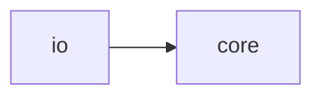

# Jack Io

[_Documentation generated by Documatic_](https://www.documatic.com)

<!---Documatic-section-Codebase Structure-start--->
## Codebase Structure

<!---Documatic-block-system_architecture-start--->

<!---Documatic-block-system_architecture-end--->

# #
<!---Documatic-section-Codebase Structure-end--->

<!---Documatic-section-jack.io.embeddings.glove.load_glove-start--->
## [jack.io.embeddings.glove.load_glove](5-jack_io.md#jack.io.embeddings.glove.load_glove)

<!---Documatic-section-load_glove-start--->
<!---Documatic-block-jack.io.embeddings.glove.load_glove-start--->
<details>
	<summary><code>jack.io.embeddings.glove.load_glove</code> code snippet</summary>

```python
def load_glove(stream, vocab=None):
    logger.info('Loading GloVe vectors ..')
    word2idx = {}
    first_line = stream.readline()
    dim = len(first_line.split()) - 1
    lookup = np.empty([500000, dim], dtype=np.float)
    lookup[0] = np.fromstring(first_line.split(maxsplit=1)[1], sep=' ')
    word2idx[first_line.split(maxsplit=1)[0].decode('utf-8')] = 0
    n = 1
    for line in stream:
        (word, vec) = line.rstrip().split(maxsplit=1)
        if vocab is None or (word in vocab and word not in word2idx):
            word = word.decode('utf-8')
            idx = len(word2idx)
            word2idx[word] = idx
            if idx > np.size(lookup, axis=0) - 1:
                lookup.resize([lookup.shape[0] + 500000, lookup.shape[1]])
            lookup[idx] = np.fromstring(vec, sep=' ')
        n += 1
    lookup.resize([len(word2idx), dim])
    logger.info('Loading GloVe vectors completed.')
    return (word2idx, lookup)
```
</details>
<!---Documatic-block-jack.io.embeddings.glove.load_glove-end--->
<!---Documatic-section-load_glove-end--->

# #
<!---Documatic-section-jack.io.embeddings.glove.load_glove-end--->

[_Documentation generated by Documatic_](https://www.documatic.com)