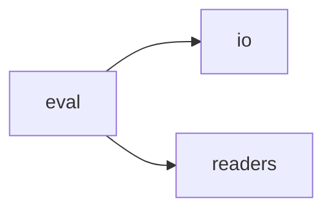

# Jack Eval

[_Documentation generated by Documatic_](https://www.documatic.com)

<!---Documatic-section-Codebase Structure-start--->
## Codebase Structure

<!---Documatic-block-system_architecture-start--->

<!---Documatic-block-system_architecture-end--->

# #
<!---Documatic-section-Codebase Structure-end--->

<!---Documatic-section-jack.eval.base.evaluate_reader-start--->
## [jack.eval.base.evaluate_reader](6-jack_eval.md#jack.eval.base.evaluate_reader)

<!---Documatic-section-evaluate_reader-start--->
<!---Documatic-block-jack.eval.base.evaluate_reader-start--->
<details>
	<summary><code>jack.eval.base.evaluate_reader</code> code snippet</summary>

```python
def evaluate_reader(reader, dataset, batch_size):
    from jack.readers.implementations import extractive_qa_readers, classification_readers, link_prediction_readers
    reader_name = reader.shared_resources.config.get('reader')
    if reader_name in extractive_qa_readers:
        return extractive_qa.evaluate(reader, dataset, batch_size)
    elif reader_name in link_prediction_readers:
        return link_prediction.evaluate(reader, dataset, batch_size)
    elif reader_name in classification_readers:
        return classification.evaluate(reader, dataset, batch_size)
```
</details>
<!---Documatic-block-jack.eval.base.evaluate_reader-end--->
<!---Documatic-section-evaluate_reader-end--->

# #
<!---Documatic-section-jack.eval.base.evaluate_reader-end--->

<!---Documatic-section-jack.eval.base.pretty_print_results-start--->
## [jack.eval.base.pretty_print_results](6-jack_eval.md#jack.eval.base.pretty_print_results)

<!---Documatic-section-pretty_print_results-start--->
<!---Documatic-block-jack.eval.base.pretty_print_results-start--->
<details>
	<summary><code>jack.eval.base.pretty_print_results</code> code snippet</summary>

```python
def pretty_print_results(d, prefix=''):
    for (k, v) in sorted(d.items(), key=lambda x: x[0]):
        if isinstance(v, dict):
            print(prefix + k + ':')
            pretty_print_results(v, prefix + '\t')
        elif '\n' in str(v):
            print(prefix + k + ':')
            print(str(v).replace('\n', '\n' + prefix + '\t'))
        else:
            print(prefix + k + ':', str(v))
```
</details>
<!---Documatic-block-jack.eval.base.pretty_print_results-end--->
<!---Documatic-section-pretty_print_results-end--->

# #
<!---Documatic-section-jack.eval.base.pretty_print_results-end--->

[_Documentation generated by Documatic_](https://www.documatic.com)