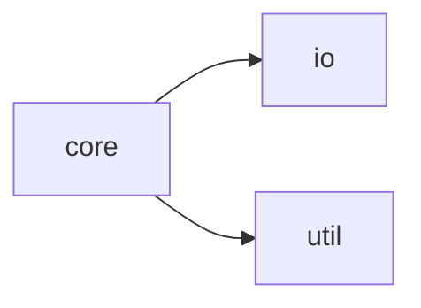
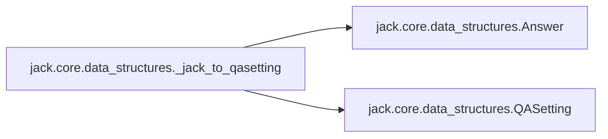
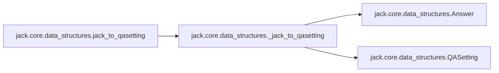

# Jack Core

[_Documentation generated by Documatic_](https://www.documatic.com)

<!---Documatic-section-Codebase Structure-start--->
## Codebase Structure

<!---Documatic-block-system_architecture-start--->

<!---Documatic-block-system_architecture-end--->

# #
<!---Documatic-section-Codebase Structure-end--->

<!---Documatic-section-jack.core.data_structures._jack_to_qasetting-start--->
## [jack.core.data_structures._jack_to_qasetting](7-jack_core.md#jack.core.data_structures._jack_to_qasetting)

<!---Documatic-section-_jack_to_qasetting-start--->


### Object Calls

* [jack.core.data_structures.Answer](7-jack_core.md#jack.core.data_structures.Answer)
* [jack.core.data_structures.QASetting](7-jack_core.md#jack.core.data_structures.QASetting)

<!---Documatic-block-jack.core.data_structures._jack_to_qasetting-start--->
<details>
	<summary><code>jack.core.data_structures._jack_to_qasetting</code> code snippet</summary>

```python
def _jack_to_qasetting(instance, value, global_candidates):
    support = [value(s) for s in instance['support']] if 'support' in instance else None
    idd = value(instance, 'id')
    for question_instance in instance['questions']:
        question = value(question_instance['question'])
        idd = value(question_instance, 'id') or idd
        idd = value(question_instance['question'], 'id') or idd
        if global_candidates is None:
            candidates = [value(c) for c in question_instance['candidates']] if 'candidates' in question_instance else None
        else:
            candidates = global_candidates
        answers = [Answer(value(c), value(c, 'span'), value(c, 'doc_idx', 0)) for c in question_instance['answers']] if 'answers' in question_instance else None
        yield (QASetting(question, support, candidates=candidates, id=idd), answers)
```
</details>
<!---Documatic-block-jack.core.data_structures._jack_to_qasetting-end--->
<!---Documatic-section-_jack_to_qasetting-end--->

# #
<!---Documatic-section-jack.core.data_structures._jack_to_qasetting-end--->

<!---Documatic-section-jack.core.data_structures.jack_to_qasetting-start--->
## [jack.core.data_structures.jack_to_qasetting](7-jack_core.md#jack.core.data_structures.jack_to_qasetting)

<!---Documatic-section-jack_to_qasetting-start--->


### Object Calls

* [jack.core.data_structures._jack_to_qasetting](7-jack_core.md#jack.core.data_structures._jack_to_qasetting)

<!---Documatic-block-jack.core.data_structures.jack_to_qasetting-start--->
<details>
	<summary><code>jack.core.data_structures.jack_to_qasetting</code> code snippet</summary>

```python
def jack_to_qasetting(jtr_data, max_count=None):

    def value(c, key='text', default=None):
        return c.get(key, default) if isinstance(c, dict) else c if key == 'text' else default
    global_candidates = [value(c) for c in jtr_data['globals']['candidates']] if 'globals' in jtr_data else None
    ans = [(inp, answer) for i in jtr_data['instances'] for (inp, answer) in _jack_to_qasetting(i, value, global_candidates)][:max_count]
    return ans
```
</details>
<!---Documatic-block-jack.core.data_structures.jack_to_qasetting-end--->
<!---Documatic-section-jack_to_qasetting-end--->

# #
<!---Documatic-section-jack.core.data_structures.jack_to_qasetting-end--->

<!---Documatic-section-jack.core.data_structures.Answer-start--->
## [jack.core.data_structures.Answer](7-jack_core.md#jack.core.data_structures.Answer)

<!---Documatic-section-Answer-start--->
<!---Documatic-block-jack.core.data_structures.Answer-start--->
<details>
	<summary><code>jack.core.data_structures.Answer</code> code snippet</summary>

```python
class Answer:

    def __init__(self, text: str, span: Tuple[int, int]=None, doc_idx: int=0, score: float=1.0):
        """
        Create a new answer.
        Args:
            text: The text string of the answer.
            span: For extractive QA, a span in the support documents. The triple `(start, end)`
                represents a span in support document with index `doc_index` in the ordered sequence of
            doc_idx: index of document where answer was found
            support documents. The span starts at `start` and ends at `end` (exclusive).
            score: the score a model associates with this answer.
        """
        assert span is None or len(span) == 2, 'span should be (char_start, char_end) tuple'
        self.score = score
        self.span = span
        self.doc_idx = doc_idx
        self.text = text
```
</details>
<!---Documatic-block-jack.core.data_structures.Answer-end--->
<!---Documatic-section-Answer-end--->

# #
<!---Documatic-section-jack.core.data_structures.Answer-end--->

<!---Documatic-section-jack.core.shared_resources.SharedResources-start--->
## [jack.core.shared_resources.SharedResources](7-jack_core.md#jack.core.shared_resources.SharedResources)

<!---Documatic-section-SharedResources-start--->
<!---Documatic-block-jack.core.shared_resources.SharedResources-start--->
<details>
	<summary><code>jack.core.shared_resources.SharedResources</code> code snippet</summary>

```python
class SharedResources:

    def __init__(self, vocab: Vocab=None, config: dict=None, embeddings: Embeddings=None):
        """
        Several shared resources are initialised here, even if no arguments
        are passed when calling __init__.
        The instantiated objects will be filled by the InputModule.
        - self.config holds hyperparameter values and general configuration
            parameters.
        - self.vocab serves as default Vocabulary object.
        - self.answer_vocab is by default the same as self.vocab. However,
            this attribute can be changed by the InputModule, e.g. by setting
            sepvocab=True when calling the setup_from_data() of the InputModule.
        """
        self.config = config or dict()
        self.vocab = vocab
        self.embeddings = embeddings

    def store(self, path):
        """
        Saves all attributes of this object.

        Args:
            path: path to save shared resources
        """
        if not os.path.exists(path):
            os.mkdir(path)
        vocabs = [(k, v) for (k, v) in self.__dict__.items() if isinstance(v, Vocab)]
        with open(os.path.join(path, 'remainder'), 'wb') as f:
            remaining = {k: v for (k, v) in self.__dict__.items() if not isinstance(v, Vocab) and (not k == 'config') and (not k == 'embeddings')}
            pickle.dump(remaining, f, pickle.HIGHEST_PROTOCOL)
        for (k, v) in vocabs:
            v.store(os.path.join(path, k))
        with open(os.path.join(path, 'config.yaml'), 'w') as f:
            yaml.dump(self.config, f)
        if self.embeddings is not None:
            self.embeddings.store(os.path.join(path, 'embeddings'))

    def load(self, path):
        """
        Loads this (potentially empty) resource from path (all object attributes).
        Args:
            path: path to shared resources
        """
        remainder_path = os.path.join(path, 'remainder')
        if os.path.exists(remainder_path):
            with open(remainder_path, 'rb') as f:
                self.__dict__.update(pickle.load(f))
        for f in os.listdir(path):
            if f == 'config.yaml':
                with open(os.path.join(path, f), 'r') as f:
                    self.config = yaml.load(f)
            elif f == 'embeddings':
                self.embeddings = Embeddings.from_dir(os.path.join(path, f))
            else:
                v = Vocab()
                v.load(os.path.join(path, f))
                self.__dict__[f] = v
```
</details>
<!---Documatic-block-jack.core.shared_resources.SharedResources-end--->
<!---Documatic-section-SharedResources-end--->

# #
<!---Documatic-section-jack.core.shared_resources.SharedResources-end--->

<!---Documatic-section-jack.core.tensorflow.TFReader-start--->
## [jack.core.tensorflow.TFReader](7-jack_core.md#jack.core.tensorflow.TFReader)

<!---Documatic-section-TFReader-start--->
<!---Documatic-block-jack.core.tensorflow.TFReader-start--->
<details>
	<summary><code>jack.core.tensorflow.TFReader</code> code snippet</summary>

```python
class TFReader(JTReader):

    @property
    def model_module(self) -> TFModelModule:
        return super().model_module

    @property
    def session(self) -> tf.Session:
        """Returns: input module"""
        return self.model_module.tf_session

    def train(self, optimizer, training_set: Iterable[Tuple[QASetting, List[Answer]]], batch_size: int, max_epochs=10, hooks=tuple(), l2=0.0, clip=None, clip_op=tf.clip_by_value, summary_writer=None, **kwargs):
        """
        This method trains the reader (and changes its state).

        Args:
            optimizer: TF optimizer
            training_set: the training instances.
            batch_size: size of training batches
            max_epochs: maximum number of epochs
            hooks: TrainingHook implementations that are called after epochs and batches
            l2: whether to use l2 regularization
            clip: whether to apply gradient clipping and at which value
            clip_op: operation to perform for clipping
            summary_writer: summary writer
        """
        (batches, loss, min_op, summaries) = self._setup_training(batch_size, clip, optimizer, training_set, summary_writer, l2, clip_op, **kwargs)
        self._train_loop(min_op, loss, batches, hooks, max_epochs, summaries, summary_writer, **kwargs)

    def _setup_training(self, batch_size, clip, optimizer, training_set, summary_writer, l2, clip_op, **kwargs):
        global_step = tf.train.get_global_step()
        if global_step is None:
            global_step = tf.train.create_global_step()
        if not self._is_setup:
            logger.info('Setting up model...')
            self.setup_from_data(training_set, is_training=True)
        logger.info('Preparing training data...')
        batches = self.input_module.batch_generator(training_set, batch_size, is_eval=False)
        logging.basicConfig(stream=sys.stdout, level=logging.DEBUG)
        loss = self.model_module.tensors[Ports.loss]
        summaries = None
        if summary_writer is not None:
            summaries = tf.summary.merge_all()
        if l2:
            loss += tf.add_n([tf.nn.l2_loss(v) for v in self.model_module.train_variables]) * l2
        if clip:
            gradients = optimizer.compute_gradients(loss)
            if clip_op == tf.clip_by_value:
                gradients = [(tf.clip_by_value(grad, clip[0], clip[1]), var) for (grad, var) in gradients if grad is not None]
            elif clip_op == tf.clip_by_norm:
                gradients = [(tf.clip_by_norm(grad, clip), var) for (grad, var) in gradients if grad is not None]
            min_op = optimizer.apply_gradients(gradients, global_step)
        else:
            min_op = optimizer.minimize(loss, global_step)
        variable_size = lambda v: reduce(lambda x, y: x * y, v.get_shape().as_list()) if v.get_shape() else 1
        num_params = sum((variable_size(v) for v in self.model_module.train_variables))
        logger.info('Number of parameters: %d' % num_params)
        self.session.run([v.initializer for v in tf.global_variables() if v not in self.model_module.variables])
        return (batches, loss, min_op, summaries)

    def _train_loop(self, optimization_op, loss_op, batches, hooks, max_epochs, summaries, summary_writer, **kwargs):
        logger.info('Start training...')
        for i in range(1, max_epochs + 1):
            for (j, batch) in enumerate(batches):
                feed_dict = self.model_module.convert_to_feed_dict(batch)
                if summaries is not None:
                    (step, sums, current_loss, _) = self.session.run([tf.train.get_global_step(), summaries, loss_op, optimization_op], feed_dict=feed_dict)
                    summary_writer.add_summary(sums, step)
                else:
                    (current_loss, _) = self.session.run([loss_op, optimization_op], feed_dict=feed_dict)
                for hook in hooks:
                    hook.at_iteration_end(i, current_loss, set_name='train')
            for hook in hooks:
                hook.at_epoch_end(i)
```
</details>
<!---Documatic-block-jack.core.tensorflow.TFReader-end--->
<!---Documatic-section-TFReader-end--->

# #
<!---Documatic-section-jack.core.tensorflow.TFReader-end--->

<!---Documatic-section-jack.core.data_structures.QASetting-start--->
## [jack.core.data_structures.QASetting](7-jack_core.md#jack.core.data_structures.QASetting)

<!---Documatic-section-QASetting-start--->
<!---Documatic-block-jack.core.data_structures.QASetting-start--->
<details>
	<summary><code>jack.core.data_structures.QASetting</code> code snippet</summary>

```python
class QASetting:

    def __init__(self, question: str, support: Sequence[str]=(), id: str=None, candidates: Sequence[str]=None, seq_candidates: Sequence[str]=None, candidate_spans: Sequence[Tuple[int, int, int]]=None):
        """
        Create a new QASetting.
        Args:
            question: the question text.
            support: a sequence of support documents the answerer has access to when answering the question.
            id: an identifier for this question setting.
            candidates: a list of candidate answer strings.
            candidate_spans: for extractive QA, a sequence of candidate spans in the support documents.
            A span `(doc_index,start,end)` corresponds to a span in support document with index `doc_index`,
            with start position `start` and end position `end`.
        """
        self.id = id
        self.candidate_spans = candidate_spans
        self.candidates = candidates
        self.support = support
        self.question = question
```
</details>
<!---Documatic-block-jack.core.data_structures.QASetting-end--->
<!---Documatic-section-QASetting-end--->

# #
<!---Documatic-section-jack.core.data_structures.QASetting-end--->

[_Documentation generated by Documatic_](https://www.documatic.com)