# Jack Util

[_Documentation generated by Documatic_](https://www.documatic.com)

<!---Documatic-section-Codebase Structure-start--->
## Codebase Structure

<!---Documatic-block-system_architecture-start--->
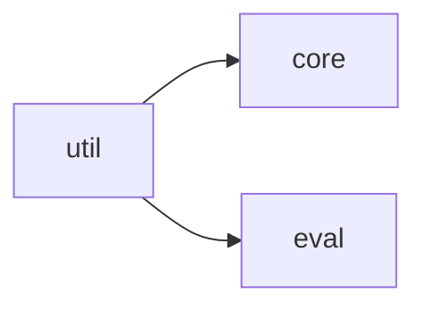
<!---Documatic-block-system_architecture-end--->

# #
<!---Documatic-section-Codebase Structure-end--->

<!---Documatic-section-jack.util.map.numpify-start--->
## [jack.util.map.numpify](8-jack_util.md#jack.util.map.numpify)

<!---Documatic-section-numpify-start--->
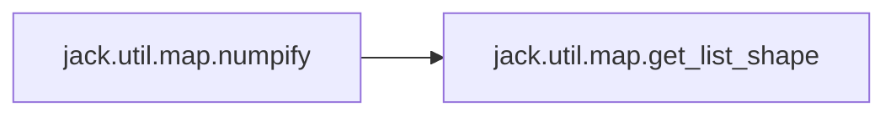

### Object Calls

* [jack.util.map.get_list_shape](8-jack_util.md#jack.util.map.get_list_shape)

<!---Documatic-block-jack.util.map.numpify-start--->
<details>
	<summary><code>jack.util.map.numpify</code> code snippet</summary>

```python
def numpify(xs, pad=0, keys=None, dtypes=None):
    is_dict = isinstance(xs, dict)
    xs_np = {} if is_dict else [0] * len(xs)
    xs_iter = xs.items() if is_dict else enumerate(xs)
    for (i, (key, x)) in enumerate(xs_iter):
        try:
            if (keys is None or key in keys) and (not isinstance(x, np.ndarray)):
                shape = get_list_shape(x)
                dtype = dtypes[i] if dtypes is not None else np.int64
                x_np = np.full(shape, pad, dtype)
                nb_dims = len(shape)
                if nb_dims == 0:
                    x_np = x
                else:

                    def f(tensor, values):
                        t_shp = tensor.shape
                        if len(t_shp) > 1:
                            for (_i, _values) in enumerate(values):
                                f(tensor[_i], _values)
                        else:
                            tensor[0:len(values)] = [v for v in values]
                    f(x_np, x)
                xs_np[key] = x_np
            else:
                xs_np[key] = x
        except Exception as e:
            logger.error('Error numpifying value ' + str(x) + ' of key ' + str(key))
            raise e
    return xs_np
```
</details>
<!---Documatic-block-jack.util.map.numpify-end--->
<!---Documatic-section-numpify-end--->

# #
<!---Documatic-section-jack.util.map.numpify-end--->

<!---Documatic-section-jack.util.tf.embedding.conv_char_embedding-start--->
## [jack.util.tf.embedding.conv_char_embedding](8-jack_util.md#jack.util.tf.embedding.conv_char_embedding)

<!---Documatic-section-conv_char_embedding-start--->
<!---Documatic-block-jack.util.tf.embedding.conv_char_embedding-start--->
<details>
	<summary><code>jack.util.tf.embedding.conv_char_embedding</code> code snippet</summary>

```python
def conv_char_embedding(num_chars, repr_dim, word_chars, word_lengths, word_sequences=None, conv_width=5, emb_initializer=tf.random_normal_initializer(0.0, 0.1), scope=None):
    pad = tf.zeros(tf.stack([tf.shape(word_lengths)[0], conv_width // 2]), tf.int32)
    word_chars = tf.concat([pad, word_chars, pad], 1)
    with tf.variable_scope(scope or 'char_embeddings'):
        char_embedding_matrix = tf.get_variable('char_embedding_matrix', shape=(num_chars, repr_dim), initializer=emb_initializer, trainable=True)
        max_word_length = tf.reduce_max(word_lengths)
        embedded_chars = tf.nn.embedding_lookup(char_embedding_matrix, tf.cast(word_chars, tf.int32))
        with tf.variable_scope('conv'):
            filter = tf.get_variable('filter', [conv_width * repr_dim, repr_dim])
            filter_reshaped = tf.reshape(filter, [conv_width, repr_dim, repr_dim])
            conv_out = tf.nn.conv1d(embedded_chars, filter_reshaped, 1, 'VALID')
            conv_mask = tf.expand_dims(misc.mask_for_lengths(word_lengths, max_length=max_word_length), 2)
            conv_out = conv_out + conv_mask
        embedded_words = tf.reduce_max(conv_out, 1)
    if word_sequences is None:
        return embedded_words
    if not isinstance(word_sequences, list):
        word_sequences = [word_sequences]
    all_embedded = []
    for word_idxs in word_sequences:
        all_embedded.append(tf.nn.embedding_lookup(embedded_words, word_idxs))
    return all_embedded
```
</details>
<!---Documatic-block-jack.util.tf.embedding.conv_char_embedding-end--->
<!---Documatic-section-conv_char_embedding-end--->

# #
<!---Documatic-section-jack.util.tf.embedding.conv_char_embedding-end--->

<!---Documatic-section-jack.util.tf.modular_encoder.modular_encoder-start--->
## [jack.util.tf.modular_encoder.modular_encoder](8-jack_util.md#jack.util.tf.modular_encoder.modular_encoder)

<!---Documatic-section-modular_encoder-start--->
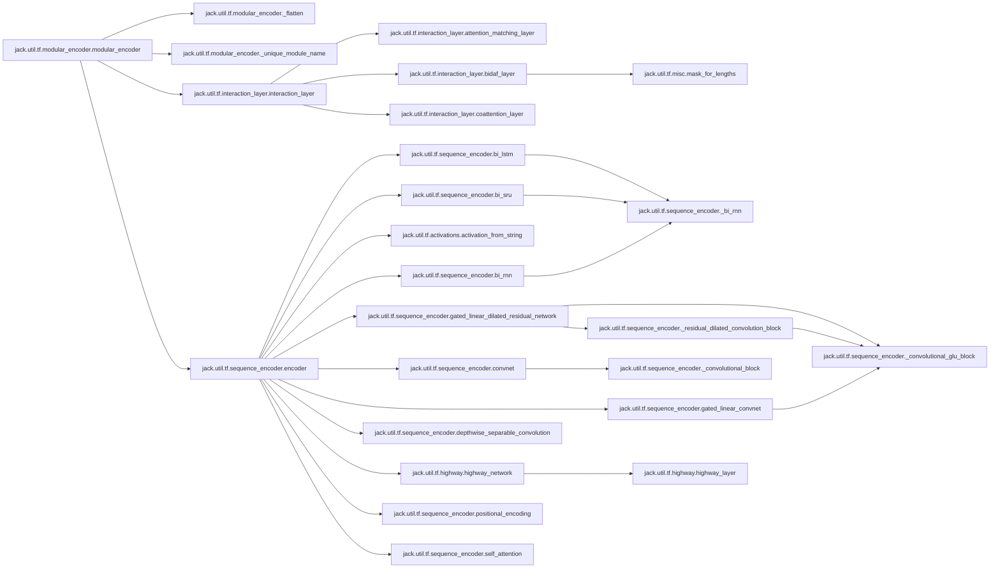

### Object Calls

* [jack.util.tf.modular_encoder._flatten](8-jack_util.md#jack.util.tf.modular_encoder._flatten)
* [jack.util.tf.modular_encoder._unique_module_name](8-jack_util.md#jack.util.tf.modular_encoder._unique_module_name)
* [jack.util.tf.interaction_layer.interaction_layer](8-jack_util.md#jack.util.tf.interaction_layer.interaction_layer)
* [jack.util.tf.sequence_encoder.encoder](8-jack_util.md#jack.util.tf.sequence_encoder.encoder)

<!---Documatic-block-jack.util.tf.modular_encoder.modular_encoder-start--->
<details>
	<summary><code>jack.util.tf.modular_encoder.modular_encoder</code> code snippet</summary>

```python
def modular_encoder(encoder_config, inputs, inputs_length, inputs_mapping, default_repr_dim, dropout, is_eval):
    outputs = dict(inputs)
    outputs_length = dict(inputs_length)
    outputs_mapping = dict(inputs_mapping)
    seen_layer = set()

    def encode_module(module):
        module_type = module['module']
        reuse = module['name'] in seen_layer
        seen_layer.add(module['name'])
        if module_type == 'repeat':
            reuse = module.get('reuse')
            for k in range(module['num']):
                prefix = module['name'] + '/' if reuse else '%s_%d/' % (module['name'], k)
                for (j, inner_module) in enumerate(module['encoder']):
                    inner_module = copy.deepcopy(inner_module)
                    if 'name' not in inner_module:
                        inner_module['name'] = _unique_module_name(inner_module, j)
                    inner_module['name'] = prefix + inner_module['name']
                    encode_module(inner_module)
            return
        try:
            key = module['input']
            out_key = module.get('output', key)
            if module['module'] in ['concat', 'add', 'mul', 'weighted_add', 'sub']:
                outputs_length[out_key] = outputs_length[key[0]]
                outputs_mapping[out_key] = outputs_mapping.get(key[0])
                if module['module'] == 'concat':
                    outputs[out_key] = tf.concat([outputs[k] for k in key], 2, name=module['name'])
                    return
                if module['module'] == 'add':
                    outputs[out_key] = tf.add_n([outputs[k] for k in key], name=module['name'])
                    return
                if module['module'] == 'sub':
                    outputs[out_key] = tf.subtract(outputs[key[0]], outputs[key[1]], name=module['name'])
                    return
                if module['module'] == 'mul':
                    o = outputs[key[0]]
                    for k in key[1:-1]:
                        o *= outputs[k]
                    outputs[out_key] = tf.multiply(o, outputs[key[-1]], name=module['name'])
                    return
                if module['module'] == 'weighted_add':
                    bias = module.get('bias', 0.0)
                    g = tf.layers.dense(tf.concat([outputs[k] for k in key], 2), outputs[key[0]].get_shape()[-1].value, tf.sigmoid, bias_initializer=tf.constant_initializer(bias))
                    outputs[out_key] = tf.identity(g * outputs[key[0]] + (1.0 - g) * outputs[key[0]], name=module['name'])
                    return
            if 'repr_dim' not in module:
                module['repr_dim'] = default_repr_dim
            if 'dependent' in module:
                dep_key = module['dependent']
                outputs[out_key] = interaction_layer(outputs[key], outputs_length[key], outputs[dep_key], outputs_length[dep_key], outputs_mapping.get(key), outputs_mapping.get(dep_key), reuse=reuse, **module)
            else:
                if module.get('dropout') is True:
                    module['dropout'] = dropout
                outputs[out_key] = encoder(outputs[key], outputs_length[key], reuse=reuse, is_eval=is_eval, **module)
            outputs_length[out_key] = outputs_length[key]
            outputs_mapping[out_key] = outputs_mapping.get(key)
        except Exception as e:
            logger.error('Creating module %s failed.', module['name'])
            raise e
    encoder_config = _flatten(encoder_config)
    encoder_config = copy.deepcopy(encoder_config)
    for (i, module) in enumerate(encoder_config):
        if 'name' not in module:
            module['name'] = _unique_module_name(module, i)
        encode_module(module)
    return (outputs, outputs_length, outputs_mapping)
```
</details>
<!---Documatic-block-jack.util.tf.modular_encoder.modular_encoder-end--->
<!---Documatic-section-modular_encoder-end--->

# #
<!---Documatic-section-jack.util.tf.modular_encoder.modular_encoder-end--->

<!---Documatic-section-jack.util.tf.segment.segment_softmax-start--->
## [jack.util.tf.segment.segment_softmax](8-jack_util.md#jack.util.tf.segment.segment_softmax)

<!---Documatic-section-segment_softmax-start--->
<!---Documatic-block-jack.util.tf.segment.segment_softmax-start--->
<details>
	<summary><code>jack.util.tf.segment.segment_softmax</code> code snippet</summary>

```python
def segment_softmax(scores, segment_ids):
    num_segments = tf.reduce_max(segment_ids) + 1
    if len(scores.get_shape()) == 2:
        max_per_partition = tf.unsorted_segment_max(tf.reduce_max(scores, axis=1), segment_ids, num_segments)
        scores -= tf.expand_dims(tf.gather(max_per_partition, segment_ids), axis=1)
    else:
        max_per_partition = tf.unsorted_segment_max(scores, segment_ids, num_segments)
        scores -= tf.gather(max_per_partition, segment_ids)
    scores_exp = tf.exp(scores)
    if len(scores.get_shape()) == 2:
        scores_exp_sum_per_partition = tf.unsorted_segment_sum(tf.reduce_sum(scores_exp, axis=1), segment_ids, num_segments)
        probs = scores_exp / tf.expand_dims(tf.gather(scores_exp_sum_per_partition, segment_ids), axis=1)
    else:
        scores_exp_sum_per_partition = tf.unsorted_segment_sum(scores_exp, segment_ids, num_segments)
        probs = scores_exp / tf.gather(scores_exp_sum_per_partition, segment_ids)
    return probs
```
</details>
<!---Documatic-block-jack.util.tf.segment.segment_softmax-end--->
<!---Documatic-section-segment_softmax-end--->

# #
<!---Documatic-section-jack.util.tf.segment.segment_softmax-end--->

<!---Documatic-section-jack.util.tf.highway.highway_network-start--->
## [jack.util.tf.highway.highway_network](8-jack_util.md#jack.util.tf.highway.highway_network)

<!---Documatic-section-highway_network-start--->
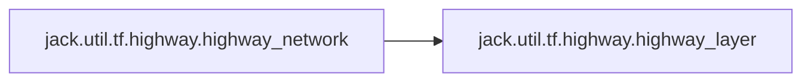

### Object Calls

* [jack.util.tf.highway.highway_layer](8-jack_util.md#jack.util.tf.highway.highway_layer)

<!---Documatic-block-jack.util.tf.highway.highway_network-start--->
<details>
	<summary><code>jack.util.tf.highway.highway_network</code> code snippet</summary>

```python
def highway_network(inputs, num_layers, activation=tf.tanh, name=None, reuse=False):
    with tf.variable_scope(name or 'highway_network', reuse=reuse):
        prev = inputs
        cur = None
        for layer_idx in range(num_layers):
            cur = highway_layer(prev, activation, name='layer_{}'.format(layer_idx))
            prev = cur
    return cur
```
</details>
<!---Documatic-block-jack.util.tf.highway.highway_network-end--->
<!---Documatic-section-highway_network-end--->

# #
<!---Documatic-section-jack.util.tf.highway.highway_network-end--->

<!---Documatic-section-jack.util.tf.sequence_encoder.encoder-start--->
## [jack.util.tf.sequence_encoder.encoder](8-jack_util.md#jack.util.tf.sequence_encoder.encoder)

<!---Documatic-section-encoder-start--->
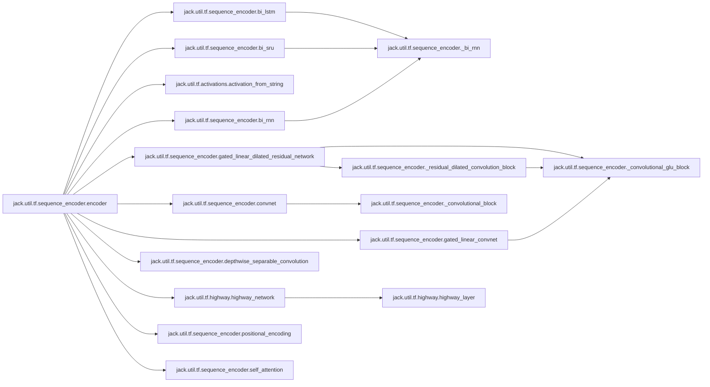

### Object Calls

* [jack.util.tf.sequence_encoder.bi_lstm](8-jack_util.md#jack.util.tf.sequence_encoder.bi_lstm)
* [jack.util.tf.sequence_encoder.bi_sru](8-jack_util.md#jack.util.tf.sequence_encoder.bi_sru)
* [jack.util.tf.activations.activation_from_string](8-jack_util.md#jack.util.tf.activations.activation_from_string)
* [jack.util.tf.sequence_encoder.bi_rnn](8-jack_util.md#jack.util.tf.sequence_encoder.bi_rnn)
* [jack.util.tf.sequence_encoder.gated_linear_dilated_residual_network](8-jack_util.md#jack.util.tf.sequence_encoder.gated_linear_dilated_residual_network)
* [jack.util.tf.sequence_encoder.convnet](8-jack_util.md#jack.util.tf.sequence_encoder.convnet)
* [jack.util.tf.sequence_encoder.gated_linear_convnet](8-jack_util.md#jack.util.tf.sequence_encoder.gated_linear_convnet)
* [jack.util.tf.sequence_encoder.depthwise_separable_convolution](8-jack_util.md#jack.util.tf.sequence_encoder.depthwise_separable_convolution)
* [jack.util.tf.highway.highway_network](8-jack_util.md#jack.util.tf.highway.highway_network)
* [jack.util.tf.sequence_encoder.positional_encoding](8-jack_util.md#jack.util.tf.sequence_encoder.positional_encoding)
* [jack.util.tf.sequence_encoder.self_attention](8-jack_util.md#jack.util.tf.sequence_encoder.self_attention)

<!---Documatic-block-jack.util.tf.sequence_encoder.encoder-start--->
<details>
	<summary><code>jack.util.tf.sequence_encoder.encoder</code> code snippet</summary>

```python
def encoder(sequence, seq_length, repr_dim=100, module='lstm', num_layers=1, reuse=None, residual=False, activation=None, layer_norm=False, name='encoder', dropout=None, is_eval=True, **kwargs):
    if num_layers == 1:
        if layer_norm:
            with tf.variable_scope('layernorm', reuse=False) as vs:
                vs._reuse = False
                num_layernorms = sum((1 for v in vs.global_variables() if 'layernorm' in v.name))
                sequence = tf.contrib.layers.layer_norm(sequence, scope=str(num_layernorms))
        with tf.variable_scope(name, reuse=reuse):
            if module == 'lstm':
                out = bi_lstm(repr_dim, sequence, seq_length, **kwargs)
                if activation:
                    out = activation_from_string(activation)(out)
            elif module == 'sru':
                with_residual = sequence.get_shape()[2].value == repr_dim
                out = bi_sru(repr_dim, sequence, seq_length, with_residual, **kwargs)
                if activation:
                    out = activation_from_string(activation)(out)
            elif module == 'rnn':
                out = bi_rnn(repr_dim, tf.nn.rnn_cell.BasicRNNCell(repr_dim, activation_from_string(activation)), sequence, seq_length, **kwargs)
            elif module == 'gru':
                out = bi_rnn(repr_dim, tf.contrib.rnn.GRUBlockCell(repr_dim), sequence, seq_length, **kwargs)
                if activation:
                    out = activation_from_string(activation)(out)
            elif module == 'gldr':
                out = gated_linear_dilated_residual_network(repr_dim, sequence, **kwargs)
            elif module == 'conv':
                out = convnet(repr_dim, sequence, 1, activation=activation_from_string(activation), **kwargs)
            elif module == 'conv_glu':
                out = gated_linear_convnet(repr_dim, sequence, 1, **kwargs)
            elif module == 'conv_separable':
                out = depthwise_separable_convolution(repr_dim, sequence, activation=activation_from_string(activation), **kwargs)
            elif module == 'dense':
                out = tf.layers.dense(sequence, repr_dim)
                if activation:
                    out = activation_from_string(activation)(out)
            elif module == 'highway':
                out = highway_network(sequence, num_layers, activation_from_string(activation))
            elif module == 'self_attn':
                outs = []
                num_attn = kwargs.get('num_attn_heads', 1)
                for i in range(num_attn):
                    with tf.variable_scope(str(i)):
                        attn = self_attention(sequence, seq_length, repr_dim=repr_dim, **kwargs)
                        outs.append(attn)
                out = tf.concat(outs, 2) if num_attn > 1 else outs[0]
            elif module == 'positional_encoding':
                out = positional_encoding(sequence, seq_length)
            else:
                raise ValueError('Unknown encoder type: %s' % module)
            if residual:
                if out.get_shape()[-1].value != sequence.get_shape()[-1].value:
                    logging.error('Residual connection only possible if input to sequence encoder %s of type %s has same dimension (%d) as output (%d).' % (name, module, sequence.get_shape()[-1].value, out.get_shape()[-1].value))
                    raise RuntimeError()
                out += sequence
            if dropout is not None:
                out = tf.cond(tf.logical_and(tf.greater(dropout, 0.0), tf.logical_not(is_eval)), lambda : tf.nn.dropout(out, 1.0 - dropout, noise_shape=[tf.shape(out)[0], 1, tf.shape(out)[-1]]), lambda : out)
    else:
        out = encoder(sequence, seq_length, repr_dim, module, num_layers - 1, reuse, residual, activation, layer_norm, name, dropout=dropout, is_eval=is_eval, **kwargs)
        out = encoder(out, seq_length, repr_dim, module, 1, reuse, residual, activation, layer_norm, name + str(num_layers - 1), dropout=dropout, is_eval=is_eval, **kwargs)
    return out
```
</details>
<!---Documatic-block-jack.util.tf.sequence_encoder.encoder-end--->
<!---Documatic-section-encoder-end--->

# #
<!---Documatic-section-jack.util.tf.sequence_encoder.encoder-end--->

<!---Documatic-section-jack.util.tf.modular_encoder._unique_module_name-start--->
## [jack.util.tf.modular_encoder._unique_module_name](8-jack_util.md#jack.util.tf.modular_encoder._unique_module_name)

<!---Documatic-section-_unique_module_name-start--->
<!---Documatic-block-jack.util.tf.modular_encoder._unique_module_name-start--->
<details>
	<summary><code>jack.util.tf.modular_encoder._unique_module_name</code> code snippet</summary>

```python
def _unique_module_name(module, layer_depth):
    inp = module.get('input', '')
    inp_str = inp if isinstance(inp, str) else '_'.join(inp)
    name = '_'.join([str(layer_depth), inp_str, module['module']])
    return name
```
</details>
<!---Documatic-block-jack.util.tf.modular_encoder._unique_module_name-end--->
<!---Documatic-section-_unique_module_name-end--->

# #
<!---Documatic-section-jack.util.tf.modular_encoder._unique_module_name-end--->

<!---Documatic-section-jack.util.tf.sequence_encoder.positional_encoding-start--->
## [jack.util.tf.sequence_encoder.positional_encoding](8-jack_util.md#jack.util.tf.sequence_encoder.positional_encoding)

<!---Documatic-section-positional_encoding-start--->
<!---Documatic-block-jack.util.tf.sequence_encoder.positional_encoding-start--->
<details>
	<summary><code>jack.util.tf.sequence_encoder.positional_encoding</code> code snippet</summary>

```python
def positional_encoding(inputs, lengths, **kwargs):
    repr_dim = inputs.get_shape()[-1].value
    pos = tf.reshape(tf.range(0.0, tf.to_float(tf.reduce_max(lengths)), dtype=tf.float32), [-1, 1])
    i = np.arange(0, repr_dim, 2, np.float32)
    denom = np.reshape(np.power(10000.0, i / repr_dim), [1, -1])
    enc = tf.expand_dims(tf.concat([tf.sin(pos / denom), tf.cos(pos / denom)], 1), 0)
    return inputs + tf.tile(enc, [tf.shape(inputs)[0], 1, 1])
```
</details>
<!---Documatic-block-jack.util.tf.sequence_encoder.positional_encoding-end--->
<!---Documatic-section-positional_encoding-end--->

# #
<!---Documatic-section-jack.util.tf.sequence_encoder.positional_encoding-end--->

<!---Documatic-section-jack.util.tf.sequence_encoder.depthwise_separable_convolution-start--->
## [jack.util.tf.sequence_encoder.depthwise_separable_convolution](8-jack_util.md#jack.util.tf.sequence_encoder.depthwise_separable_convolution)

<!---Documatic-section-depthwise_separable_convolution-start--->
<!---Documatic-block-jack.util.tf.sequence_encoder.depthwise_separable_convolution-start--->
<details>
	<summary><code>jack.util.tf.sequence_encoder.depthwise_separable_convolution</code> code snippet</summary>

```python
def depthwise_separable_convolution(repr_dim, inputs, conv_width, activation=tf.nn.relu, bias=True, **kwargs):
    inputs = tf.expand_dims(inputs, 1)
    shapes = inputs.shape.as_list()
    depthwise_filter = tf.get_variable('depthwise_filter', (1, conv_width, shapes[-1], 1), dtype=tf.float32)
    pointwise_filter = tf.get_variable('pointwise_filter', (1, 1, shapes[-1], repr_dim), dtype=tf.float32)
    outputs = tf.nn.separable_conv2d(inputs, depthwise_filter, pointwise_filter, strides=(1, 1, 1, 1), padding='SAME')
    outputs = tf.squeeze(outputs, 1)
    if bias:
        b = tf.get_variable('bias', outputs.shape[-1], initializer=tf.zeros_initializer())
        outputs += b
    outputs = activation(outputs)
    return outputs
```
</details>
<!---Documatic-block-jack.util.tf.sequence_encoder.depthwise_separable_convolution-end--->
<!---Documatic-section-depthwise_separable_convolution-end--->

# #
<!---Documatic-section-jack.util.tf.sequence_encoder.depthwise_separable_convolution-end--->

<!---Documatic-section-jack.util.map.get_list_shape-start--->
## [jack.util.map.get_list_shape](8-jack_util.md#jack.util.map.get_list_shape)

<!---Documatic-section-get_list_shape-start--->
<!---Documatic-block-jack.util.map.get_list_shape-start--->
<details>
	<summary><code>jack.util.map.get_list_shape</code> code snippet</summary>

```python
def get_list_shape(xs):
    if isinstance(xs, int):
        shape = []
    else:
        shape = [len(xs)]
        for (i, x) in enumerate(xs):
            if isinstance(x, list) or isinstance(x, tuple):
                if len(shape) == 1:
                    shape.append(0)
                shape[1] = max(len(x), shape[1])
                for (j, y) in enumerate(x):
                    if isinstance(y, list):
                        if len(shape) == 2:
                            shape.append(0)
                        shape[2] = max(len(y), shape[2])
    return shape
```
</details>
<!---Documatic-block-jack.util.map.get_list_shape-end--->
<!---Documatic-section-get_list_shape-end--->

# #
<!---Documatic-section-jack.util.map.get_list_shape-end--->

<!---Documatic-section-jack.util.tf.sequence_encoder.convnet-start--->
## [jack.util.tf.sequence_encoder.convnet](8-jack_util.md#jack.util.tf.sequence_encoder.convnet)

<!---Documatic-section-convnet-start--->
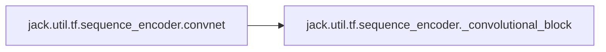

### Object Calls

* jack.util.tf.sequence_encoder._convolutional_block

<!---Documatic-block-jack.util.tf.sequence_encoder.convnet-start--->
<details>
	<summary><code>jack.util.tf.sequence_encoder.convnet</code> code snippet</summary>

```python
def convnet(repr_dim, inputs, num_layers, conv_width=3, activation=tf.nn.relu, **kwargs):
    output = inputs
    for i in range(num_layers):
        output = _convolutional_block(output, repr_dim, conv_width=conv_width, name='conv_%d' % i)
    return output
```
</details>
<!---Documatic-block-jack.util.tf.sequence_encoder.convnet-end--->
<!---Documatic-section-convnet-end--->

# #
<!---Documatic-section-jack.util.tf.sequence_encoder.convnet-end--->

<!---Documatic-section-jack.util.tf.sequence_encoder.bi_lstm-start--->
## [jack.util.tf.sequence_encoder.bi_lstm](8-jack_util.md#jack.util.tf.sequence_encoder.bi_lstm)

<!---Documatic-section-bi_lstm-start--->
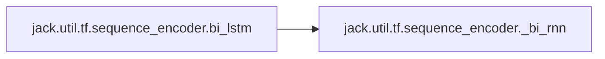

### Object Calls

* jack.util.tf.sequence_encoder._bi_rnn

<!---Documatic-block-jack.util.tf.sequence_encoder.bi_lstm-start--->
<details>
	<summary><code>jack.util.tf.sequence_encoder.bi_lstm</code> code snippet</summary>

```python
def bi_lstm(size, sequence, seq_length, with_projection=False, **kwargs):
    fused_rnn = tf.contrib.rnn.LSTMBlockFusedCell(size)
    return _bi_rnn(size, fused_rnn, sequence, seq_length, with_projection)
```
</details>
<!---Documatic-block-jack.util.tf.sequence_encoder.bi_lstm-end--->
<!---Documatic-section-bi_lstm-end--->

# #
<!---Documatic-section-jack.util.tf.sequence_encoder.bi_lstm-end--->

<!---Documatic-section-jack.util.tf.modular_encoder._flatten-start--->
## [jack.util.tf.modular_encoder._flatten](8-jack_util.md#jack.util.tf.modular_encoder._flatten)

<!---Documatic-section-_flatten-start--->
<!---Documatic-block-jack.util.tf.modular_encoder._flatten-start--->
<details>
	<summary><code>jack.util.tf.modular_encoder._flatten</code> code snippet</summary>

```python
def _flatten(l):
    if isinstance(l, list):
        return [module for sl in l for module in _flatten(sl)]
    else:
        return [l]
```
</details>
<!---Documatic-block-jack.util.tf.modular_encoder._flatten-end--->
<!---Documatic-section-_flatten-end--->

# #
<!---Documatic-section-jack.util.tf.modular_encoder._flatten-end--->

<!---Documatic-section-jack.util.tf.sequence_encoder.gated_linear_convnet-start--->
## [jack.util.tf.sequence_encoder.gated_linear_convnet](8-jack_util.md#jack.util.tf.sequence_encoder.gated_linear_convnet)

<!---Documatic-section-gated_linear_convnet-start--->
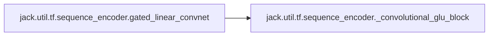

### Object Calls

* jack.util.tf.sequence_encoder._convolutional_glu_block

<!---Documatic-block-jack.util.tf.sequence_encoder.gated_linear_convnet-start--->
<details>
	<summary><code>jack.util.tf.sequence_encoder.gated_linear_convnet</code> code snippet</summary>

```python
def gated_linear_convnet(out_size, inputs, num_layers, conv_width=3, **kwargs):
    output = inputs
    for i in range(num_layers):
        output = _convolutional_glu_block(output, out_size, conv_width=conv_width, name='conv_%d' % i)
    return output
```
</details>
<!---Documatic-block-jack.util.tf.sequence_encoder.gated_linear_convnet-end--->
<!---Documatic-section-gated_linear_convnet-end--->

# #
<!---Documatic-section-jack.util.tf.sequence_encoder.gated_linear_convnet-end--->

<!---Documatic-section-jack.util.tf.sequence_encoder.gated_linear_dilated_residual_network-start--->
## [jack.util.tf.sequence_encoder.gated_linear_dilated_residual_network](8-jack_util.md#jack.util.tf.sequence_encoder.gated_linear_dilated_residual_network)

<!---Documatic-section-gated_linear_dilated_residual_network-start--->
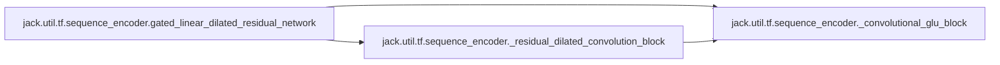

### Object Calls

* jack.util.tf.sequence_encoder._convolutional_glu_block
* jack.util.tf.sequence_encoder._residual_dilated_convolution_block

<!---Documatic-block-jack.util.tf.sequence_encoder.gated_linear_dilated_residual_network-start--->
<details>
	<summary><code>jack.util.tf.sequence_encoder.gated_linear_dilated_residual_network</code> code snippet</summary>

```python
def gated_linear_dilated_residual_network(out_size, inputs, dilations, conv_width=3, name='gldr_network', reuse=None, **kwargs):
    output = _convolutional_glu_block(inputs, out_size, name='conv_dim_reduction')
    for (i, d) in enumerate(dilations):
        output = _residual_dilated_convolution_block(output, d, conv_width, name='dilated_conv_%d' % i)
    return output
```
</details>
<!---Documatic-block-jack.util.tf.sequence_encoder.gated_linear_dilated_residual_network-end--->
<!---Documatic-section-gated_linear_dilated_residual_network-end--->

# #
<!---Documatic-section-jack.util.tf.sequence_encoder.gated_linear_dilated_residual_network-end--->

<!---Documatic-section-jack.util.tf.sequence_encoder.self_attention-start--->
## [jack.util.tf.sequence_encoder.self_attention](8-jack_util.md#jack.util.tf.sequence_encoder.self_attention)

<!---Documatic-section-self_attention-start--->
<!---Documatic-block-jack.util.tf.sequence_encoder.self_attention-start--->
<details>
	<summary><code>jack.util.tf.sequence_encoder.self_attention</code> code snippet</summary>

```python
def self_attention(inputs, lengths, attn_type='bilinear', scaled=True, activation=None, with_sentinel=False, **kwargs):
    if attn_type == 'bilinear':
        attn_states = attention.bilinear_attention(inputs, inputs, lengths, scaled, with_sentinel, **kwargs)[2]
    elif attn_type == 'dot':
        attn_states = attention.dot_attention(inputs, inputs, lengths, scaled, with_sentinel, **kwargs)[2]
    elif attn_type == 'diagonal_bilinear':
        attn_states = attention.diagonal_bilinear_attention(inputs, inputs, lengths, scaled, with_sentinel, **kwargs)[2]
    elif attn_type == 'mlp':
        attn_states = attention.mlp_attention(kwargs['repr_dim'], activation, inputs, inputs, lengths, with_sentinel, **kwargs)[2]
    else:
        raise ValueError('Unknown attention type: %s' % attn_type)
    return attn_states
```
</details>
<!---Documatic-block-jack.util.tf.sequence_encoder.self_attention-end--->
<!---Documatic-section-self_attention-end--->

# #
<!---Documatic-section-jack.util.tf.sequence_encoder.self_attention-end--->

<!---Documatic-section-jack.util.tf.sequence_encoder.bi_sru-start--->
## [jack.util.tf.sequence_encoder.bi_sru](8-jack_util.md#jack.util.tf.sequence_encoder.bi_sru)

<!---Documatic-section-bi_sru-start--->
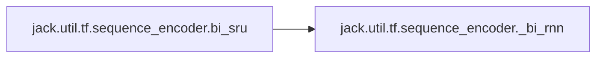

### Object Calls

* jack.util.tf.sequence_encoder._bi_rnn

<!---Documatic-block-jack.util.tf.sequence_encoder.bi_sru-start--->
<details>
	<summary><code>jack.util.tf.sequence_encoder.bi_sru</code> code snippet</summary>

```python
def bi_sru(size, sequence, seq_length, with_residual=True, name='bi_sru', reuse=None, with_projection=False, **kwargs):
    fused_rnn = rnn.SRUFusedRNN(size, with_residual)
    return _bi_rnn(size, fused_rnn, sequence, seq_length, with_projection)
```
</details>
<!---Documatic-block-jack.util.tf.sequence_encoder.bi_sru-end--->
<!---Documatic-section-bi_sru-end--->

# #
<!---Documatic-section-jack.util.tf.sequence_encoder.bi_sru-end--->

<!---Documatic-section-jack.util.tf.activations.activation_from_string-start--->
## [jack.util.tf.activations.activation_from_string](8-jack_util.md#jack.util.tf.activations.activation_from_string)

<!---Documatic-section-activation_from_string-start--->
<!---Documatic-block-jack.util.tf.activations.activation_from_string-start--->
<details>
	<summary><code>jack.util.tf.activations.activation_from_string</code> code snippet</summary>

```python
def activation_from_string(activation_str):
    if activation_str is None:
        return tf.identity
    return getattr(tf.nn, activation_str)
```
</details>
<!---Documatic-block-jack.util.tf.activations.activation_from_string-end--->
<!---Documatic-section-activation_from_string-end--->

# #
<!---Documatic-section-jack.util.tf.activations.activation_from_string-end--->

<!---Documatic-section-jack.util.tf.highway.highway_layer-start--->
## [jack.util.tf.highway.highway_layer](8-jack_util.md#jack.util.tf.highway.highway_layer)

<!---Documatic-section-highway_layer-start--->
<!---Documatic-block-jack.util.tf.highway.highway_layer-start--->
<details>
	<summary><code>jack.util.tf.highway.highway_layer</code> code snippet</summary>

```python
def highway_layer(inputs, activation, name=None):
    with tf.variable_scope(name or 'highway_layer'):
        d = inputs.get_shape()[-1].value
        trans_gate = tf.contrib.layers.fully_connected(inputs, 2 * d, activation_fn=None, weights_initializer=None, scope='trans_gate')
        (trans, gate) = tf.split(trans_gate, 2, len(inputs.get_shape()) - 1)
        (trans, gate) = (activation(trans), tf.sigmoid(gate))
        out = gate * trans + (1 - gate) * inputs
        return out
```
</details>
<!---Documatic-block-jack.util.tf.highway.highway_layer-end--->
<!---Documatic-section-highway_layer-end--->

# #
<!---Documatic-section-jack.util.tf.highway.highway_layer-end--->

<!---Documatic-section-jack.util.tf.interaction_layer.interaction_layer-start--->
## [jack.util.tf.interaction_layer.interaction_layer](8-jack_util.md#jack.util.tf.interaction_layer.interaction_layer)

<!---Documatic-section-interaction_layer-start--->
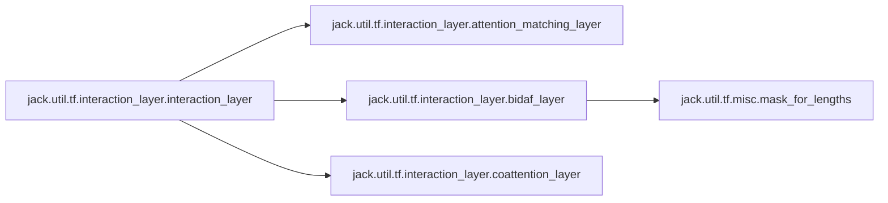

### Object Calls

* jack.util.tf.interaction_layer.attention_matching_layer
* jack.util.tf.interaction_layer.bidaf_layer
* jack.util.tf.interaction_layer.coattention_layer

<!---Documatic-block-jack.util.tf.interaction_layer.interaction_layer-start--->
<details>
	<summary><code>jack.util.tf.interaction_layer.interaction_layer</code> code snippet</summary>

```python
def interaction_layer(seq1, seq1_length, seq2, seq2_length, seq1_to_seq2, seq2_to_seq1, module='attention_matching', name='interaction_layer', reuse=False, concat=True, repr_dim=None, **kwargs):
    with tf.variable_scope(name, reuse=reuse):
        if seq1_to_seq2 is not None:
            seq2 = tf.gather(seq2, seq1_to_seq2)
            seq2_length = tf.gather(seq2_length, seq1_to_seq2)
        if module == 'attention_matching':
            out = attention_matching_layer(seq1, seq1_length, seq2, seq2_length, seq2_to_seq1, **kwargs)
        elif module == 'bidaf':
            out = bidaf_layer(seq1, seq1_length, seq2, seq2_length, **kwargs)
        elif module == 'coattention':
            if kwargs.get('encoder') and 'repr_dim' not in kwargs['encoder']:
                kwargs['encoder']['repr_dim'] = repr_dim
            out = coattention_layer(seq1, seq1_length, seq2, seq2_length, **kwargs)
        else:
            raise ValueError('Unknown interaction type: %s' % module)
    if concat:
        out = tf.concat([seq1, out], 2)
    return out
```
</details>
<!---Documatic-block-jack.util.tf.interaction_layer.interaction_layer-end--->
<!---Documatic-section-interaction_layer-end--->

# #
<!---Documatic-section-jack.util.tf.interaction_layer.interaction_layer-end--->

<!---Documatic-section-jack.util.tf.sequence_encoder.bi_rnn-start--->
## [jack.util.tf.sequence_encoder.bi_rnn](8-jack_util.md#jack.util.tf.sequence_encoder.bi_rnn)

<!---Documatic-section-bi_rnn-start--->
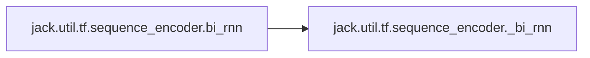

### Object Calls

* jack.util.tf.sequence_encoder._bi_rnn

<!---Documatic-block-jack.util.tf.sequence_encoder.bi_rnn-start--->
<details>
	<summary><code>jack.util.tf.sequence_encoder.bi_rnn</code> code snippet</summary>

```python
def bi_rnn(size, rnn_cell, sequence, seq_length, with_projection=False, **kwargs):
    fused_rnn = tf.contrib.rnn.FusedRNNCellAdaptor(rnn_cell, use_dynamic_rnn=True)
    return _bi_rnn(size, fused_rnn, sequence, seq_length, with_projection)
```
</details>
<!---Documatic-block-jack.util.tf.sequence_encoder.bi_rnn-end--->
<!---Documatic-section-bi_rnn-end--->

# #
<!---Documatic-section-jack.util.tf.sequence_encoder.bi_rnn-end--->

[_Documentation generated by Documatic_](https://www.documatic.com)