# Key Objects

[_Documentation generated by Documatic_](https://www.documatic.com)

<!---Documatic-section-jack.util.tf.segment.segment_softmax-start--->
## jack.util.tf.segment.segment_softmax

<!---Documatic-section-segment_softmax-start--->
<!---Documatic-block-jack.util.tf.segment.segment_softmax-start--->
<details>
	<summary><code>jack.util.tf.segment.segment_softmax</code> code snippet</summary>

```python
def segment_softmax(scores, segment_ids):
    num_segments = tf.reduce_max(segment_ids) + 1
    if len(scores.get_shape()) == 2:
        max_per_partition = tf.unsorted_segment_max(tf.reduce_max(scores, axis=1), segment_ids, num_segments)
        scores -= tf.expand_dims(tf.gather(max_per_partition, segment_ids), axis=1)
    else:
        max_per_partition = tf.unsorted_segment_max(scores, segment_ids, num_segments)
        scores -= tf.gather(max_per_partition, segment_ids)
    scores_exp = tf.exp(scores)
    if len(scores.get_shape()) == 2:
        scores_exp_sum_per_partition = tf.unsorted_segment_sum(tf.reduce_sum(scores_exp, axis=1), segment_ids, num_segments)
        probs = scores_exp / tf.expand_dims(tf.gather(scores_exp_sum_per_partition, segment_ids), axis=1)
    else:
        scores_exp_sum_per_partition = tf.unsorted_segment_sum(scores_exp, segment_ids, num_segments)
        probs = scores_exp / tf.gather(scores_exp_sum_per_partition, segment_ids)
    return probs
```
</details>
<!---Documatic-block-jack.util.tf.segment.segment_softmax-end--->
<!---Documatic-section-segment_softmax-end--->

# #
<!---Documatic-section-jack.util.tf.segment.segment_softmax-end--->

<!---Documatic-section-jack.util.tf.modular_encoder._unique_module_name-start--->
## jack.util.tf.modular_encoder._unique_module_name

<!---Documatic-section-_unique_module_name-start--->
<!---Documatic-block-jack.util.tf.modular_encoder._unique_module_name-start--->
<details>
	<summary><code>jack.util.tf.modular_encoder._unique_module_name</code> code snippet</summary>

```python
def _unique_module_name(module, layer_depth):
    inp = module.get('input', '')
    inp_str = inp if isinstance(inp, str) else '_'.join(inp)
    name = '_'.join([str(layer_depth), inp_str, module['module']])
    return name
```
</details>
<!---Documatic-block-jack.util.tf.modular_encoder._unique_module_name-end--->
<!---Documatic-section-_unique_module_name-end--->

# #
<!---Documatic-section-jack.util.tf.modular_encoder._unique_module_name-end--->

<!---Documatic-section-jack.util.tf.sequence_encoder.encoder-start--->
## jack.util.tf.sequence_encoder.encoder

<!---Documatic-section-encoder-start--->
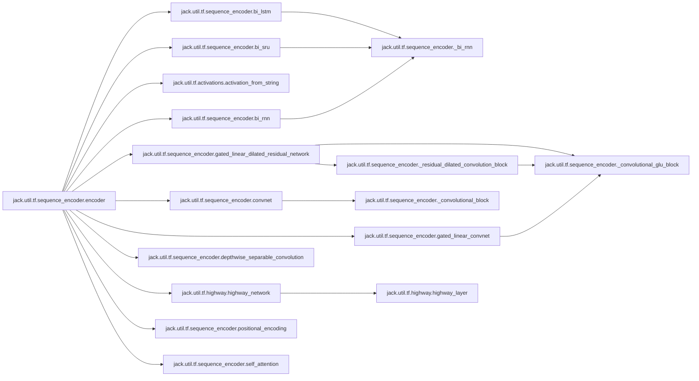

### Object Calls

* jack.util.tf.sequence_encoder.bi_lstm
* jack.util.tf.sequence_encoder.bi_sru
* jack.util.tf.activations.activation_from_string
* jack.util.tf.sequence_encoder.bi_rnn
* jack.util.tf.sequence_encoder.gated_linear_dilated_residual_network
* jack.util.tf.sequence_encoder.convnet
* jack.util.tf.sequence_encoder.gated_linear_convnet
* jack.util.tf.sequence_encoder.depthwise_separable_convolution
* jack.util.tf.highway.highway_network
* jack.util.tf.sequence_encoder.positional_encoding
* jack.util.tf.sequence_encoder.self_attention

<!---Documatic-block-jack.util.tf.sequence_encoder.encoder-start--->
<details>
	<summary><code>jack.util.tf.sequence_encoder.encoder</code> code snippet</summary>

```python
def encoder(sequence, seq_length, repr_dim=100, module='lstm', num_layers=1, reuse=None, residual=False, activation=None, layer_norm=False, name='encoder', dropout=None, is_eval=True, **kwargs):
    if num_layers == 1:
        if layer_norm:
            with tf.variable_scope('layernorm', reuse=False) as vs:
                vs._reuse = False
                num_layernorms = sum((1 for v in vs.global_variables() if 'layernorm' in v.name))
                sequence = tf.contrib.layers.layer_norm(sequence, scope=str(num_layernorms))
        with tf.variable_scope(name, reuse=reuse):
            if module == 'lstm':
                out = bi_lstm(repr_dim, sequence, seq_length, **kwargs)
                if activation:
                    out = activation_from_string(activation)(out)
            elif module == 'sru':
                with_residual = sequence.get_shape()[2].value == repr_dim
                out = bi_sru(repr_dim, sequence, seq_length, with_residual, **kwargs)
                if activation:
                    out = activation_from_string(activation)(out)
            elif module == 'rnn':
                out = bi_rnn(repr_dim, tf.nn.rnn_cell.BasicRNNCell(repr_dim, activation_from_string(activation)), sequence, seq_length, **kwargs)
            elif module == 'gru':
                out = bi_rnn(repr_dim, tf.contrib.rnn.GRUBlockCell(repr_dim), sequence, seq_length, **kwargs)
                if activation:
                    out = activation_from_string(activation)(out)
            elif module == 'gldr':
                out = gated_linear_dilated_residual_network(repr_dim, sequence, **kwargs)
            elif module == 'conv':
                out = convnet(repr_dim, sequence, 1, activation=activation_from_string(activation), **kwargs)
            elif module == 'conv_glu':
                out = gated_linear_convnet(repr_dim, sequence, 1, **kwargs)
            elif module == 'conv_separable':
                out = depthwise_separable_convolution(repr_dim, sequence, activation=activation_from_string(activation), **kwargs)
            elif module == 'dense':
                out = tf.layers.dense(sequence, repr_dim)
                if activation:
                    out = activation_from_string(activation)(out)
            elif module == 'highway':
                out = highway_network(sequence, num_layers, activation_from_string(activation))
            elif module == 'self_attn':
                outs = []
                num_attn = kwargs.get('num_attn_heads', 1)
                for i in range(num_attn):
                    with tf.variable_scope(str(i)):
                        attn = self_attention(sequence, seq_length, repr_dim=repr_dim, **kwargs)
                        outs.append(attn)
                out = tf.concat(outs, 2) if num_attn > 1 else outs[0]
            elif module == 'positional_encoding':
                out = positional_encoding(sequence, seq_length)
            else:
                raise ValueError('Unknown encoder type: %s' % module)
            if residual:
                if out.get_shape()[-1].value != sequence.get_shape()[-1].value:
                    logging.error('Residual connection only possible if input to sequence encoder %s of type %s has same dimension (%d) as output (%d).' % (name, module, sequence.get_shape()[-1].value, out.get_shape()[-1].value))
                    raise RuntimeError()
                out += sequence
            if dropout is not None:
                out = tf.cond(tf.logical_and(tf.greater(dropout, 0.0), tf.logical_not(is_eval)), lambda : tf.nn.dropout(out, 1.0 - dropout, noise_shape=[tf.shape(out)[0], 1, tf.shape(out)[-1]]), lambda : out)
    else:
        out = encoder(sequence, seq_length, repr_dim, module, num_layers - 1, reuse, residual, activation, layer_norm, name, dropout=dropout, is_eval=is_eval, **kwargs)
        out = encoder(out, seq_length, repr_dim, module, 1, reuse, residual, activation, layer_norm, name + str(num_layers - 1), dropout=dropout, is_eval=is_eval, **kwargs)
    return out
```
</details>
<!---Documatic-block-jack.util.tf.sequence_encoder.encoder-end--->
<!---Documatic-section-encoder-end--->

# #
<!---Documatic-section-jack.util.tf.sequence_encoder.encoder-end--->

<!---Documatic-section-jack.util.tf.sequence_encoder.positional_encoding-start--->
## jack.util.tf.sequence_encoder.positional_encoding

<!---Documatic-section-positional_encoding-start--->
<!---Documatic-block-jack.util.tf.sequence_encoder.positional_encoding-start--->
<details>
	<summary><code>jack.util.tf.sequence_encoder.positional_encoding</code> code snippet</summary>

```python
def positional_encoding(inputs, lengths, **kwargs):
    repr_dim = inputs.get_shape()[-1].value
    pos = tf.reshape(tf.range(0.0, tf.to_float(tf.reduce_max(lengths)), dtype=tf.float32), [-1, 1])
    i = np.arange(0, repr_dim, 2, np.float32)
    denom = np.reshape(np.power(10000.0, i / repr_dim), [1, -1])
    enc = tf.expand_dims(tf.concat([tf.sin(pos / denom), tf.cos(pos / denom)], 1), 0)
    return inputs + tf.tile(enc, [tf.shape(inputs)[0], 1, 1])
```
</details>
<!---Documatic-block-jack.util.tf.sequence_encoder.positional_encoding-end--->
<!---Documatic-section-positional_encoding-end--->

# #
<!---Documatic-section-jack.util.tf.sequence_encoder.positional_encoding-end--->

<!---Documatic-section-jack.readers.implementations._tf_extractive_qa_reader-start--->
## jack.readers.implementations._tf_extractive_qa_reader

<!---Documatic-section-_tf_extractive_qa_reader-start--->
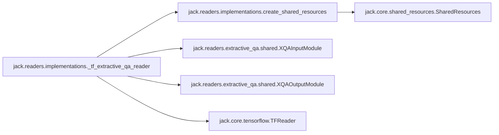

### Object Calls

* jack.readers.implementations.create_shared_resources
* jack.readers.extractive_qa.shared.XQAInputModule
* jack.readers.extractive_qa.shared.XQAOutputModule
* jack.core.tensorflow.TFReader

<!---Documatic-block-jack.readers.implementations._tf_extractive_qa_reader-start--->
<details>
	<summary><code>jack.readers.implementations._tf_extractive_qa_reader</code> code snippet</summary>

```python
def _tf_extractive_qa_reader(model_module_constructor, resources_or_conf: Union[dict, SharedResources]):
    from jack.readers.extractive_qa.shared import XQAInputModule, XQAOutputModule
    shared_resources = create_shared_resources(resources_or_conf)
    input_module = XQAInputModule(shared_resources)
    model_module = model_module_constructor(shared_resources)
    output_module = XQAOutputModule()
    return TFReader(shared_resources, input_module, model_module, output_module)
```
</details>
<!---Documatic-block-jack.readers.implementations._tf_extractive_qa_reader-end--->
<!---Documatic-section-_tf_extractive_qa_reader-end--->

# #
<!---Documatic-section-jack.readers.implementations._tf_extractive_qa_reader-end--->

<!---Documatic-section-jack.util.tf.sequence_encoder.depthwise_separable_convolution-start--->
## jack.util.tf.sequence_encoder.depthwise_separable_convolution

<!---Documatic-section-depthwise_separable_convolution-start--->
<!---Documatic-block-jack.util.tf.sequence_encoder.depthwise_separable_convolution-start--->
<details>
	<summary><code>jack.util.tf.sequence_encoder.depthwise_separable_convolution</code> code snippet</summary>

```python
def depthwise_separable_convolution(repr_dim, inputs, conv_width, activation=tf.nn.relu, bias=True, **kwargs):
    inputs = tf.expand_dims(inputs, 1)
    shapes = inputs.shape.as_list()
    depthwise_filter = tf.get_variable('depthwise_filter', (1, conv_width, shapes[-1], 1), dtype=tf.float32)
    pointwise_filter = tf.get_variable('pointwise_filter', (1, 1, shapes[-1], repr_dim), dtype=tf.float32)
    outputs = tf.nn.separable_conv2d(inputs, depthwise_filter, pointwise_filter, strides=(1, 1, 1, 1), padding='SAME')
    outputs = tf.squeeze(outputs, 1)
    if bias:
        b = tf.get_variable('bias', outputs.shape[-1], initializer=tf.zeros_initializer())
        outputs += b
    outputs = activation(outputs)
    return outputs
```
</details>
<!---Documatic-block-jack.util.tf.sequence_encoder.depthwise_separable_convolution-end--->
<!---Documatic-section-depthwise_separable_convolution-end--->

# #
<!---Documatic-section-jack.util.tf.sequence_encoder.depthwise_separable_convolution-end--->

<!---Documatic-section-jack.train_reader.train_pytorch-start--->
## jack.train_reader.train_pytorch

<!---Documatic-section-train_pytorch-start--->
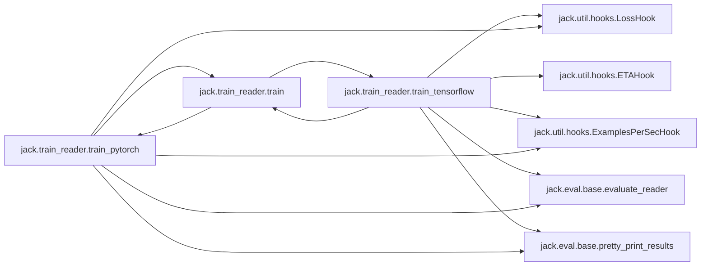

### Object Calls

* jack.train_reader.train
* jack.util.hooks.LossHook
* jack.util.hooks.ExamplesPerSecHook
* jack.eval.base.evaluate_reader
* jack.eval.base.pretty_print_results

<!---Documatic-block-jack.train_reader.train_pytorch-start--->
<details>
	<summary><code>jack.train_reader.train_pytorch</code> code snippet</summary>

```python
def train_pytorch(reader, train_data, test_data, dev_data, configuration: dict, debug=False):
    import torch
    seed = configuration.get('seed')
    random.seed(seed)
    torch.manual_seed(seed)
    clip_value = configuration.get('clip_value')
    batch_size = configuration.get('batch_size')
    epochs = configuration.get('epochs')
    l2 = configuration.get('l2')
    optimizer = configuration.get('optimizer')
    learning_rate = configuration.get('learning_rate')
    learning_rate_decay = configuration.get('learning_rate_decay')
    log_interval = configuration.get('log_interval')
    validation_interval = configuration.get('validation_interval')
    tensorboard_folder = configuration.get('tensorboard_folder')
    model = configuration.get('reader')
    save_dir = configuration.get('save_dir')
    write_metrics_to = configuration.get('write_metrics_to')
    reader.setup_from_data(train_data, is_training=True)
    if clip_value != 0.0:
        clip_value = (-abs(clip_value), abs(clip_value))
    name_to_optimizer = {'gd': torch.optim.SGD, 'adam': torch.optim.Adam, 'adagrad': torch.optim.Adagrad, 'adadelta': torch.optim.Adadelta}
    if optimizer not in name_to_optimizer:
        raise ValueError('Unknown optimizer: {}'.format(optimizer))
    torch_optimizer_class = name_to_optimizer[optimizer]
    params = list(reader.model_module.prediction_module.parameters())
    params.extend(reader.model_module.loss_module.parameters())
    torch_optimizer = torch_optimizer_class(params, lr=learning_rate)
    sw = None
    if tensorboard_folder is not None:
        if os.path.exists(tensorboard_folder):
            shutil.rmtree(tensorboard_folder)
        sw = tf.summary.FileWriter(tensorboard_folder)
    iter_interval = 1 if debug else log_interval
    hooks = [LossHook(reader, iter_interval, summary_writer=sw), ExamplesPerSecHook(reader, batch_size, iter_interval, sw)]
    (preferred_metric, best_metric) = readers.eval_hooks[model].preferred_metric_and_initial_score()

    def side_effect(metrics, prev_metric):
        """Returns: a state (in this case a metric) that is used as input for the next call"""
        m = metrics[preferred_metric]
        if prev_metric is not None and m < prev_metric:
            for param_group in torch_optimizer.param_groups:
                param_group['lr'] *= learning_rate_decay
                logger.info('Decayed learning rate to: %.5f' % param_group['lr'])
        elif m > best_metric[0] and save_dir is not None:
            best_metric[0] = m
            if prev_metric is None:
                reader.store(save_dir)
            else:
                reader.model_module.store(os.path.join(save_dir, 'model_module'))
            logger.info('Saving model to: %s' % save_dir)
        return m
    hooks.append(readers.eval_hooks[model](reader, dev_data, batch_size, summary_writer=sw, side_effect=side_effect, iter_interval=validation_interval, epoch_interval=1 if validation_interval is None else None, write_metrics_to=write_metrics_to))
    reader.train(torch_optimizer, train_data, batch_size, max_epochs=epochs, hooks=hooks, l2=l2, clip=clip_value)
    if dev_data is not None and save_dir is not None:
        reader.load(save_dir)
        result_dict = evaluate_reader(reader, dev_data, batch_size)
        logger.info('############### Results on the Dev Set##############')
        pretty_print_results(result_dict)
    if test_data is not None and save_dir is not None:
        reader.load(save_dir)
        result_dict = evaluate_reader(reader, test_data, batch_size)
        logger.info('############### Results on the Test Set##############')
        pretty_print_results(result_dict)
```
</details>
<!---Documatic-block-jack.train_reader.train_pytorch-end--->
<!---Documatic-section-train_pytorch-end--->

# #
<!---Documatic-section-jack.train_reader.train_pytorch-end--->

<!---Documatic-section-jack.readers.extractive_qa.shared.XQAInputModule-start--->
## jack.readers.extractive_qa.shared.XQAInputModule

<!---Documatic-section-XQAInputModule-start--->
<!---Documatic-block-jack.readers.extractive_qa.shared.XQAInputModule-start--->
<details>
	<summary><code>jack.readers.extractive_qa.shared.XQAInputModule</code> code snippet</summary>

```python
class XQAInputModule(OnlineInputModule[XQAAnnotation]):
    _output_ports = [XQAPorts.emb_question, XQAPorts.question_length, XQAPorts.emb_support, XQAPorts.support_length, XQAPorts.support2question, XQAPorts.word_chars, XQAPorts.word_char_length, XQAPorts.question_batch_words, XQAPorts.support_batch_words, XQAPorts.word_in_question, XQAPorts.correct_start, XQAPorts.answer2support_training, XQAPorts.is_eval, XQAPorts.token_offsets, XQAPorts.selected_support]
    _training_ports = [XQAPorts.answer_span_target, XQAPorts.answer2support_training]

    def setup_from_data(self, data: Iterable[Tuple[QASetting, List[Answer]]]):
        if not self.shared_resources.vocab.frozen:
            preprocessing.fill_vocab((q for (q, _) in data), self.shared_resources.vocab, self.shared_resources.config.get('lowercase', False))
            self.shared_resources.vocab.freeze()
        self.shared_resources.char_vocab = preprocessing.char_vocab_from_vocab(self.shared_resources.vocab)

    def setup(self):
        self._rng = random.Random(1)
        self.vocab = self.shared_resources.vocab
        self.config = self.shared_resources.config
        self.embeddings = self.shared_resources.embeddings
        self.__default_vec = np.zeros([self.embeddings.shape[-1]])
        self.char_vocab = self.shared_resources.char_vocab

    @property
    def output_ports(self) -> List[TensorPort]:
        return self._output_ports

    @property
    def training_ports(self) -> List[TensorPort]:
        return self._training_ports

    def preprocess(self, questions: List[QASetting], answers: Optional[List[List[Answer]]]=None, is_eval: bool=False) -> List[XQAAnnotation]:
        if answers is None:
            answers = [None] * len(questions)
        preprocessed = []
        if len(questions) > 1000:
            bar = progressbar.ProgressBar(max_value=len(questions), widgets=[' [', progressbar.Timer(), '] ', progressbar.Bar(), ' (', progressbar.ETA(), ') '])
            for (q, a) in bar(zip(questions, answers)):
                preprocessed.append(self.preprocess_instance(q, a))
        else:
            for (q, a) in zip(questions, answers):
                preprocessed.append(self.preprocess_instance(q, a))
        return preprocessed

    def preprocess_instance(self, question: QASetting, answers: Optional[List[Answer]]=None) -> XQAAnnotation:
        has_answers = answers is not None
        (q_tokenized, q_ids, _, q_length, s_tokenized, s_ids, _, s_length, word_in_question, token_offsets, answer_spans) = prepare_data(question, answers, self.vocab, self.config.get('lowercase', False), with_answers=has_answers, max_support_length=self.config.get('max_support_length', None))
        max_num_support = self.config.get('max_num_support', len(question.support))
        if len(question.support) > 1:
            scores = sort_by_tfidf(' '.join(q_tokenized), [' '.join(s) for s in s_tokenized])
            selected_supports = [s_idx for (s_idx, _) in scores[:max_num_support]]
            s_tokenized = [s_tokenized[s_idx] for s_idx in selected_supports]
            s_ids = [s_ids[s_idx] for s_idx in selected_supports]
            s_length = [s_length[s_idx] for s_idx in selected_supports]
            word_in_question = [word_in_question[s_idx] for s_idx in selected_supports]
            token_offsets = [token_offsets[s_idx] for s_idx in selected_supports]
            answer_spans = [answer_spans[s_idx] for s_idx in selected_supports]
        else:
            selected_supports = list(range(len(question.support)))
        return XQAAnnotation(question_tokens=q_tokenized, question_ids=q_ids, question_length=q_length, support_tokens=s_tokenized, support_ids=s_ids, support_length=s_length, word_in_question=word_in_question, token_offsets=token_offsets, answer_spans=answer_spans if has_answers else None, selected_supports=selected_supports)

    def create_batch(self, annotations: List[XQAAnnotation], is_eval: bool, with_answers: bool) -> Mapping[TensorPort, np.ndarray]:
        q_tokenized = [a.question_tokens for a in annotations]
        question_lengths = [a.question_length for a in annotations]
        max_training_support = self.config.get('max_training_support', 2)
        s_tokenized = []
        support_lengths = []
        wiq = []
        offsets = []
        support2question = []
        support_ids = []
        selected_support = []
        all_spans = []
        for (i, a) in enumerate(annotations):
            all_spans.append([])
            if len(a.support_tokens) > max_training_support > 0 and (not is_eval):
                is_done = False
                any_answer = any(a.answer_spans)
                while not is_done:
                    selected = self._rng.sample(range(0, len(a.support_tokens) + 1), max_training_support + 1)
                    if 0 in selected and 1 in selected:
                        selected = [s - 1 for s in selected if s > 0]
                    else:
                        selected = [max(0, s - 1) for s in selected[:max_training_support]]
                    is_done = not any_answer or any((a.answer_spans[s] for s in selected))
            else:
                selected = set(range(len(a.support_tokens)))
            for s in selected:
                s_tokenized.append(a.support_tokens[s])
                support_lengths.append(a.support_length[s])
                wiq.append(a.word_in_question[s])
                offsets.append(a.token_offsets[s])
                selected_support.append(a.selected_supports[s])
                support_ids.append(a.support_ids[s])
                support2question.append(i)
                if with_answers:
                    all_spans[-1].append(a.answer_spans[s])
        (word_chars, word_lengths, batch_word_ids, batch_vocab, batch_rev_vocab) = preprocessing.unique_words_with_chars(q_tokenized + s_tokenized, self.char_vocab)
        emb_support = np.zeros([len(support_lengths), max(support_lengths), self.embeddings.shape[-1]])
        emb_question = np.zeros([len(question_lengths), max(question_lengths), self.embeddings.shape[-1]])
        for (i, a) in enumerate(annotations):
            for (j, t) in enumerate(a.question_tokens):
                emb_question[i, j] = self.embeddings.get(t, self.__default_vec)
        for (k, s_ids) in enumerate(s_tokenized):
            for (j, t) in enumerate(s_ids):
                emb_support[k, j] = self.embeddings.get(t, self.__default_vec)
        output = {XQAPorts.word_chars: word_chars, XQAPorts.word_char_length: word_lengths, XQAPorts.question_batch_words: batch_word_ids[:len(q_tokenized)], XQAPorts.support_batch_words: batch_word_ids[len(q_tokenized):], XQAPorts.emb_support: emb_support, XQAPorts.support_length: support_lengths, XQAPorts.emb_question: emb_question, XQAPorts.question_length: question_lengths, XQAPorts.word_in_question: wiq, XQAPorts.support2question: support2question, XQAPorts.is_eval: is_eval, XQAPorts.token_offsets: offsets, XQAPorts.selected_support: selected_support, '__vocab': batch_vocab, '__rev_vocab': batch_rev_vocab}
        if with_answers:
            spans = [s for a in all_spans for spans_per_support in a for s in spans_per_support]
            span2support = []
            support_idx = 0
            for a in all_spans:
                for spans_per_support in a:
                    span2support.extend([support_idx] * len(spans_per_support))
                    support_idx += 1
            output.update({XQAPorts.answer_span_target: [span for span in spans] if spans else np.zeros([0, 2], np.int32), XQAPorts.correct_start: [] if is_eval else [span[0] for span in spans], XQAPorts.answer2support_training: span2support})
        batch = numpify(output, keys=[XQAPorts.word_chars, XQAPorts.question_batch_words, XQAPorts.support_batch_words, XQAPorts.word_in_question, XQAPorts.token_offsets])
        return batch
```
</details>
<!---Documatic-block-jack.readers.extractive_qa.shared.XQAInputModule-end--->
<!---Documatic-section-XQAInputModule-end--->

# #
<!---Documatic-section-jack.readers.extractive_qa.shared.XQAInputModule-end--->

<!---Documatic-section-jack.readers.classification.shared.SimpleClassificationOutputModule-start--->
## jack.readers.classification.shared.SimpleClassificationOutputModule

<!---Documatic-section-SimpleClassificationOutputModule-start--->
<!---Documatic-block-jack.readers.classification.shared.SimpleClassificationOutputModule-start--->
<details>
	<summary><code>jack.readers.classification.shared.SimpleClassificationOutputModule</code> code snippet</summary>

```python
class SimpleClassificationOutputModule(OutputModule):

    def __init__(self, shared_resources=None):
        self._shared_resources = shared_resources

    def setup(self):
        pass

    @property
    def input_ports(self) -> List[TensorPort]:
        return [Ports.Prediction.logits]

    def __call__(self, questions: List[QASetting], tensors: Mapping[TensorPort, np.ndarray]) -> List[Answer]:
        logits = tensors[Ports.Prediction.logits]
        winning_indices = np.argmax(logits, axis=1)
        result = []
        for (index_in_batch, question) in enumerate(questions):
            winning_index = winning_indices[index_in_batch]
            score = _np_softmax(logits[index_in_batch])[winning_index]
            if self._shared_resources is not None and hasattr(self._shared_resources, 'answer_vocab'):
                ans = Answer(self._shared_resources.answer_vocab.get_sym(winning_index), score=score)
            else:
                ans = Answer(question.candidates[winning_index], score=score)
            result.append([ans])
        return result
```
</details>
<!---Documatic-block-jack.readers.classification.shared.SimpleClassificationOutputModule-end--->
<!---Documatic-section-SimpleClassificationOutputModule-end--->

# #
<!---Documatic-section-jack.readers.classification.shared.SimpleClassificationOutputModule-end--->

<!---Documatic-section-jack.io.embeddings.glove.load_glove-start--->
## jack.io.embeddings.glove.load_glove

<!---Documatic-section-load_glove-start--->
<!---Documatic-block-jack.io.embeddings.glove.load_glove-start--->
<details>
	<summary><code>jack.io.embeddings.glove.load_glove</code> code snippet</summary>

```python
def load_glove(stream, vocab=None):
    logger.info('Loading GloVe vectors ..')
    word2idx = {}
    first_line = stream.readline()
    dim = len(first_line.split()) - 1
    lookup = np.empty([500000, dim], dtype=np.float)
    lookup[0] = np.fromstring(first_line.split(maxsplit=1)[1], sep=' ')
    word2idx[first_line.split(maxsplit=1)[0].decode('utf-8')] = 0
    n = 1
    for line in stream:
        (word, vec) = line.rstrip().split(maxsplit=1)
        if vocab is None or (word in vocab and word not in word2idx):
            word = word.decode('utf-8')
            idx = len(word2idx)
            word2idx[word] = idx
            if idx > np.size(lookup, axis=0) - 1:
                lookup.resize([lookup.shape[0] + 500000, lookup.shape[1]])
            lookup[idx] = np.fromstring(vec, sep=' ')
        n += 1
    lookup.resize([len(word2idx), dim])
    logger.info('Loading GloVe vectors completed.')
    return (word2idx, lookup)
```
</details>
<!---Documatic-block-jack.io.embeddings.glove.load_glove-end--->
<!---Documatic-section-load_glove-end--->

# #
<!---Documatic-section-jack.io.embeddings.glove.load_glove-end--->

<!---Documatic-section-jack.util.map.get_list_shape-start--->
## jack.util.map.get_list_shape

<!---Documatic-section-get_list_shape-start--->
<!---Documatic-block-jack.util.map.get_list_shape-start--->
<details>
	<summary><code>jack.util.map.get_list_shape</code> code snippet</summary>

```python
def get_list_shape(xs):
    if isinstance(xs, int):
        shape = []
    else:
        shape = [len(xs)]
        for (i, x) in enumerate(xs):
            if isinstance(x, list) or isinstance(x, tuple):
                if len(shape) == 1:
                    shape.append(0)
                shape[1] = max(len(x), shape[1])
                for (j, y) in enumerate(x):
                    if isinstance(y, list):
                        if len(shape) == 2:
                            shape.append(0)
                        shape[2] = max(len(y), shape[2])
    return shape
```
</details>
<!---Documatic-block-jack.util.map.get_list_shape-end--->
<!---Documatic-section-get_list_shape-end--->

# #
<!---Documatic-section-jack.util.map.get_list_shape-end--->

<!---Documatic-section-jack.readers.classification.shared.ClassificationSingleSupportInputModule-start--->
## jack.readers.classification.shared.ClassificationSingleSupportInputModule

<!---Documatic-section-ClassificationSingleSupportInputModule-start--->
<!---Documatic-block-jack.readers.classification.shared.ClassificationSingleSupportInputModule-start--->
<details>
	<summary><code>jack.readers.classification.shared.ClassificationSingleSupportInputModule</code> code snippet</summary>

```python
class ClassificationSingleSupportInputModule(OnlineInputModule[MCAnnotation]):

    def setup(self):
        self.vocab = self.shared_resources.vocab
        self.config = self.shared_resources.config
        self.embeddings = self.shared_resources.embeddings
        if self.embeddings is not None:
            self.__default_vec = np.zeros([self.embeddings.shape[-1]])

    def setup_from_data(self, data: Iterable[Tuple[QASetting, List[Answer]]]):
        vocab = self.shared_resources.vocab
        if not vocab.frozen:
            preprocessing.fill_vocab((q for (q, _) in data), vocab, lowercase=self.shared_resources.config.get('lowercase', True))
            vocab.freeze()
        if not hasattr(self.shared_resources, 'answer_vocab') or not self.shared_resources.answer_vocab.frozen:
            self.shared_resources.answer_vocab = util.create_answer_vocab(qa_settings=(q for (q, _) in data), answers=(a for (_, ass) in data for a in ass))
            self.shared_resources.answer_vocab.freeze()
        self.shared_resources.char_vocab = preprocessing.char_vocab_from_vocab(self.shared_resources.vocab)

    @property
    def training_ports(self) -> List[TensorPort]:
        return [Ports.Target.target_index]

    @property
    def output_ports(self) -> List[TensorPort]:
        """Defines the outputs of the InputModule"""
        if self.shared_resources.embeddings is not None:
            return [Ports.Input.emb_support, Ports.Input.emb_question, Ports.Input.support, Ports.Input.question, Ports.Input.support_length, Ports.Input.question_length, Ports.Input.sample_id, Ports.Input.word_chars, Ports.Input.word_char_length, Ports.Input.question_batch_words, Ports.Input.support_batch_words, Ports.is_eval]
        else:
            return [Ports.Input.support, Ports.Input.question, Ports.Input.support_length, Ports.Input.question_length, Ports.Input.sample_id, Ports.Input.word_chars, Ports.Input.word_char_length, Ports.Input.question_batch_words, Ports.Input.support_batch_words, Ports.is_eval]

    def preprocess(self, questions: List[QASetting], answers: Optional[List[List[Answer]]]=None, is_eval: bool=False) -> List[MCAnnotation]:
        if answers is None:
            answers = [None] * len(questions)
        preprocessed = []
        if len(questions) > 1000:
            bar = progressbar.ProgressBar(max_value=len(questions), widgets=[' [', progressbar.Timer(), '] ', progressbar.Bar(), ' (', progressbar.ETA(), ') '])
            for (i, (q, a)) in bar(enumerate(zip(questions, answers))):
                preprocessed.append(self.preprocess_instance(i, q, a))
        else:
            for (i, (q, a)) in enumerate(zip(questions, answers)):
                preprocessed.append(self.preprocess_instance(i, q, a))
        return preprocessed

    def preprocess_instance(self, idd: int, question: QASetting, answers: Optional[List[Answer]]=None) -> MCAnnotation:
        has_answers = answers is not None
        (q_tokenized, q_ids, q_length, _, _) = preprocessing.nlp_preprocess(question.question, self.shared_resources.vocab, lowercase=self.shared_resources.config.get('lowercase', True))
        (s_tokenized, s_ids, s_length, _, _) = preprocessing.nlp_preprocess(question.support[0], self.shared_resources.vocab, lowercase=self.shared_resources.config.get('lowercase', True))
        return MCAnnotation(question_tokens=q_tokenized, question_ids=q_ids, question_length=q_length, support_tokens=s_tokenized, support_ids=s_ids, support_length=s_length, answer=self.shared_resources.answer_vocab(answers[0].text) if has_answers else 0, id=idd)

    def create_batch(self, annotations: List[MCAnnotation], is_eval: bool, with_answers: bool) -> Mapping[TensorPort, np.ndarray]:
        (word_chars, word_lengths, tokens, vocab, rev_vocab) = preprocessing.unique_words_with_chars([a.question_tokens for a in annotations] + [a.support_tokens for a in annotations], self.shared_resources.char_vocab)
        (question_words, support_words) = (tokens[:len(annotations)], tokens[len(annotations):])
        q_lengths = [a.question_length for a in annotations]
        s_lengths = [a.support_length for a in annotations]
        xy_dict = {Ports.Input.question_length: q_lengths, Ports.Input.support_length: s_lengths, Ports.Input.sample_id: [a.id for a in annotations], Ports.Input.word_chars: word_chars, Ports.Input.word_char_length: word_lengths, Ports.Input.question_batch_words: question_words, Ports.Input.support_batch_words: support_words, Ports.is_eval: is_eval, Ports.Input.support: [a.support_ids for a in annotations], Ports.Input.question: [a.question_ids for a in annotations]}
        if self.embeddings is not None:
            emb_support = np.zeros([len(annotations), max(s_lengths), self.embeddings.shape[-1]])
            emb_question = np.zeros([len(annotations), max(q_lengths), self.embeddings.shape[-1]])
            for (i, a) in enumerate(annotations):
                for (j, t) in enumerate(a.support_tokens):
                    emb_support[i, j] = self.embeddings.get(t, self.__default_vec)
                for (j, t) in enumerate(a.question_tokens):
                    emb_question[i, j] = self.embeddings.get(t, self.__default_vec)
            xy_dict[Ports.Input.emb_support] = emb_support
            xy_dict[Ports.Input.emb_question] = emb_question
        if with_answers:
            xy_dict[Ports.Target.target_index] = [a.answer for a in annotations]
        return numpify(xy_dict)
```
</details>
<!---Documatic-block-jack.readers.classification.shared.ClassificationSingleSupportInputModule-end--->
<!---Documatic-section-ClassificationSingleSupportInputModule-end--->

# #
<!---Documatic-section-jack.readers.classification.shared.ClassificationSingleSupportInputModule-end--->

<!---Documatic-section-jack.readers.link_prediction.models.KnowledgeGraphEmbeddingOutputModule-start--->
## jack.readers.link_prediction.models.KnowledgeGraphEmbeddingOutputModule

<!---Documatic-section-KnowledgeGraphEmbeddingOutputModule-start--->
<!---Documatic-block-jack.readers.link_prediction.models.KnowledgeGraphEmbeddingOutputModule-start--->
<details>
	<summary><code>jack.readers.link_prediction.models.KnowledgeGraphEmbeddingOutputModule</code> code snippet</summary>

```python
class KnowledgeGraphEmbeddingOutputModule(OutputModule):

    def setup(self):
        pass

    @property
    def input_ports(self) -> List[TensorPort]:
        return [Ports.Prediction.logits]

    def __call__(self, questions: Sequence[QASetting], tensors: Mapping[TensorPort, np.array]) -> Sequence[Sequence[Answer]]:
        logits = tensors[Ports.Prediction.logits]
        results = []
        for (index_in_batch, question) in enumerate(questions):
            score = logits[index_in_batch]
            results.append([Answer(question.question, score=score)])
        return results
```
</details>
<!---Documatic-block-jack.readers.link_prediction.models.KnowledgeGraphEmbeddingOutputModule-end--->
<!---Documatic-section-KnowledgeGraphEmbeddingOutputModule-end--->

# #
<!---Documatic-section-jack.readers.link_prediction.models.KnowledgeGraphEmbeddingOutputModule-end--->

<!---Documatic-section-jack.train_reader.train-start--->
## jack.train_reader.train

<!---Documatic-section-train-start--->
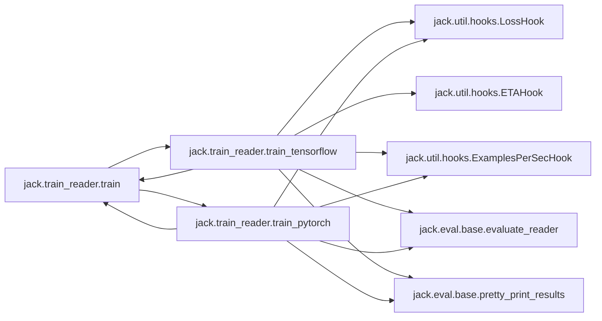

### Object Calls

* jack.train_reader.train_tensorflow
* jack.train_reader.train_pytorch

<!---Documatic-block-jack.train_reader.train-start--->
<details>
	<summary><code>jack.train_reader.train</code> code snippet</summary>

```python
def train(reader, train_data, test_data, dev_data, configuration: dict, debug=False):
    if isinstance(reader, TFReader):
        train_tensorflow(reader, train_data, test_data, dev_data, configuration, debug)
    else:
        train_pytorch(reader, train_data, test_data, dev_data, configuration, debug)
```
</details>
<!---Documatic-block-jack.train_reader.train-end--->
<!---Documatic-section-train-end--->

# #
<!---Documatic-section-jack.train_reader.train-end--->

<!---Documatic-section-jack.util.tf.sequence_encoder.convnet-start--->
## jack.util.tf.sequence_encoder.convnet

<!---Documatic-section-convnet-start--->
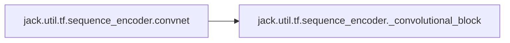

### Object Calls

* jack.util.tf.sequence_encoder._convolutional_block

<!---Documatic-block-jack.util.tf.sequence_encoder.convnet-start--->
<details>
	<summary><code>jack.util.tf.sequence_encoder.convnet</code> code snippet</summary>

```python
def convnet(repr_dim, inputs, num_layers, conv_width=3, activation=tf.nn.relu, **kwargs):
    output = inputs
    for i in range(num_layers):
        output = _convolutional_block(output, repr_dim, conv_width=conv_width, name='conv_%d' % i)
    return output
```
</details>
<!---Documatic-block-jack.util.tf.sequence_encoder.convnet-end--->
<!---Documatic-section-convnet-end--->

# #
<!---Documatic-section-jack.util.tf.sequence_encoder.convnet-end--->

<!---Documatic-section-jack.util.tf.highway.highway_network-start--->
## jack.util.tf.highway.highway_network

<!---Documatic-section-highway_network-start--->
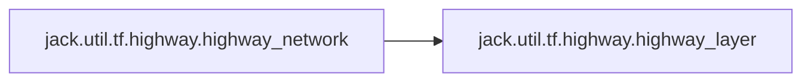

### Object Calls

* jack.util.tf.highway.highway_layer

<!---Documatic-block-jack.util.tf.highway.highway_network-start--->
<details>
	<summary><code>jack.util.tf.highway.highway_network</code> code snippet</summary>

```python
def highway_network(inputs, num_layers, activation=tf.tanh, name=None, reuse=False):
    with tf.variable_scope(name or 'highway_network', reuse=reuse):
        prev = inputs
        cur = None
        for layer_idx in range(num_layers):
            cur = highway_layer(prev, activation, name='layer_{}'.format(layer_idx))
            prev = cur
    return cur
```
</details>
<!---Documatic-block-jack.util.tf.highway.highway_network-end--->
<!---Documatic-section-highway_network-end--->

# #
<!---Documatic-section-jack.util.tf.highway.highway_network-end--->

<!---Documatic-section-jack.util.tf.sequence_encoder.bi_lstm-start--->
## jack.util.tf.sequence_encoder.bi_lstm

<!---Documatic-section-bi_lstm-start--->
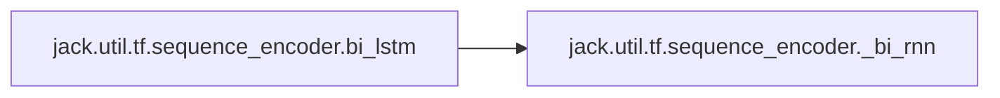

### Object Calls

* jack.util.tf.sequence_encoder._bi_rnn

<!---Documatic-block-jack.util.tf.sequence_encoder.bi_lstm-start--->
<details>
	<summary><code>jack.util.tf.sequence_encoder.bi_lstm</code> code snippet</summary>

```python
def bi_lstm(size, sequence, seq_length, with_projection=False, **kwargs):
    fused_rnn = tf.contrib.rnn.LSTMBlockFusedCell(size)
    return _bi_rnn(size, fused_rnn, sequence, seq_length, with_projection)
```
</details>
<!---Documatic-block-jack.util.tf.sequence_encoder.bi_lstm-end--->
<!---Documatic-section-bi_lstm-end--->

# #
<!---Documatic-section-jack.util.tf.sequence_encoder.bi_lstm-end--->

<!---Documatic-section-jack.util.tf.modular_encoder._flatten-start--->
## jack.util.tf.modular_encoder._flatten

<!---Documatic-section-_flatten-start--->
<!---Documatic-block-jack.util.tf.modular_encoder._flatten-start--->
<details>
	<summary><code>jack.util.tf.modular_encoder._flatten</code> code snippet</summary>

```python
def _flatten(l):
    if isinstance(l, list):
        return [module for sl in l for module in _flatten(sl)]
    else:
        return [l]
```
</details>
<!---Documatic-block-jack.util.tf.modular_encoder._flatten-end--->
<!---Documatic-section-_flatten-end--->

# #
<!---Documatic-section-jack.util.tf.modular_encoder._flatten-end--->

<!---Documatic-section-jack.core.data_structures.Answer-start--->
## jack.core.data_structures.Answer

<!---Documatic-section-Answer-start--->
<!---Documatic-block-jack.core.data_structures.Answer-start--->
<details>
	<summary><code>jack.core.data_structures.Answer</code> code snippet</summary>

```python
class Answer:

    def __init__(self, text: str, span: Tuple[int, int]=None, doc_idx: int=0, score: float=1.0):
        """
        Create a new answer.
        Args:
            text: The text string of the answer.
            span: For extractive QA, a span in the support documents. The triple `(start, end)`
                represents a span in support document with index `doc_index` in the ordered sequence of
            doc_idx: index of document where answer was found
            support documents. The span starts at `start` and ends at `end` (exclusive).
            score: the score a model associates with this answer.
        """
        assert span is None or len(span) == 2, 'span should be (char_start, char_end) tuple'
        self.score = score
        self.span = span
        self.doc_idx = doc_idx
        self.text = text
```
</details>
<!---Documatic-block-jack.core.data_structures.Answer-end--->
<!---Documatic-section-Answer-end--->

# #
<!---Documatic-section-jack.core.data_structures.Answer-end--->

<!---Documatic-section-jack.readers.extractive_qa.shared.XQAOutputModule-start--->
## jack.readers.extractive_qa.shared.XQAOutputModule

<!---Documatic-section-XQAOutputModule-start--->
<!---Documatic-block-jack.readers.extractive_qa.shared.XQAOutputModule-start--->
<details>
	<summary><code>jack.readers.extractive_qa.shared.XQAOutputModule</code> code snippet</summary>

```python
class XQAOutputModule(OutputModule):

    @property
    def input_ports(self) -> List[TensorPort]:
        return [XQAPorts.answer_span, XQAPorts.token_offsets, XQAPorts.selected_support, XQAPorts.support2question, XQAPorts.start_scores, XQAPorts.end_scores]

    def __call__(self, questions, tensors: Mapping[TensorPort, np.ndarray]) -> Sequence[Sequence[Answer]]:
        """Produces top-k answers for each question."""
        tensors = TensorPortTensors(tensors)
        topk = tensors.answer_span.shape[0] // len(questions)
        all_answers = []
        for (n, q) in enumerate(questions):
            answers = []
            doc_idx_map = [i for (i, q_id) in enumerate(tensors.support2question) if q_id == n]
            for j in range(topk):
                i = n * topk + j
                (doc_idx, start, end) = tensors.answer_span[i]
                score = _np_softmax(tensors.start_scores[doc_idx_map[doc_idx]])[start] * _np_softmax(tensors.end_scores[doc_idx_map[doc_idx]])[end]
                (answer, doc_idx, span) = get_answer_and_span(q, doc_idx, start, end, tensors.token_offsets[doc_idx_map[doc_idx]], [i for (q_id, i) in zip(tensors.support2question, tensors.selected_support) if q_id == n])
                answers.append(Answer(answer, span=span, doc_idx=doc_idx, score=score))
            all_answers.append(answers)
        return all_answers
```
</details>
<!---Documatic-block-jack.readers.extractive_qa.shared.XQAOutputModule-end--->
<!---Documatic-section-XQAOutputModule-end--->

# #
<!---Documatic-section-jack.readers.extractive_qa.shared.XQAOutputModule-end--->

<!---Documatic-section-jack.readers.link_prediction.models.KnowledgeGraphEmbeddingModelModule-start--->
## jack.readers.link_prediction.models.KnowledgeGraphEmbeddingModelModule

<!---Documatic-section-KnowledgeGraphEmbeddingModelModule-start--->
<!---Documatic-block-jack.readers.link_prediction.models.KnowledgeGraphEmbeddingModelModule-start--->
<details>
	<summary><code>jack.readers.link_prediction.models.KnowledgeGraphEmbeddingModelModule</code> code snippet</summary>

```python
class KnowledgeGraphEmbeddingModelModule(TFModelModule):

    def __init__(self, *args, model_name='DistMult', **kwargs):
        super().__init__(*args, **kwargs)
        self.model_name = model_name

    @property
    def input_ports(self) -> List[TensorPort]:
        return [Ports.Input.question]

    @property
    def output_ports(self) -> List[TensorPort]:
        return [Ports.Prediction.logits]

    @property
    def training_input_ports(self) -> List[TensorPort]:
        return [Ports.Target.target_index, Ports.Prediction.logits]

    @property
    def training_output_ports(self) -> List[TensorPort]:
        return [Ports.loss]

    def create_training_output(self, shared_resources: SharedResources, input_tensors) -> Mapping[TensorPort, tf.Tensor]:
        tensors = TensorPortTensors(input_tensors)
        losses = tf.nn.sigmoid_cross_entropy_with_logits(logits=tensors.logits, labels=tf.to_float(tensors.target_index))
        loss = tf.reduce_mean(losses, axis=0)
        return {Ports.loss: loss}

    def create_output(self, shared_resources: SharedResources, input_tensors) -> Mapping[TensorPort, tf.Tensor]:
        tensors = TensorPortTensors(input_tensors)
        with tf.variable_scope('knowledge_graph_embedding'):
            embedding_size = shared_resources.config['repr_dim']
            nb_entities = max(shared_resources.entity_to_index.values()) + 1
            nb_predicates = max(shared_resources.predicate_to_index.values()) + 1
            entity_embeddings = tf.get_variable('entity_embeddings', shape=[nb_entities, embedding_size], initializer=tf.contrib.layers.xavier_initializer(), dtype='float32')
            predicate_embeddings = tf.get_variable('predicate_embeddings', shape=[nb_predicates, embedding_size], initializer=tf.contrib.layers.xavier_initializer(), dtype='float32')
            subject_idx = tensors.question[:, 0]
            predicate_idx = tensors.question[:, 1]
            object_idx = tensors.question[:, 2]
            subject_emb = tf.nn.embedding_lookup(entity_embeddings, subject_idx, max_norm=1.0)
            predicate_emb = tf.nn.embedding_lookup(predicate_embeddings, predicate_idx)
            object_emb = tf.nn.embedding_lookup(entity_embeddings, object_idx, max_norm=1.0)
            assert self.model_name is not None
            model_class = scores.get_function(self.model_name)
            model = model_class(subject_embeddings=subject_emb, predicate_embeddings=predicate_emb, object_embeddings=object_emb)
            logits = model()
        return {Ports.Prediction.logits: logits}
```
</details>
<!---Documatic-block-jack.readers.link_prediction.models.KnowledgeGraphEmbeddingModelModule-end--->
<!---Documatic-section-KnowledgeGraphEmbeddingModelModule-end--->

# #
<!---Documatic-section-jack.readers.link_prediction.models.KnowledgeGraphEmbeddingModelModule-end--->

<!---Documatic-section-jack.readers.implementations.create_shared_resources-start--->
## jack.readers.implementations.create_shared_resources

<!---Documatic-section-create_shared_resources-start--->
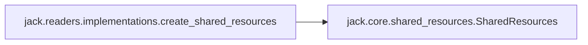

### Object Calls

* jack.core.shared_resources.SharedResources

<!---Documatic-block-jack.readers.implementations.create_shared_resources-start--->
<details>
	<summary><code>jack.readers.implementations.create_shared_resources</code> code snippet</summary>

```python
def create_shared_resources(resources_or_config: Union[dict, SharedResources]=None) -> SharedResources:
    if resources_or_config is None:
        return SharedResources()
    elif isinstance(resources_or_config, SharedResources):
        return resources_or_config
    else:
        return SharedResources(config=resources_or_config)
```
</details>
<!---Documatic-block-jack.readers.implementations.create_shared_resources-end--->
<!---Documatic-section-create_shared_resources-end--->

# #
<!---Documatic-section-jack.readers.implementations.create_shared_resources-end--->

<!---Documatic-section-jack.readers.implementations.complex_reader-start--->
## jack.readers.implementations.complex_reader

<!---Documatic-section-complex_reader-start--->
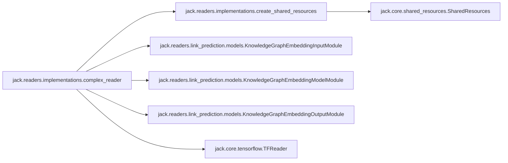

### Object Calls

* jack.readers.implementations.create_shared_resources
* jack.readers.link_prediction.models.KnowledgeGraphEmbeddingInputModule
* jack.readers.link_prediction.models.KnowledgeGraphEmbeddingModelModule
* jack.readers.link_prediction.models.KnowledgeGraphEmbeddingOutputModule
* jack.core.tensorflow.TFReader

<!---Documatic-block-jack.readers.implementations.complex_reader-start--->
<details>
	<summary><code>jack.readers.implementations.complex_reader</code> code snippet</summary>

```python
@link_prediction_reader
def complex_reader(resources_or_conf: Union[dict, SharedResources]=None):
    from jack.readers.link_prediction.models import KnowledgeGraphEmbeddingInputModule, KnowledgeGraphEmbeddingModelModule, KnowledgeGraphEmbeddingOutputModule
    shared_resources = create_shared_resources(resources_or_conf)
    input_module = KnowledgeGraphEmbeddingInputModule(shared_resources)
    model_module = KnowledgeGraphEmbeddingModelModule(shared_resources, model_name='ComplEx')
    output_module = KnowledgeGraphEmbeddingOutputModule()
    return TFReader(shared_resources, input_module, model_module, output_module)
```
</details>
<!---Documatic-block-jack.readers.implementations.complex_reader-end--->
<!---Documatic-section-complex_reader-end--->

# #
<!---Documatic-section-jack.readers.implementations.complex_reader-end--->

<!---Documatic-section-jack.readers.link_prediction.models.KnowledgeGraphEmbeddingInputModule-start--->
## jack.readers.link_prediction.models.KnowledgeGraphEmbeddingInputModule

<!---Documatic-section-KnowledgeGraphEmbeddingInputModule-start--->
<!---Documatic-block-jack.readers.link_prediction.models.KnowledgeGraphEmbeddingInputModule-start--->
<details>
	<summary><code>jack.readers.link_prediction.models.KnowledgeGraphEmbeddingInputModule</code> code snippet</summary>

```python
class KnowledgeGraphEmbeddingInputModule(OnlineInputModule[List[List[int]]]):

    def __init__(self, shared_resources):
        self._kbp_rng = np.random.RandomState(0)
        super(KnowledgeGraphEmbeddingInputModule, self).__init__(shared_resources)

    def setup_from_data(self, data: Iterable[Tuple[QASetting, List[Answer]]]):
        triples = [tuple(x[0].question.split()) for x in data]
        entity_set = {s for [s, _, _] in triples} | {o for [_, _, o] in triples}
        predicate_set = {p for [_, p, _] in triples}
        entity_to_index = {entity: index for (index, entity) in enumerate(entity_set, start=1)}
        predicate_to_index = {predicate: index for (index, predicate) in enumerate(predicate_set, start=1)}
        self.shared_resources.entity_to_index = entity_to_index
        self.shared_resources.predicate_to_index = predicate_to_index
        self.shared_resources.nb_entities = max(self.shared_resources.entity_to_index.values()) + 1
        self.shared_resources.nb_predicates = max(self.shared_resources.predicate_to_index.values()) + 1

    def preprocess(self, questions: List[QASetting], answers: Optional[List[List[Answer]]]=None, is_eval: bool=False) -> List[List[int]]:
        """Converts questions to triples."""
        triples = []
        for qa_setting in questions:
            (s, p, o) = qa_setting.question.split()
            s_idx = self.shared_resources.entity_to_index.get(s, 0)
            o_idx = self.shared_resources.entity_to_index.get(o, 0)
            p_idx = self.shared_resources.predicate_to_index.get(p, 0)
            triples.append([s_idx, p_idx, o_idx])
        return triples

    def create_batch(self, triples: List[List[int]], is_eval: bool, with_answers: bool) -> Mapping[TensorPort, np.ndarray]:
        _triples = list(triples)
        if with_answers:
            target = [1] * len(_triples)
        nb_entities = self.shared_resources.nb_entities
        nb_predicates = self.shared_resources.nb_predicates
        if with_answers:
            for i in range(len(_triples)):
                (s, p, o) = triples[i]
                for _ in range(self.shared_resources.config.get('num_negative', 1)):
                    random_subject_index = self._kbp_rng.randint(0, nb_entities)
                    random_object_index = self._kbp_rng.randint(0, nb_predicates)
                    _triples.append([random_subject_index, p, o])
                    _triples.append([s, p, random_object_index])
                    target.append(0)
                    target.append(0)
        xy_dict = {Ports.Input.question: _triples}
        if with_answers:
            xy_dict[Ports.Target.target_index] = target
        return numpify(xy_dict)

    @property
    def output_ports(self) -> List[TensorPort]:
        return [Ports.Input.question]

    @property
    def training_ports(self) -> List[TensorPort]:
        return [Ports.Target.target_index]
```
</details>
<!---Documatic-block-jack.readers.link_prediction.models.KnowledgeGraphEmbeddingInputModule-end--->
<!---Documatic-section-KnowledgeGraphEmbeddingInputModule-end--->

# #
<!---Documatic-section-jack.readers.link_prediction.models.KnowledgeGraphEmbeddingInputModule-end--->

<!---Documatic-section-jack.eval.base.pretty_print_results-start--->
## jack.eval.base.pretty_print_results

<!---Documatic-section-pretty_print_results-start--->
<!---Documatic-block-jack.eval.base.pretty_print_results-start--->
<details>
	<summary><code>jack.eval.base.pretty_print_results</code> code snippet</summary>

```python
def pretty_print_results(d, prefix=''):
    for (k, v) in sorted(d.items(), key=lambda x: x[0]):
        if isinstance(v, dict):
            print(prefix + k + ':')
            pretty_print_results(v, prefix + '\t')
        elif '\n' in str(v):
            print(prefix + k + ':')
            print(str(v).replace('\n', '\n' + prefix + '\t'))
        else:
            print(prefix + k + ':', str(v))
```
</details>
<!---Documatic-block-jack.eval.base.pretty_print_results-end--->
<!---Documatic-section-pretty_print_results-end--->

# #
<!---Documatic-section-jack.eval.base.pretty_print_results-end--->

<!---Documatic-section-jack.core.shared_resources.SharedResources-start--->
## jack.core.shared_resources.SharedResources

<!---Documatic-section-SharedResources-start--->
<!---Documatic-block-jack.core.shared_resources.SharedResources-start--->
<details>
	<summary><code>jack.core.shared_resources.SharedResources</code> code snippet</summary>

```python
class SharedResources:

    def __init__(self, vocab: Vocab=None, config: dict=None, embeddings: Embeddings=None):
        """
        Several shared resources are initialised here, even if no arguments
        are passed when calling __init__.
        The instantiated objects will be filled by the InputModule.
        - self.config holds hyperparameter values and general configuration
            parameters.
        - self.vocab serves as default Vocabulary object.
        - self.answer_vocab is by default the same as self.vocab. However,
            this attribute can be changed by the InputModule, e.g. by setting
            sepvocab=True when calling the setup_from_data() of the InputModule.
        """
        self.config = config or dict()
        self.vocab = vocab
        self.embeddings = embeddings

    def store(self, path):
        """
        Saves all attributes of this object.

        Args:
            path: path to save shared resources
        """
        if not os.path.exists(path):
            os.mkdir(path)
        vocabs = [(k, v) for (k, v) in self.__dict__.items() if isinstance(v, Vocab)]
        with open(os.path.join(path, 'remainder'), 'wb') as f:
            remaining = {k: v for (k, v) in self.__dict__.items() if not isinstance(v, Vocab) and (not k == 'config') and (not k == 'embeddings')}
            pickle.dump(remaining, f, pickle.HIGHEST_PROTOCOL)
        for (k, v) in vocabs:
            v.store(os.path.join(path, k))
        with open(os.path.join(path, 'config.yaml'), 'w') as f:
            yaml.dump(self.config, f)
        if self.embeddings is not None:
            self.embeddings.store(os.path.join(path, 'embeddings'))

    def load(self, path):
        """
        Loads this (potentially empty) resource from path (all object attributes).
        Args:
            path: path to shared resources
        """
        remainder_path = os.path.join(path, 'remainder')
        if os.path.exists(remainder_path):
            with open(remainder_path, 'rb') as f:
                self.__dict__.update(pickle.load(f))
        for f in os.listdir(path):
            if f == 'config.yaml':
                with open(os.path.join(path, f), 'r') as f:
                    self.config = yaml.load(f)
            elif f == 'embeddings':
                self.embeddings = Embeddings.from_dir(os.path.join(path, f))
            else:
                v = Vocab()
                v.load(os.path.join(path, f))
                self.__dict__[f] = v
```
</details>
<!---Documatic-block-jack.core.shared_resources.SharedResources-end--->
<!---Documatic-section-SharedResources-end--->

# #
<!---Documatic-section-jack.core.shared_resources.SharedResources-end--->

<!---Documatic-section-jack.core.tensorflow.TFReader-start--->
## jack.core.tensorflow.TFReader

<!---Documatic-section-TFReader-start--->
<!---Documatic-block-jack.core.tensorflow.TFReader-start--->
<details>
	<summary><code>jack.core.tensorflow.TFReader</code> code snippet</summary>

```python
class TFReader(JTReader):

    @property
    def model_module(self) -> TFModelModule:
        return super().model_module

    @property
    def session(self) -> tf.Session:
        """Returns: input module"""
        return self.model_module.tf_session

    def train(self, optimizer, training_set: Iterable[Tuple[QASetting, List[Answer]]], batch_size: int, max_epochs=10, hooks=tuple(), l2=0.0, clip=None, clip_op=tf.clip_by_value, summary_writer=None, **kwargs):
        """
        This method trains the reader (and changes its state).

        Args:
            optimizer: TF optimizer
            training_set: the training instances.
            batch_size: size of training batches
            max_epochs: maximum number of epochs
            hooks: TrainingHook implementations that are called after epochs and batches
            l2: whether to use l2 regularization
            clip: whether to apply gradient clipping and at which value
            clip_op: operation to perform for clipping
            summary_writer: summary writer
        """
        (batches, loss, min_op, summaries) = self._setup_training(batch_size, clip, optimizer, training_set, summary_writer, l2, clip_op, **kwargs)
        self._train_loop(min_op, loss, batches, hooks, max_epochs, summaries, summary_writer, **kwargs)

    def _setup_training(self, batch_size, clip, optimizer, training_set, summary_writer, l2, clip_op, **kwargs):
        global_step = tf.train.get_global_step()
        if global_step is None:
            global_step = tf.train.create_global_step()
        if not self._is_setup:
            logger.info('Setting up model...')
            self.setup_from_data(training_set, is_training=True)
        logger.info('Preparing training data...')
        batches = self.input_module.batch_generator(training_set, batch_size, is_eval=False)
        logging.basicConfig(stream=sys.stdout, level=logging.DEBUG)
        loss = self.model_module.tensors[Ports.loss]
        summaries = None
        if summary_writer is not None:
            summaries = tf.summary.merge_all()
        if l2:
            loss += tf.add_n([tf.nn.l2_loss(v) for v in self.model_module.train_variables]) * l2
        if clip:
            gradients = optimizer.compute_gradients(loss)
            if clip_op == tf.clip_by_value:
                gradients = [(tf.clip_by_value(grad, clip[0], clip[1]), var) for (grad, var) in gradients if grad is not None]
            elif clip_op == tf.clip_by_norm:
                gradients = [(tf.clip_by_norm(grad, clip), var) for (grad, var) in gradients if grad is not None]
            min_op = optimizer.apply_gradients(gradients, global_step)
        else:
            min_op = optimizer.minimize(loss, global_step)
        variable_size = lambda v: reduce(lambda x, y: x * y, v.get_shape().as_list()) if v.get_shape() else 1
        num_params = sum((variable_size(v) for v in self.model_module.train_variables))
        logger.info('Number of parameters: %d' % num_params)
        self.session.run([v.initializer for v in tf.global_variables() if v not in self.model_module.variables])
        return (batches, loss, min_op, summaries)

    def _train_loop(self, optimization_op, loss_op, batches, hooks, max_epochs, summaries, summary_writer, **kwargs):
        logger.info('Start training...')
        for i in range(1, max_epochs + 1):
            for (j, batch) in enumerate(batches):
                feed_dict = self.model_module.convert_to_feed_dict(batch)
                if summaries is not None:
                    (step, sums, current_loss, _) = self.session.run([tf.train.get_global_step(), summaries, loss_op, optimization_op], feed_dict=feed_dict)
                    summary_writer.add_summary(sums, step)
                else:
                    (current_loss, _) = self.session.run([loss_op, optimization_op], feed_dict=feed_dict)
                for hook in hooks:
                    hook.at_iteration_end(i, current_loss, set_name='train')
            for hook in hooks:
                hook.at_epoch_end(i)
```
</details>
<!---Documatic-block-jack.core.tensorflow.TFReader-end--->
<!---Documatic-section-TFReader-end--->

# #
<!---Documatic-section-jack.core.tensorflow.TFReader-end--->

<!---Documatic-section-jack.util.tf.modular_encoder.modular_encoder-start--->
## jack.util.tf.modular_encoder.modular_encoder

<!---Documatic-section-modular_encoder-start--->
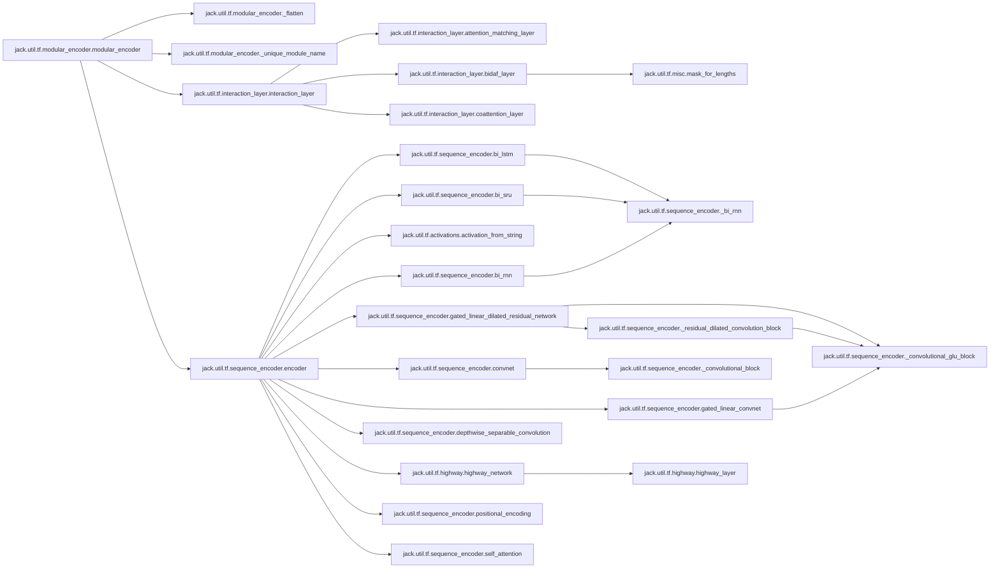

### Object Calls

* jack.util.tf.modular_encoder._flatten
* jack.util.tf.modular_encoder._unique_module_name
* jack.util.tf.interaction_layer.interaction_layer
* jack.util.tf.sequence_encoder.encoder

<!---Documatic-block-jack.util.tf.modular_encoder.modular_encoder-start--->
<details>
	<summary><code>jack.util.tf.modular_encoder.modular_encoder</code> code snippet</summary>

```python
def modular_encoder(encoder_config, inputs, inputs_length, inputs_mapping, default_repr_dim, dropout, is_eval):
    outputs = dict(inputs)
    outputs_length = dict(inputs_length)
    outputs_mapping = dict(inputs_mapping)
    seen_layer = set()

    def encode_module(module):
        module_type = module['module']
        reuse = module['name'] in seen_layer
        seen_layer.add(module['name'])
        if module_type == 'repeat':
            reuse = module.get('reuse')
            for k in range(module['num']):
                prefix = module['name'] + '/' if reuse else '%s_%d/' % (module['name'], k)
                for (j, inner_module) in enumerate(module['encoder']):
                    inner_module = copy.deepcopy(inner_module)
                    if 'name' not in inner_module:
                        inner_module['name'] = _unique_module_name(inner_module, j)
                    inner_module['name'] = prefix + inner_module['name']
                    encode_module(inner_module)
            return
        try:
            key = module['input']
            out_key = module.get('output', key)
            if module['module'] in ['concat', 'add', 'mul', 'weighted_add', 'sub']:
                outputs_length[out_key] = outputs_length[key[0]]
                outputs_mapping[out_key] = outputs_mapping.get(key[0])
                if module['module'] == 'concat':
                    outputs[out_key] = tf.concat([outputs[k] for k in key], 2, name=module['name'])
                    return
                if module['module'] == 'add':
                    outputs[out_key] = tf.add_n([outputs[k] for k in key], name=module['name'])
                    return
                if module['module'] == 'sub':
                    outputs[out_key] = tf.subtract(outputs[key[0]], outputs[key[1]], name=module['name'])
                    return
                if module['module'] == 'mul':
                    o = outputs[key[0]]
                    for k in key[1:-1]:
                        o *= outputs[k]
                    outputs[out_key] = tf.multiply(o, outputs[key[-1]], name=module['name'])
                    return
                if module['module'] == 'weighted_add':
                    bias = module.get('bias', 0.0)
                    g = tf.layers.dense(tf.concat([outputs[k] for k in key], 2), outputs[key[0]].get_shape()[-1].value, tf.sigmoid, bias_initializer=tf.constant_initializer(bias))
                    outputs[out_key] = tf.identity(g * outputs[key[0]] + (1.0 - g) * outputs[key[0]], name=module['name'])
                    return
            if 'repr_dim' not in module:
                module['repr_dim'] = default_repr_dim
            if 'dependent' in module:
                dep_key = module['dependent']
                outputs[out_key] = interaction_layer(outputs[key], outputs_length[key], outputs[dep_key], outputs_length[dep_key], outputs_mapping.get(key), outputs_mapping.get(dep_key), reuse=reuse, **module)
            else:
                if module.get('dropout') is True:
                    module['dropout'] = dropout
                outputs[out_key] = encoder(outputs[key], outputs_length[key], reuse=reuse, is_eval=is_eval, **module)
            outputs_length[out_key] = outputs_length[key]
            outputs_mapping[out_key] = outputs_mapping.get(key)
        except Exception as e:
            logger.error('Creating module %s failed.', module['name'])
            raise e
    encoder_config = _flatten(encoder_config)
    encoder_config = copy.deepcopy(encoder_config)
    for (i, module) in enumerate(encoder_config):
        if 'name' not in module:
            module['name'] = _unique_module_name(module, i)
        encode_module(module)
    return (outputs, outputs_length, outputs_mapping)
```
</details>
<!---Documatic-block-jack.util.tf.modular_encoder.modular_encoder-end--->
<!---Documatic-section-modular_encoder-end--->

# #
<!---Documatic-section-jack.util.tf.modular_encoder.modular_encoder-end--->

<!---Documatic-section-jack.util.tf.embedding.conv_char_embedding-start--->
## jack.util.tf.embedding.conv_char_embedding

<!---Documatic-section-conv_char_embedding-start--->
<!---Documatic-block-jack.util.tf.embedding.conv_char_embedding-start--->
<details>
	<summary><code>jack.util.tf.embedding.conv_char_embedding</code> code snippet</summary>

```python
def conv_char_embedding(num_chars, repr_dim, word_chars, word_lengths, word_sequences=None, conv_width=5, emb_initializer=tf.random_normal_initializer(0.0, 0.1), scope=None):
    pad = tf.zeros(tf.stack([tf.shape(word_lengths)[0], conv_width // 2]), tf.int32)
    word_chars = tf.concat([pad, word_chars, pad], 1)
    with tf.variable_scope(scope or 'char_embeddings'):
        char_embedding_matrix = tf.get_variable('char_embedding_matrix', shape=(num_chars, repr_dim), initializer=emb_initializer, trainable=True)
        max_word_length = tf.reduce_max(word_lengths)
        embedded_chars = tf.nn.embedding_lookup(char_embedding_matrix, tf.cast(word_chars, tf.int32))
        with tf.variable_scope('conv'):
            filter = tf.get_variable('filter', [conv_width * repr_dim, repr_dim])
            filter_reshaped = tf.reshape(filter, [conv_width, repr_dim, repr_dim])
            conv_out = tf.nn.conv1d(embedded_chars, filter_reshaped, 1, 'VALID')
            conv_mask = tf.expand_dims(misc.mask_for_lengths(word_lengths, max_length=max_word_length), 2)
            conv_out = conv_out + conv_mask
        embedded_words = tf.reduce_max(conv_out, 1)
    if word_sequences is None:
        return embedded_words
    if not isinstance(word_sequences, list):
        word_sequences = [word_sequences]
    all_embedded = []
    for word_idxs in word_sequences:
        all_embedded.append(tf.nn.embedding_lookup(embedded_words, word_idxs))
    return all_embedded
```
</details>
<!---Documatic-block-jack.util.tf.embedding.conv_char_embedding-end--->
<!---Documatic-section-conv_char_embedding-end--->

# #
<!---Documatic-section-jack.util.tf.embedding.conv_char_embedding-end--->

<!---Documatic-section-jack.readers.implementations.classification_reader-start--->
## jack.readers.implementations.classification_reader

<!---Documatic-section-classification_reader-start--->
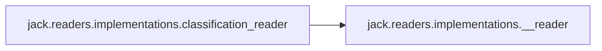

### Object Calls

* jack.readers.implementations.__reader

<!---Documatic-block-jack.readers.implementations.classification_reader-start--->
<details>
	<summary><code>jack.readers.implementations.classification_reader</code> code snippet</summary>

```python
def classification_reader(f):
    __reader(f)
    classification_readers.setdefault(f.__name__, f)
    eval_hooks.setdefault(f.__name__, ClassificationEvalHook)
    return f
```
</details>
<!---Documatic-block-jack.readers.implementations.classification_reader-end--->
<!---Documatic-section-classification_reader-end--->

# #
<!---Documatic-section-jack.readers.implementations.classification_reader-end--->

<!---Documatic-section-jack.util.tf.sequence_encoder.gated_linear_convnet-start--->
## jack.util.tf.sequence_encoder.gated_linear_convnet

<!---Documatic-section-gated_linear_convnet-start--->
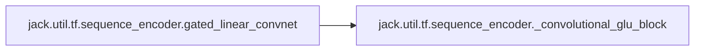

### Object Calls

* jack.util.tf.sequence_encoder._convolutional_glu_block

<!---Documatic-block-jack.util.tf.sequence_encoder.gated_linear_convnet-start--->
<details>
	<summary><code>jack.util.tf.sequence_encoder.gated_linear_convnet</code> code snippet</summary>

```python
def gated_linear_convnet(out_size, inputs, num_layers, conv_width=3, **kwargs):
    output = inputs
    for i in range(num_layers):
        output = _convolutional_glu_block(output, out_size, conv_width=conv_width, name='conv_%d' % i)
    return output
```
</details>
<!---Documatic-block-jack.util.tf.sequence_encoder.gated_linear_convnet-end--->
<!---Documatic-section-gated_linear_convnet-end--->

# #
<!---Documatic-section-jack.util.tf.sequence_encoder.gated_linear_convnet-end--->

<!---Documatic-section-jack.train_reader.train_tensorflow-start--->
## jack.train_reader.train_tensorflow

<!---Documatic-section-train_tensorflow-start--->
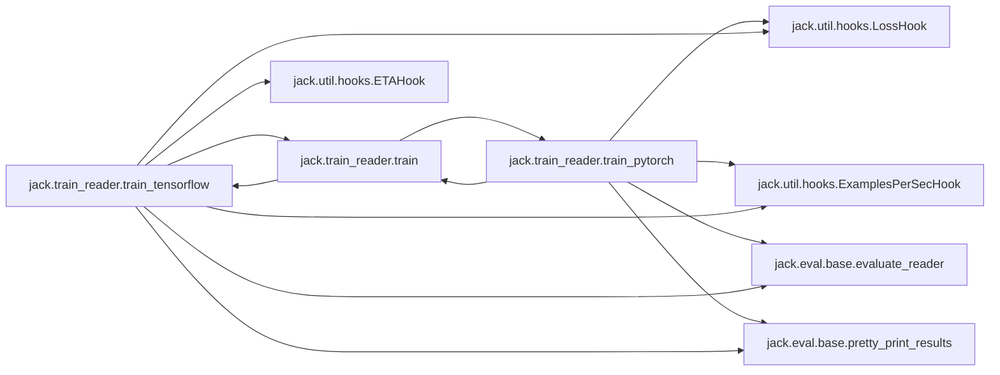

### Object Calls

* jack.train_reader.train
* jack.util.hooks.LossHook
* jack.util.hooks.ETAHook
* jack.util.hooks.ExamplesPerSecHook
* jack.eval.base.evaluate_reader
* jack.eval.base.pretty_print_results

<!---Documatic-block-jack.train_reader.train_tensorflow-start--->
<details>
	<summary><code>jack.train_reader.train_tensorflow</code> code snippet</summary>

```python
def train_tensorflow(reader, train_data, test_data, dev_data, configuration: dict, debug=False):
    import tensorflow as tf
    seed = configuration.get('seed', 0)
    random.seed(seed)
    tf.set_random_seed(seed)
    clip_value = configuration.get('clip_value')
    batch_size = configuration.get('batch_size')
    dev_batch_size = configuration.get('dev_batch_size') or batch_size
    epochs = configuration.get('epochs')
    l2 = configuration.get('l2')
    optimizer = configuration.get('optimizer')
    learning_rate = configuration.get('learning_rate')
    min_learning_rate = configuration.get('min_learning_rate')
    learning_rate_decay = configuration.get('learning_rate_decay')
    log_interval = configuration.get('log_interval')
    validation_interval = configuration.get('validation_interval')
    tensorboard_folder = configuration.get('tensorboard_folder')
    reader_type = configuration.get('reader')
    save_dir = configuration.get('save_dir')
    write_metrics_to = configuration.get('write_metrics_to')
    if clip_value != 0.0:
        clip_value = (-abs(clip_value), abs(clip_value))
    learning_rate = tf.get_variable('learning_rate', initializer=learning_rate, dtype=tf.float32, trainable=False)
    lr_decay_op = learning_rate.assign(tf.maximum(learning_rate_decay * learning_rate, min_learning_rate))
    name_to_optimizer = {'gd': tf.train.GradientDescentOptimizer, 'adam': tf.train.AdamOptimizer, 'adagrad': tf.train.AdagradOptimizer, 'adadelta': tf.train.AdadeltaOptimizer, 'rmsprop': tf.train.RMSPropOptimizer}
    if optimizer not in name_to_optimizer:
        raise ValueError('Unknown optimizer: {}'.format(optimizer))
    tf_optimizer_class = name_to_optimizer[optimizer]
    tf_optimizer = tf_optimizer_class(learning_rate=learning_rate)
    sw = None
    if tensorboard_folder is not None:
        if os.path.exists(tensorboard_folder):
            shutil.rmtree(tensorboard_folder)
        sw = tf.summary.FileWriter(tensorboard_folder)
    iter_interval = 1 if debug else log_interval
    hooks = [LossHook(reader, iter_interval, summary_writer=sw), ETAHook(reader, iter_interval, int(math.ceil(len(train_data) / batch_size)), epochs), ExamplesPerSecHook(reader, batch_size, iter_interval, sw)]
    (preferred_metric, best_metric) = readers.eval_hooks[reader_type].preferred_metric_and_initial_score()

    def side_effect(metrics, prev_metric):
        """Returns: a state (in this case a metric) that is used as input for the next call"""
        if prev_metric is None:
            reader.store(save_dir)
        m = metrics[preferred_metric]
        if prev_metric is not None and m < prev_metric:
            reader.session.run(lr_decay_op)
            logger.info('Decayed learning rate to: %.5f' % reader.session.run(learning_rate))
        elif m > best_metric[0] and save_dir is not None:
            best_metric[0] = m
            reader.model_module.store(os.path.join(save_dir, 'model_module'))
            logger.info('Saving reader to: %s' % save_dir)
        return m
    hooks.append(readers.eval_hooks[reader_type](reader, dev_data, dev_batch_size, summary_writer=sw, side_effect=side_effect, iter_interval=validation_interval, epoch_interval=1 if validation_interval is None else None, write_metrics_to=write_metrics_to))
    reader.train(tf_optimizer, train_data, batch_size, max_epochs=epochs, hooks=hooks, l2=l2, clip=clip_value, clip_op=tf.clip_by_value, summary_writer=sw)
    if dev_data is not None and save_dir is not None:
        reader.load(save_dir)
        result_dict = evaluate_reader(reader, dev_data, batch_size)
        logger.info('############### Results on the Dev Set##############')
        pretty_print_results(result_dict)
    if test_data is not None and save_dir is not None:
        reader.load(save_dir)
        result_dict = evaluate_reader(reader, test_data, batch_size)
        logger.info('############### Results on the Test Set##############')
        pretty_print_results(result_dict)
```
</details>
<!---Documatic-block-jack.train_reader.train_tensorflow-end--->
<!---Documatic-section-train_tensorflow-end--->

# #
<!---Documatic-section-jack.train_reader.train_tensorflow-end--->

<!---Documatic-section-jack.readers.implementations.dam_snli_reader-start--->
## jack.readers.implementations.dam_snli_reader

<!---Documatic-section-dam_snli_reader-start--->
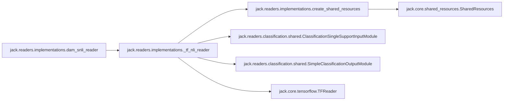

### Object Calls

* jack.readers.implementations._tf_nli_reader

<!---Documatic-block-jack.readers.implementations.dam_snli_reader-start--->
<details>
	<summary><code>jack.readers.implementations.dam_snli_reader</code> code snippet</summary>

```python
@nli_reader
def dam_snli_reader(resources_or_conf: Union[dict, SharedResources]=None):
    from jack.readers.natural_language_inference.decomposable_attention import DecomposableAttentionModel
    return _tf_nli_reader(DecomposableAttentionModel, resources_or_conf)
```
</details>
<!---Documatic-block-jack.readers.implementations.dam_snli_reader-end--->
<!---Documatic-section-dam_snli_reader-end--->

# #
<!---Documatic-section-jack.readers.implementations.dam_snli_reader-end--->

<!---Documatic-section-jack.util.map.numpify-start--->
## jack.util.map.numpify

<!---Documatic-section-numpify-start--->
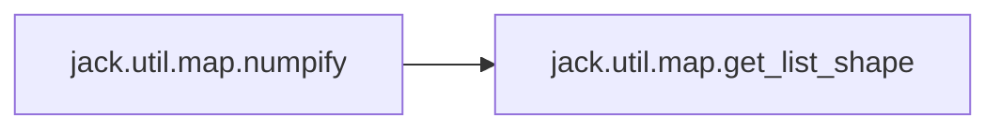

### Object Calls

* jack.util.map.get_list_shape

<!---Documatic-block-jack.util.map.numpify-start--->
<details>
	<summary><code>jack.util.map.numpify</code> code snippet</summary>

```python
def numpify(xs, pad=0, keys=None, dtypes=None):
    is_dict = isinstance(xs, dict)
    xs_np = {} if is_dict else [0] * len(xs)
    xs_iter = xs.items() if is_dict else enumerate(xs)
    for (i, (key, x)) in enumerate(xs_iter):
        try:
            if (keys is None or key in keys) and (not isinstance(x, np.ndarray)):
                shape = get_list_shape(x)
                dtype = dtypes[i] if dtypes is not None else np.int64
                x_np = np.full(shape, pad, dtype)
                nb_dims = len(shape)
                if nb_dims == 0:
                    x_np = x
                else:

                    def f(tensor, values):
                        t_shp = tensor.shape
                        if len(t_shp) > 1:
                            for (_i, _values) in enumerate(values):
                                f(tensor[_i], _values)
                        else:
                            tensor[0:len(values)] = [v for v in values]
                    f(x_np, x)
                xs_np[key] = x_np
            else:
                xs_np[key] = x
        except Exception as e:
            logger.error('Error numpifying value ' + str(x) + ' of key ' + str(key))
            raise e
    return xs_np
```
</details>
<!---Documatic-block-jack.util.map.numpify-end--->
<!---Documatic-section-numpify-end--->

# #
<!---Documatic-section-jack.util.map.numpify-end--->

<!---Documatic-section-jack.util.tf.sequence_encoder.gated_linear_dilated_residual_network-start--->
## jack.util.tf.sequence_encoder.gated_linear_dilated_residual_network

<!---Documatic-section-gated_linear_dilated_residual_network-start--->
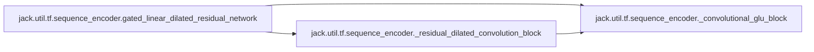

### Object Calls

* jack.util.tf.sequence_encoder._convolutional_glu_block
* jack.util.tf.sequence_encoder._residual_dilated_convolution_block

<!---Documatic-block-jack.util.tf.sequence_encoder.gated_linear_dilated_residual_network-start--->
<details>
	<summary><code>jack.util.tf.sequence_encoder.gated_linear_dilated_residual_network</code> code snippet</summary>

```python
def gated_linear_dilated_residual_network(out_size, inputs, dilations, conv_width=3, name='gldr_network', reuse=None, **kwargs):
    output = _convolutional_glu_block(inputs, out_size, name='conv_dim_reduction')
    for (i, d) in enumerate(dilations):
        output = _residual_dilated_convolution_block(output, d, conv_width, name='dilated_conv_%d' % i)
    return output
```
</details>
<!---Documatic-block-jack.util.tf.sequence_encoder.gated_linear_dilated_residual_network-end--->
<!---Documatic-section-gated_linear_dilated_residual_network-end--->

# #
<!---Documatic-section-jack.util.tf.sequence_encoder.gated_linear_dilated_residual_network-end--->

<!---Documatic-section-jack.core.data_structures.jack_to_qasetting-start--->
## jack.core.data_structures.jack_to_qasetting

<!---Documatic-section-jack_to_qasetting-start--->
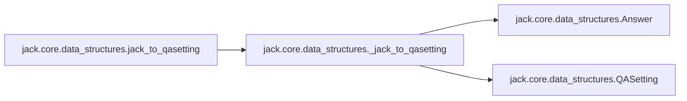

### Object Calls

* jack.core.data_structures._jack_to_qasetting

<!---Documatic-block-jack.core.data_structures.jack_to_qasetting-start--->
<details>
	<summary><code>jack.core.data_structures.jack_to_qasetting</code> code snippet</summary>

```python
def jack_to_qasetting(jtr_data, max_count=None):

    def value(c, key='text', default=None):
        return c.get(key, default) if isinstance(c, dict) else c if key == 'text' else default
    global_candidates = [value(c) for c in jtr_data['globals']['candidates']] if 'globals' in jtr_data else None
    ans = [(inp, answer) for i in jtr_data['instances'] for (inp, answer) in _jack_to_qasetting(i, value, global_candidates)][:max_count]
    return ans
```
</details>
<!---Documatic-block-jack.core.data_structures.jack_to_qasetting-end--->
<!---Documatic-section-jack_to_qasetting-end--->

# #
<!---Documatic-section-jack.core.data_structures.jack_to_qasetting-end--->

<!---Documatic-section-jack.util.tf.sequence_encoder.self_attention-start--->
## jack.util.tf.sequence_encoder.self_attention

<!---Documatic-section-self_attention-start--->
<!---Documatic-block-jack.util.tf.sequence_encoder.self_attention-start--->
<details>
	<summary><code>jack.util.tf.sequence_encoder.self_attention</code> code snippet</summary>

```python
def self_attention(inputs, lengths, attn_type='bilinear', scaled=True, activation=None, with_sentinel=False, **kwargs):
    if attn_type == 'bilinear':
        attn_states = attention.bilinear_attention(inputs, inputs, lengths, scaled, with_sentinel, **kwargs)[2]
    elif attn_type == 'dot':
        attn_states = attention.dot_attention(inputs, inputs, lengths, scaled, with_sentinel, **kwargs)[2]
    elif attn_type == 'diagonal_bilinear':
        attn_states = attention.diagonal_bilinear_attention(inputs, inputs, lengths, scaled, with_sentinel, **kwargs)[2]
    elif attn_type == 'mlp':
        attn_states = attention.mlp_attention(kwargs['repr_dim'], activation, inputs, inputs, lengths, with_sentinel, **kwargs)[2]
    else:
        raise ValueError('Unknown attention type: %s' % attn_type)
    return attn_states
```
</details>
<!---Documatic-block-jack.util.tf.sequence_encoder.self_attention-end--->
<!---Documatic-section-self_attention-end--->

# #
<!---Documatic-section-jack.util.tf.sequence_encoder.self_attention-end--->

<!---Documatic-section-jack.core.data_structures.QASetting-start--->
## jack.core.data_structures.QASetting

<!---Documatic-section-QASetting-start--->
<!---Documatic-block-jack.core.data_structures.QASetting-start--->
<details>
	<summary><code>jack.core.data_structures.QASetting</code> code snippet</summary>

```python
class QASetting:

    def __init__(self, question: str, support: Sequence[str]=(), id: str=None, candidates: Sequence[str]=None, seq_candidates: Sequence[str]=None, candidate_spans: Sequence[Tuple[int, int, int]]=None):
        """
        Create a new QASetting.
        Args:
            question: the question text.
            support: a sequence of support documents the answerer has access to when answering the question.
            id: an identifier for this question setting.
            candidates: a list of candidate answer strings.
            candidate_spans: for extractive QA, a sequence of candidate spans in the support documents.
            A span `(doc_index,start,end)` corresponds to a span in support document with index `doc_index`,
            with start position `start` and end position `end`.
        """
        self.id = id
        self.candidate_spans = candidate_spans
        self.candidates = candidates
        self.support = support
        self.question = question
```
</details>
<!---Documatic-block-jack.core.data_structures.QASetting-end--->
<!---Documatic-section-QASetting-end--->

# #
<!---Documatic-section-jack.core.data_structures.QASetting-end--->

<!---Documatic-section-jack.readers.implementations.__reader-start--->
## jack.readers.implementations.__reader

<!---Documatic-section-__reader-start--->
<!---Documatic-block-jack.readers.implementations.__reader-start--->
<details>
	<summary><code>jack.readers.implementations.__reader</code> code snippet</summary>

```python
def __reader(f):
    readers.setdefault(f.__name__, f)
    return f
```
</details>
<!---Documatic-block-jack.readers.implementations.__reader-end--->
<!---Documatic-section-__reader-end--->

# #
<!---Documatic-section-jack.readers.implementations.__reader-end--->

<!---Documatic-section-jack.readers.implementations._tf_nli_reader-start--->
## jack.readers.implementations._tf_nli_reader

<!---Documatic-section-_tf_nli_reader-start--->
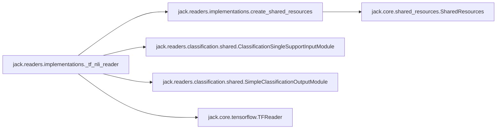

### Object Calls

* jack.readers.implementations.create_shared_resources
* jack.readers.classification.shared.ClassificationSingleSupportInputModule
* jack.readers.classification.shared.SimpleClassificationOutputModule
* jack.core.tensorflow.TFReader

<!---Documatic-block-jack.readers.implementations._tf_nli_reader-start--->
<details>
	<summary><code>jack.readers.implementations._tf_nli_reader</code> code snippet</summary>

```python
def _tf_nli_reader(model_module_constructor, resources_or_conf: Union[dict, SharedResources]=None):
    from jack.readers.classification.shared import ClassificationSingleSupportInputModule
    from jack.readers.classification.shared import SimpleClassificationOutputModule
    shared_resources = create_shared_resources(resources_or_conf)
    input_module = ClassificationSingleSupportInputModule(shared_resources)
    model_module = model_module_constructor(shared_resources)
    output_module = SimpleClassificationOutputModule(shared_resources)
    return TFReader(shared_resources, input_module, model_module, output_module)
```
</details>
<!---Documatic-block-jack.readers.implementations._tf_nli_reader-end--->
<!---Documatic-section-_tf_nli_reader-end--->

# #
<!---Documatic-section-jack.readers.implementations._tf_nli_reader-end--->

<!---Documatic-section-jack.util.tf.sequence_encoder.bi_sru-start--->
## jack.util.tf.sequence_encoder.bi_sru

<!---Documatic-section-bi_sru-start--->
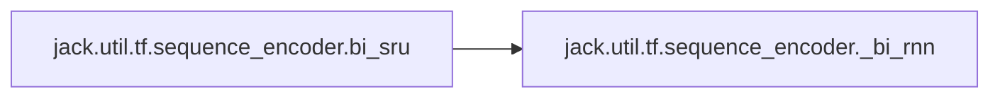

### Object Calls

* jack.util.tf.sequence_encoder._bi_rnn

<!---Documatic-block-jack.util.tf.sequence_encoder.bi_sru-start--->
<details>
	<summary><code>jack.util.tf.sequence_encoder.bi_sru</code> code snippet</summary>

```python
def bi_sru(size, sequence, seq_length, with_residual=True, name='bi_sru', reuse=None, with_projection=False, **kwargs):
    fused_rnn = rnn.SRUFusedRNN(size, with_residual)
    return _bi_rnn(size, fused_rnn, sequence, seq_length, with_projection)
```
</details>
<!---Documatic-block-jack.util.tf.sequence_encoder.bi_sru-end--->
<!---Documatic-section-bi_sru-end--->

# #
<!---Documatic-section-jack.util.tf.sequence_encoder.bi_sru-end--->

<!---Documatic-section-jack.util.tf.activations.activation_from_string-start--->
## jack.util.tf.activations.activation_from_string

<!---Documatic-section-activation_from_string-start--->
<!---Documatic-block-jack.util.tf.activations.activation_from_string-start--->
<details>
	<summary><code>jack.util.tf.activations.activation_from_string</code> code snippet</summary>

```python
def activation_from_string(activation_str):
    if activation_str is None:
        return tf.identity
    return getattr(tf.nn, activation_str)
```
</details>
<!---Documatic-block-jack.util.tf.activations.activation_from_string-end--->
<!---Documatic-section-activation_from_string-end--->

# #
<!---Documatic-section-jack.util.tf.activations.activation_from_string-end--->

<!---Documatic-section-jack.util.tf.highway.highway_layer-start--->
## jack.util.tf.highway.highway_layer

<!---Documatic-section-highway_layer-start--->
<!---Documatic-block-jack.util.tf.highway.highway_layer-start--->
<details>
	<summary><code>jack.util.tf.highway.highway_layer</code> code snippet</summary>

```python
def highway_layer(inputs, activation, name=None):
    with tf.variable_scope(name or 'highway_layer'):
        d = inputs.get_shape()[-1].value
        trans_gate = tf.contrib.layers.fully_connected(inputs, 2 * d, activation_fn=None, weights_initializer=None, scope='trans_gate')
        (trans, gate) = tf.split(trans_gate, 2, len(inputs.get_shape()) - 1)
        (trans, gate) = (activation(trans), tf.sigmoid(gate))
        out = gate * trans + (1 - gate) * inputs
        return out
```
</details>
<!---Documatic-block-jack.util.tf.highway.highway_layer-end--->
<!---Documatic-section-highway_layer-end--->

# #
<!---Documatic-section-jack.util.tf.highway.highway_layer-end--->

<!---Documatic-section-jack.eval.base.evaluate_reader-start--->
## jack.eval.base.evaluate_reader

<!---Documatic-section-evaluate_reader-start--->
<!---Documatic-block-jack.eval.base.evaluate_reader-start--->
<details>
	<summary><code>jack.eval.base.evaluate_reader</code> code snippet</summary>

```python
def evaluate_reader(reader, dataset, batch_size):
    from jack.readers.implementations import extractive_qa_readers, classification_readers, link_prediction_readers
    reader_name = reader.shared_resources.config.get('reader')
    if reader_name in extractive_qa_readers:
        return extractive_qa.evaluate(reader, dataset, batch_size)
    elif reader_name in link_prediction_readers:
        return link_prediction.evaluate(reader, dataset, batch_size)
    elif reader_name in classification_readers:
        return classification.evaluate(reader, dataset, batch_size)
```
</details>
<!---Documatic-block-jack.eval.base.evaluate_reader-end--->
<!---Documatic-section-evaluate_reader-end--->

# #
<!---Documatic-section-jack.eval.base.evaluate_reader-end--->

<!---Documatic-section-jack.core.data_structures._jack_to_qasetting-start--->
## jack.core.data_structures._jack_to_qasetting

<!---Documatic-section-_jack_to_qasetting-start--->
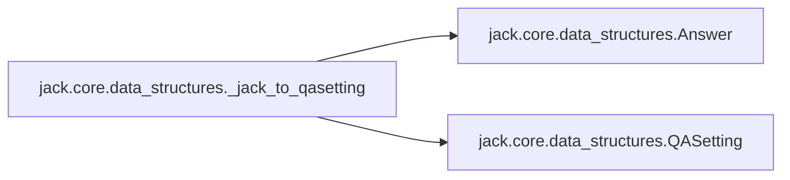

### Object Calls

* jack.core.data_structures.Answer
* jack.core.data_structures.QASetting

<!---Documatic-block-jack.core.data_structures._jack_to_qasetting-start--->
<details>
	<summary><code>jack.core.data_structures._jack_to_qasetting</code> code snippet</summary>

```python
def _jack_to_qasetting(instance, value, global_candidates):
    support = [value(s) for s in instance['support']] if 'support' in instance else None
    idd = value(instance, 'id')
    for question_instance in instance['questions']:
        question = value(question_instance['question'])
        idd = value(question_instance, 'id') or idd
        idd = value(question_instance['question'], 'id') or idd
        if global_candidates is None:
            candidates = [value(c) for c in question_instance['candidates']] if 'candidates' in question_instance else None
        else:
            candidates = global_candidates
        answers = [Answer(value(c), value(c, 'span'), value(c, 'doc_idx', 0)) for c in question_instance['answers']] if 'answers' in question_instance else None
        yield (QASetting(question, support, candidates=candidates, id=idd), answers)
```
</details>
<!---Documatic-block-jack.core.data_structures._jack_to_qasetting-end--->
<!---Documatic-section-_jack_to_qasetting-end--->

# #
<!---Documatic-section-jack.core.data_structures._jack_to_qasetting-end--->

<!---Documatic-section-jack.readers.implementations.cbilstm_nli_reader-start--->
## jack.readers.implementations.cbilstm_nli_reader

<!---Documatic-section-cbilstm_nli_reader-start--->
```mermaid
flowchart LR
jack.readers.implementations.cbilstm_nli_reader-->jack.readers.implementations._tf_nli_reader
jack.readers.implementations._tf_nli_reader-->jack.readers.implementations.create_shared_resources
jack.readers.implementations.create_shared_resources-->jack.core.shared_resources.SharedResources
jack.readers.implementations._tf_nli_reader-->jack.readers.classification.shared.ClassificationSingleSupportInputModule
jack.readers.implementations._tf_nli_reader-->jack.readers.classification.shared.SimpleClassificationOutputModule
jack.readers.implementations._tf_nli_reader-->jack.core.tensorflow.TFReader
```

### Object Calls

* jack.readers.implementations._tf_nli_reader

<!---Documatic-block-jack.readers.implementations.cbilstm_nli_reader-start--->
<details>
	<summary><code>jack.readers.implementations.cbilstm_nli_reader</code> code snippet</summary>

```python
@nli_reader
def cbilstm_nli_reader(resources_or_conf: Union[dict, SharedResources]=None):
    from jack.readers.natural_language_inference.conditional_bilstm import ConditionalBiLSTMClassificationModel
    return _tf_nli_reader(ConditionalBiLSTMClassificationModel, resources_or_conf)
```
</details>
<!---Documatic-block-jack.readers.implementations.cbilstm_nli_reader-end--->
<!---Documatic-section-cbilstm_nli_reader-end--->

# #
<!---Documatic-section-jack.readers.implementations.cbilstm_nli_reader-end--->

<!---Documatic-section-jack.readers.implementations.distmult_reader-start--->
## jack.readers.implementations.distmult_reader

<!---Documatic-section-distmult_reader-start--->
```mermaid
flowchart LR
jack.readers.implementations.distmult_reader-->jack.readers.implementations.create_shared_resources
jack.readers.implementations.create_shared_resources-->jack.core.shared_resources.SharedResources
jack.readers.implementations.distmult_reader-->jack.readers.link_prediction.models.KnowledgeGraphEmbeddingInputModule
jack.readers.implementations.distmult_reader-->jack.readers.link_prediction.models.KnowledgeGraphEmbeddingModelModule
jack.readers.implementations.distmult_reader-->jack.readers.link_prediction.models.KnowledgeGraphEmbeddingOutputModule
jack.readers.implementations.distmult_reader-->jack.core.tensorflow.TFReader
```

### Object Calls

* jack.readers.implementations.create_shared_resources
* jack.readers.link_prediction.models.KnowledgeGraphEmbeddingInputModule
* jack.readers.link_prediction.models.KnowledgeGraphEmbeddingModelModule
* jack.readers.link_prediction.models.KnowledgeGraphEmbeddingOutputModule
* jack.core.tensorflow.TFReader

<!---Documatic-block-jack.readers.implementations.distmult_reader-start--->
<details>
	<summary><code>jack.readers.implementations.distmult_reader</code> code snippet</summary>

```python
@link_prediction_reader
def distmult_reader(resources_or_conf: Union[dict, SharedResources]=None):
    from jack.readers.link_prediction.models import KnowledgeGraphEmbeddingInputModule, KnowledgeGraphEmbeddingModelModule, KnowledgeGraphEmbeddingOutputModule
    shared_resources = create_shared_resources(resources_or_conf)
    input_module = KnowledgeGraphEmbeddingInputModule(shared_resources)
    model_module = KnowledgeGraphEmbeddingModelModule(shared_resources, model_name='DistMult')
    output_module = KnowledgeGraphEmbeddingOutputModule()
    return TFReader(shared_resources, input_module, model_module, output_module)
```
</details>
<!---Documatic-block-jack.readers.implementations.distmult_reader-end--->
<!---Documatic-section-distmult_reader-end--->

# #
<!---Documatic-section-jack.readers.implementations.distmult_reader-end--->

<!---Documatic-section-jack.util.tf.interaction_layer.interaction_layer-start--->
## jack.util.tf.interaction_layer.interaction_layer

<!---Documatic-section-interaction_layer-start--->
```mermaid
flowchart LR
jack.util.tf.interaction_layer.interaction_layer-->jack.util.tf.interaction_layer.attention_matching_layer
jack.util.tf.interaction_layer.interaction_layer-->jack.util.tf.interaction_layer.bidaf_layer
jack.util.tf.interaction_layer.bidaf_layer-->jack.util.tf.misc.mask_for_lengths
jack.util.tf.interaction_layer.interaction_layer-->jack.util.tf.interaction_layer.coattention_layer
```

### Object Calls

* jack.util.tf.interaction_layer.attention_matching_layer
* jack.util.tf.interaction_layer.bidaf_layer
* jack.util.tf.interaction_layer.coattention_layer

<!---Documatic-block-jack.util.tf.interaction_layer.interaction_layer-start--->
<details>
	<summary><code>jack.util.tf.interaction_layer.interaction_layer</code> code snippet</summary>

```python
def interaction_layer(seq1, seq1_length, seq2, seq2_length, seq1_to_seq2, seq2_to_seq1, module='attention_matching', name='interaction_layer', reuse=False, concat=True, repr_dim=None, **kwargs):
    with tf.variable_scope(name, reuse=reuse):
        if seq1_to_seq2 is not None:
            seq2 = tf.gather(seq2, seq1_to_seq2)
            seq2_length = tf.gather(seq2_length, seq1_to_seq2)
        if module == 'attention_matching':
            out = attention_matching_layer(seq1, seq1_length, seq2, seq2_length, seq2_to_seq1, **kwargs)
        elif module == 'bidaf':
            out = bidaf_layer(seq1, seq1_length, seq2, seq2_length, **kwargs)
        elif module == 'coattention':
            if kwargs.get('encoder') and 'repr_dim' not in kwargs['encoder']:
                kwargs['encoder']['repr_dim'] = repr_dim
            out = coattention_layer(seq1, seq1_length, seq2, seq2_length, **kwargs)
        else:
            raise ValueError('Unknown interaction type: %s' % module)
    if concat:
        out = tf.concat([seq1, out], 2)
    return out
```
</details>
<!---Documatic-block-jack.util.tf.interaction_layer.interaction_layer-end--->
<!---Documatic-section-interaction_layer-end--->

# #
<!---Documatic-section-jack.util.tf.interaction_layer.interaction_layer-end--->

<!---Documatic-section-jack.util.tf.sequence_encoder.bi_rnn-start--->
## jack.util.tf.sequence_encoder.bi_rnn

<!---Documatic-section-bi_rnn-start--->
```mermaid
flowchart LR
jack.util.tf.sequence_encoder.bi_rnn-->jack.util.tf.sequence_encoder._bi_rnn
```

### Object Calls

* jack.util.tf.sequence_encoder._bi_rnn

<!---Documatic-block-jack.util.tf.sequence_encoder.bi_rnn-start--->
<details>
	<summary><code>jack.util.tf.sequence_encoder.bi_rnn</code> code snippet</summary>

```python
def bi_rnn(size, rnn_cell, sequence, seq_length, with_projection=False, **kwargs):
    fused_rnn = tf.contrib.rnn.FusedRNNCellAdaptor(rnn_cell, use_dynamic_rnn=True)
    return _bi_rnn(size, fused_rnn, sequence, seq_length, with_projection)
```
</details>
<!---Documatic-block-jack.util.tf.sequence_encoder.bi_rnn-end--->
<!---Documatic-section-bi_rnn-end--->

# #
<!---Documatic-section-jack.util.tf.sequence_encoder.bi_rnn-end--->

[_Documentation generated by Documatic_](https://www.documatic.com)